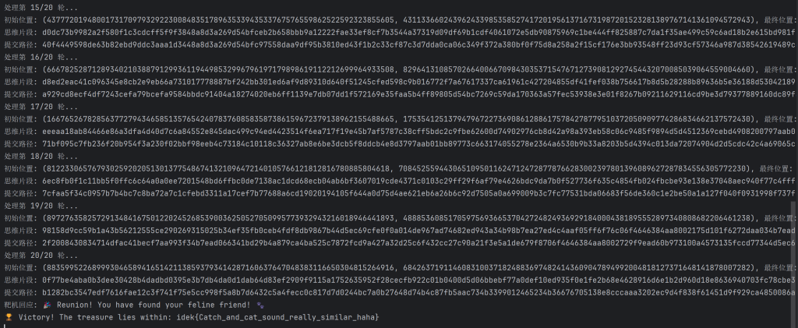
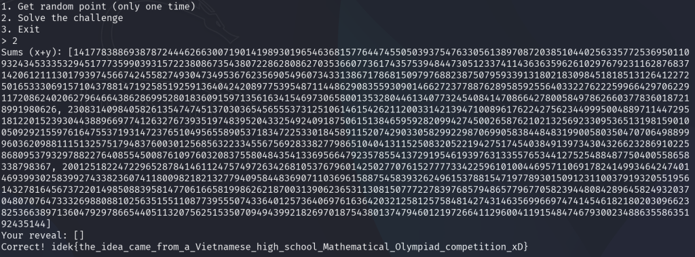
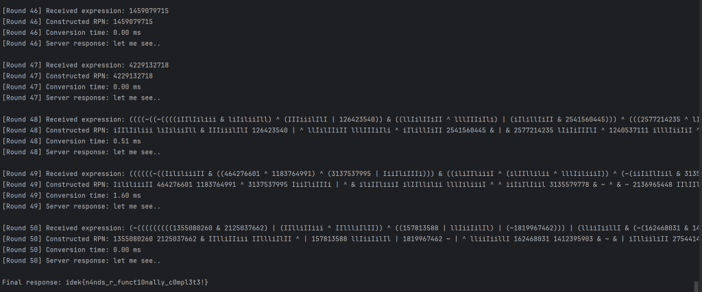

# Sanity
## check

Welcome to idekCTF 2025! Please join our discord for any announcements and updates on challenges.


:::tip[flag]
idek{imagine_starting_ctf_on_time}
:::

## 问卷调查


:::tip[flag]
idek{th4nk5_f0r_p1ay1ng_s33_y0u_n3xt_y34r}
:::

# Crypto
## Catch
### 题目

Through every cryptic stride, the cat weaves secrets in the fabric of numbers—seek the patterns, and the path shall reveal the prize.  
通过每一个神秘的步伐，猫在数字的织物中编织秘密——寻找模式，道路就会揭示奖品

靶机源码如下

```python
from Crypto.Random.random import randint, choice  
import os  
  
# In a realm where curiosity roams free, our fearless cat sets out on an epic journey.  
# Even the cleverest feline must respect the boundaries of its world—this magical limit holds all wonders within.  
limit = 0xe5db6a6d765b1ba6e727aa7a87a792c49bb9ddeb2bad999f5ea04f047255d5a72e193a7d58aa8ef619b0262de6d25651085842fd9c385fa4f1032c305f44b8a4f92b16c8115d0595cebfccc1c655ca20db597ff1f01e0db70b9073fbaa1ae5e489484c7a45c215ea02db3c77f1865e1e8597cb0b0af3241cd8214bd5b5c1491f  
  
# Through cryptic patterns, our cat deciphers its next move.  
def walking(x, y, part):  
    # Each step is guided by a fragment of the cat's own secret mind.  
    epart = [int.from_bytes(part[i:i+2], "big") for i in range(0, len(part), 2)]  
    xx = epart[0] * x + epart[1] * y  
    yy = epart[2] * x + epart[3] * y  
    return xx, yy  
  
# Enter the Cat: curious wanderer and keeper of hidden paths.  
class Cat:  
    def __init__(self):  
        # The cat's starting position is born of pure randomness.  
        self.x = randint(0, 2**256)  
        self.y = randint(0, 2**256)  
        # Deep within, its mind holds a thousand mysterious fragments.  
        while True:  
            self.mind = os.urandom(1000)  
            self.step = [self.mind[i:i+8] for i in range(0, 1000, 8)]  
            if len(set(self.step)) == len(self.step):  
                break  
  
    # The epic chase begins: the cat ponders and strides toward the horizon.  
    def moving(self):  
        for _ in range(30):  
            # A moment of reflection: choose a thought from the cat's endless mind.  
            part = choice(self.step)  
            self.step.remove(part)  
            # With each heartbeat, the cat takes a cryptic step.  
            xx, yy = walking(self.x, self.y, part)  
            self.x, self.y = xx, yy  
            # When the wild spirit reaches the edge, it respects the boundary and pauses.  
            if self.x > limit or self.y > limit:  
                self.x %= limit  
                self.y %= limit  
                break  
  
    # When the cosmos beckons, the cat reveals its secret coordinates.  
    def position(self):  
        return (self.x, self.y)  
  
# Adventurer, your quest: find and connect with 20 elusive cats.  
for round in range(20):  
    try:  
        print(f"👉 Hunt {round+1}/20 begins!")  
        cat = Cat()  
  
        # At the start, you and the cat share the same starlit square.  
        human_pos = cat.position()  
        print(f"🐱✨ Co-location: {human_pos}")  
        print(f"🔮 Cat's hidden mind: {cat.mind.hex()}")  
  
        # But the cat, ever playful, dashes into the unknown...  
        cat.moving()  
        print("😸 The chase is on!")  
  
        print(f"🗺️ Cat now at: {cat.position()}")  
  
        # Your turn: recall the cat's secret path fragments to catch up.  
        mind = bytes.fromhex(input("🤔 Path to recall (hex): "))  
  
        # Step by step, follow the trail the cat has laid.  
        for i in range(0, len(mind), 8):  
            part = mind[i:i+8]  
            if part not in cat.mind:  
                print("❌ Lost in the labyrinth of thoughts.")  
                exit()  
            human_pos = walking(human_pos[0], human_pos[1], part)  
  
        # At last, if destiny aligns...  
        if human_pos == cat.position():  
            print("🎉 Reunion! You have found your feline friend! 🐾")  
        else:  
            print("😿 The path eludes you... Your heart aches.")  
            exit()  
    except Exception:  
        print("🙀 A puzzle too tangled for tonight. Rest well.")  
        exit()  
  
# Triumph at last: the final cat yields the secret prize.  
print(f"🏆 Victory! The treasure lies within: {open('flag.txt').read()}")
```

### 思路

:::note
这段代码的核心是通过逆向求解线性变换结合广度优先搜索(BFS),从猫的最终位置回溯到初始位置,找到猫移动的步骤序列,本质上是一个基于线性代数和图搜索的解密过程
:::

+ 分析一下题中的参数
    + `LIMIT`:一个极大的十六进制数,当猫咪的坐标`(x, y)`超过这个值时,会对其取模(`z %= limit`),确保始终在边界内
    + `起点(start_x, start_y)`:人与猫的初始位置
    + `终点(end_x, end_y)`:猫的最终位置
    + `思想片段(mind_hex)`:1000字节的十六进制字符串,分割后得到125个"移动步骤"(每8字节一个步骤),每个步骤对应一个线性变换规则

+ 分析一下猫移动的步骤
    + 每个"移动步骤"(8字节)被拆分为4个2字节整数`e0, e1, e2, e3`,组成一个2x2矩阵
    + $$M = \begin{bmatrix} e0 & e1 \\ e2 & e3 \\ \end{bmatrix}$$
    + 猫的正向移动规则是用矩阵`M`对当前位置`(x, y)`做线性变换,再对`LIMIT`取模,得到新位置`(x', y')`
    + $$\begin{cases} x' \equiv e0 \cdot x + e1 \cdot y \pmod{\text{LIMIT}} \\ y' \equiv e2 \cdot x + e3 \cdot y \pmod{\text{LIMIT}} \end{cases}$$
    + 那么我们的目的就很清晰了,就是线性代数中的求逆矩阵呗
    + 方程组的解依赖矩阵`M`的行列式 $D=e0⋅e3−e1⋅e2$ 若`D ≠ 0`,矩阵可逆,逆矩阵为
    + $$M^{-1} = \frac{1}{D} \begin{bmatrix} e3 & -e1 \\ -e2 & e0 \end{bmatrix}$$
    + 由于正向移动对`LIMIT`取模,`x'`和`y'`其实是变换后的值除以`LIMIT`的余数,因此逆向求解时需考虑"取模前的原值"(`k`,`m`是整数)
    + $$\begin{cases} e0 \cdot x + e1 \cdot y = x' + k \cdot \text{LIMIT} \\ e2 \cdot x + e3 \cdot y = y' + m \cdot \text{LIMIT} \end{cases}$$
    + 代入逆矩阵可解得
    + $$\begin{cases} x = \frac{(x' + k \cdot \text{LIMIT}) \cdot e3 - (y' + m \cdot \text{LIMIT}) \cdot e1}{D} \\ y = \frac{(y' + m \cdot \text{LIMIT}) \cdot e0 - (x' + k \cdot \text{LIMIT}) \cdot e2}{D} \end{cases}$$
    + 要求`x`和`y`为整数,因此分子必须能被`D`整除(代码中通过`num_x % D == 0`和`num_y % D == 0`判断)

+ 然后需要找一下最短路径
    + 由于步骤可能有125个,且不可重复使用,代码用`BFS`从终点出发,逐层尝试所有未使用的步骤,计算可能的上一步位置,直到找到起点,BFS的优势是能找到最短路径且步骤最少,且通过`used_indices`集合避免重复使用步骤

+ 最后将找到的步骤序列反转为正向顺序,转成十六进制字符串即为答案

### 解答

```python
import sys  
import socket  
from collections import deque  
  
def connect_to_target():  
    host = "catch.chal.idek.team"  
    port = 1337  
    s = socket.socket(socket.AF_INET, socket.SOCK_STREAM)  
    s.connect((host, port))  
    return s  
  
def read_target_data(s):  
    data = b""  
    while b"Path to recall (hex):" not in data:  
        data += s.recv(4096)  
  
    data_str = data.decode()  
    # 解析初始位置  
    co_loc_start = data_str.find("Co-location: (") + len("Co-location: (")  
    co_loc_end = data_str.find(")", co_loc_start)  
    start_x, start_y = map(int, data_str[co_loc_start:co_loc_end].split(","))  
  
    # 解析思维片段  
    mind_start = data_str.find("Cat's hidden mind: ") + len("Cat's hidden mind: ")  
    mind_end = data_str.find("\n", mind_start)  
    mind_hex = data_str[mind_start:mind_end].strip()  
  
    # 解析最终位置  
    end_loc_start = data_str.find("Cat now at: (") + len("Cat now at: (")  
    end_loc_end = data_str.find(")", end_loc_start)  
    end_x, end_y = map(int, data_str[end_loc_start:end_loc_end].split(","))  
  
    return start_x, start_y, end_x, end_y, mind_hex  
  
def solve_round(start_x, start_y, end_x, end_y, mind_hex, LIMIT):  
    """求解单轮路径"""  
    mind_bytes = bytes.fromhex(mind_hex)  
    steps = [mind_bytes[i:i + 8] for i in range(0, len(mind_bytes), 8)]  
  
    def reverse_step(current_x, current_y, step, k_max=1, m_max=1):  
        e0 = int.from_bytes(step[0:2], 'big')  
        e1 = int.from_bytes(step[2:4], 'big')  
        e2 = int.from_bytes(step[4:6], 'big')  
        e3 = int.from_bytes(step[6:8], 'big')  
  
        D = e0 * e3 - e1 * e2  
        if D == 0:  
            return []  
  
        possible_prev = []  
        for k in range(k_max + 1):  
            for m in range(m_max + 1):  
                x_after = current_x + k * LIMIT  
                y_after = current_y + m * LIMIT  
  
                num_x = x_after * e3 - y_after * e1  
                num_y = y_after * e0 - x_after * e2  
  
                if num_x % D != 0 or num_y % D != 0:  
                    continue  
  
                prev_x = num_x // D  
                prev_y = num_y // D  
                possible_prev.append((prev_x, prev_y))  
  
        return possible_prev  
  
    queue = deque()  
    queue.append((end_x, end_y, [], set()))  
    found = False  
    answer_steps = []  
  
    while queue:  
        curr_x, curr_y, path, used_indices = queue.popleft()  
  
        if curr_x == start_x and curr_y == start_y:  
            answer_steps = path  
            found = True  
            break  
        if len(path) >= 30:  
            continue  
  
        for i in range(len(steps)):  
            if i in used_indices:  
                continue  
  
            step = steps[i]  
            possible_prevs = reverse_step(curr_x, curr_y, step, k_max=1, m_max=1)  
  
            for prev_x, prev_y in possible_prevs:  
                new_used = used_indices.copy()  
                new_used.add(i)  
                new_path = path + [step]  
                queue.append((prev_x, prev_y, new_path, new_used))  
  
    if found:  
        answer_steps.reverse()  
        return b''.join(answer_steps).hex()  
    else:  
        return None  
  
def main():  
    LIMIT = 0xe5db6a6d765b1ba6e727aa7a87a792c49bb9ddeb2bad999f5ea04f047255d5a72e193a7d58aa8ef619b0262de6d25651085842fd9c385fa4f1032c305f44b8a4f92b16c8115d0595cebfccc1c655ca20db597ff1f01e0db70b9073fbaa1ae5e489484c7a45c215ea02db3c77f1865e1e8597cb0b0af3241cd8214bd5b5c1491f  
  
    s = connect_to_target()  
  
    all_paths = []  
  
    for round in range(1, 21):  
        print(f"处理第 {round}/20 轮...")  
  
        # 获取本轮数据  
        start_x, start_y, end_x, end_y, mind_hex = read_target_data(s)  
        print(f"初始位置: ({start_x}, {start_y}), 最终位置: ({end_x}, {end_y})")  
        print(f"思维片段: {mind_hex}")  
  
        # 计算路径  
        path_hex = solve_round(start_x, start_y, end_x, end_y, mind_hex, LIMIT)  
  
        if not path_hex:  
            print("未找到路径，尝试调整k_max和m_max")  
            path_hex = solve_round(start_x, start_y, end_x, end_y, mind_hex, LIMIT, k_max=2, m_max=2)  
  
        if path_hex:  
            print(f"提交路径: {path_hex}")  
            all_paths.append(path_hex)  
            s.sendall((path_hex + "\n").encode())  
        else:  
            print("无法找到有效路径，退出")  
            break  
  
    response = s.recv(4096)  
    print(f"靶机回应: {response.decode()}")  
    s.close()  
  
if __name__ == "__main__":  
    main()
```
---
```python
👉 Hunt 1/20 begins!
🐱✨ Co-location: (112011843462173672352315361207578134751833637951002721441072754168046022669254, 91951073409635148305831479006796566851063956286293873358076045985503728816647)
🔮 Cat's hidden mind: a1ffa49bc71657d34d793a5f6a858891fc790d5370d2d560e1bc9c4f9a59a914ba660d60ef79e1c6d286679d2d3826ca4a40c0fb1b0a2087103ef3c08eb67b5099f89172bc78f002a7e498d484db9edc01217a3f90c515eca680a7078861d836bad072fc61a6d664a388485bb60887e0ea4012147e6a363dadface4afbed5565b7947d04556ab67ce913ed4694010b999a54e841884078c994b886168eaeacfeef2477b6d9cf0c3fdb006dab2d64e3d1e471c803f1826fe56616f19ddc95b2cc665953fc50fcb81c807d48d8c989abe68914787d16c5a965950b609e25fc746036f611a19889bac91c73193a88f53805b7d56427b13919660243e4bdffe11939c5c3766e2e814161cbd1ea1747db6062cc82eff15beef1db74a0b8cde401570a161bb8e0dccc264417cb8ada395cfe38a4ee2ecb60328192693c33a9c2360799d9b64154aaa65e887ec1412d322377b394c043e3dead2ffebc7553ddac3528587d63b178f12ce713216779d8531f854b1ac7f55ed4935327078da7994595066b2db47b273ed5dca806f8c69fb0ca0c39a73adae28bb06babece1419f3a935243216df09dee1734c02700b5c064c2a6d7d3b2030cee6e9d3f894f2f2a5c9fd8db58b958b587624b650bc95392f7c1210b4f453b60bf2a363a0b53d1dac7ab76eef9e47ff8cf8a1422534a827666fe842630700b2fab8f2862fd123d9263a969bbba93a21616a374b56cae652483dc2036b269baa1f9550f905367a4b67f83b02bc633d8b7c99cfb597541468e44cf4a5bba66d65177be2185be837b25290f7b6238b137accee8118b699519c9139ae3fa9ed9623c74c36a5fdb3a1781318b7897e331140581bb627ce683c9660fc6d916e2bfdbe43a002d4df13962599d3f6fb4b669f8191cfb9b95f7fe64b86d6996427f02f982f0d6c5fab88bb70426d978d583a9391e908cad0f07a0d7261ad87276858b387020eff8bb2ffdefbd9f35781bc0c9318841acb915bbafc1535b6c85e3744adc677f54c5a23252658abaa240acfa530703bc288d6e0e76a422d4fb33c6b1ad32ba8209586523c45f7424cadd61c09fbc25f184e5698c8123723fe99af5883a4fe9a15adc835abbc43d5b16fff46a805bc7ba1e665a414e189e8a4400c883067b030a7fd0ad1a52eccfef4e2743f94add27f359458e8326e0914583518a2487c0ce88c30627567538a98dc28885e5a397830477cfaf85195484aa893eda6d0671c84dc504251f541f6f2d358be46d779dc2fbe147c53b1eb1e348394d99d41e7736540b5d273f0295ea0b07808c81e3f2dff690a6fb7c0e6fe20557628008091bc9dec16ec7ac50660530d752abbb17e9f50de6f433509dfb25abad1d7e5cf7429273b2129205b895d491c8b1f57ec40e883e400bcb
😸 The chase is on!
🗺️ Cat now at: (452664507485440192987380036360598719589502832973536219030433835210770805382852364998892519079952150573662845098849736476960027251205839884512176589123254874155493289823597771753101874862351220992907200969311976138613969920, 384767007220961594664400753374359830194734725687148040679142977619005324954254241221670731477270279121595658937102194029915286239641345578743873055039884207107965970974512422538286223026616744716399638841759541851225077760)
🤔 Path to recall (hex): d3b2030cee6e9d3fea4012147e6a363de471c803f1826fe5db006dab2d64e3d19a54e841884078c90243e4bdffe11939a680a7078861d8363252658abaa240ac05b895d491c8b1f50b53d1dac7ab76ee7f02f982f0d6c5fabb17e9f50de6f433d41e7736540b5d278c8123723fe99af52db47b273ed5dca8f13962599d3f6fb4f94add27f359458e83a9391e908cad0fbe837b25290f7b62567538a98dc288853f0295ea0b07808cf9e47ff8cf8a1422ba93a21616a374b5c09fbc25f184e5694f453b60bf2a363a807d48d8c989abe6d286679d2d3826ca414e189e8a4400c85cf7429273b21292c0c9318841acb915
🎉 Reunion! You have found your feline friend! 🐾
```



:::tip[flag]
idek{Catch_and_cat_sound_really_similar_haha}
:::

## Sadness ECC*
### 题目

This curve is sad because it doesn't know if it's an elliptic curve or not...  
这条曲线很可悲，因为它不知道它是否是椭圆曲线......

靶机源码如下

```python
from Crypto.Util.number import *  
from secret import n, xG, yG  
import ast  
  
class DummyPoint:  
    O = object()  
  
    def __init__(self, x=None, y=None):  
        if (x, y) == (None, None):  
            self._infinity = True  
        else:  
            assert DummyPoint.isOnCurve(x, y), (x, y)  
            self.x, self.y = x, y  
            self._infinity = False  
  
    @classmethod  
    def infinity(cls):  
        return cls()  
  
    def is_infinity(self):  
        return getattr(self, "_infinity", False)  
  
    @staticmethod  
    def isOnCurve(x, y):  
        return "<REDACTED>"  
  
    def __add__(self, other):  
        if other.is_infinity():  
            return self  
        if self.is_infinity():  
            return other  
  
        # ——— Distinct‑points case ———  
        if self.x != other.x or self.y != other.y:  
            dy    = self.y - other.y  
            dx    = self.x - other.x  
            inv_dx = pow(dx, -1, n)  
            prod1 = dy * inv_dx  
            s     = prod1 % n  
  
            inv_s = pow(s, -1, n)  
            s3    = pow(inv_s, 3, n)  
  
            tmp1 = s * self.x  
            d    = self.y - tmp1  
  
            d_minus    = d - 1337  
            neg_three  = -3  
            tmp2       = neg_three * d_minus  
            tmp3       = tmp2 * inv_s  
            sum_x      = self.x + other.x  
            x_temp     = tmp3 + s3  
            x_pre      = x_temp - sum_x  
            x          = x_pre % n  
  
            tmp4       = self.x - x  
            tmp5       = s * tmp4  
            y_pre      = self.y - tmp5  
            y          = y_pre % n  
  
            return DummyPoint(x, y)  
  
        dy_term       = self.y - 1337  
        dy2           = dy_term * dy_term  
        three_dy2     = 3 * dy2  
        inv_3dy2      = pow(three_dy2, -1, n)  
        two_x         = 2 * self.x  
        prod2         = two_x * inv_3dy2  
        s             = prod2 % n  
  
        inv_s         = pow(s, -1, n)  
        s3            = pow(inv_s, 3, n)  
  
        tmp6          = s * self.x  
        d2            = self.y - tmp6  
  
        d2_minus      = d2 - 1337  
        tmp7          = -3 * d2_minus  
        tmp8          = tmp7 * inv_s  
        x_temp2       = tmp8 + s3  
        x_pre2        = x_temp2 - two_x  
        x2            = x_pre2 % n  
  
        tmp9          = self.x - x2  
        tmp10         = s * tmp9  
        y_pre2        = self.y - tmp10  
        y2            = y_pre2 % n  
  
        return DummyPoint(x2, y2)  
  
    def __rmul__(self, k):  
        if not isinstance(k, int) or k < 0:  
            raise ValueError("Choose another k")  
          
        R = DummyPoint.infinity()  
        addend = self  
        while k:  
            if k & 1:  
                R = R + addend  
            addend = addend + addend  
            k >>= 1  
        return R  
  
    def __repr__(self):  
        return f"DummyPoint({self.x}, {self.y})"  
  
    def __eq__(self, other):  
        return self.x == other.x and self.y == other.y  
  
if __name__ == "__main__":  
    G = DummyPoint(xG, yG)  
    print(f"{n = }")  
    stop = False  
    while True:  
        print("1. Get random point (only one time)\n2. Solve the challenge\n3. Exit")  
        try:  
            opt = int(input("> "))  
        except:  
            print("❓ Try again."); continue  
  
        if opt == 1:  
            if stop:  
                print("Only one time!")  
            else:  
                stop = True  
                k = getRandomRange(1, n)  
                P = k * G  
                print("Here is your point:")  
                print(P)  
  
        elif opt == 2:  
            ks = [getRandomRange(1, n) for _ in range(2)]  
            Ps = [k * G for k in ks]  
            Ps.append(Ps[0] + Ps[1])  
  
            print("Sums (x+y):", [P.x + P.y for P in Ps])  
            try:  
                ans = ast.literal_eval(input("Your reveal: "))  
            except:  
                print("Couldn't parse."); continue  
  
            if all(P == DummyPoint(*c) for P, c in zip(Ps, ans)):  
                print("Correct! " + open("flag.txt").read())  
            else:  
                print("Wrong...")  
            break  
  
        else:  
            print("Farewell.")   
            break
```

### 思路

+ 连接靶机获取数据

```python
n = 18462925487718580334270042594143977219610425117899940337155124026128371741308753433204240210795227010717937541232846792104611962766611611163876559160422428966906186397821598025933872438955725823904587695009410689230415635161754603680035967278877313283697377952334244199935763429714549639256865992874516173501812823285781745993930473682283430062179323232132574582638414763651749680222672408397689569117233599147511410313171491361805303193358817974658401842269098694647226354547005971868845012340264871645065372049483020435661973539128701921925288361298815876347017295555593466546029673585316558973730767171452962355953
DummyPoint(315460603591324421912776295594586351754624712573355287895993208470948807736825588735971535689896632857094225795196938478584860798317496899882384448714391125919845165964808858306806383742669339082732227678352355716712195187355370737883763931023687689549388651605864517724964251501340396946498755163074414349548809667864776812162766457010480925175139937660879286610351111682296006578397879007481853152401017278717890625345565744095841887312313544954457403927524782986001574926412584780061961406925539460672489909513166159493233209445523829773968383690391321865319538758683520856902915900443583253299683365384771883581, 17746452387871160474689504157696473350364727057005154157954311251073601515131831207464841081526470967153085656041229292425129452226092407789932788883333496425974985442755417880072035022885183631767444064418391506806430204542267487417995728624965627268213670389316597183203027213953095394578238026207923505676663500980039352905672307657553041764916042294828054287251419766551137618892221463386927069955564638964434949999772679045587661632466655055148901073796370684601692301874047961764237312554766797589536269132320590679213274386393824953843122338150240817123551442484809234979352097918487951361084114298978435385987)
Sums (x+y): [14177838869387872444626630071901419893019654636815776447455050393754763305613897087203851044025633577253695011093243453335329451777359903931572238086735438072286280862703536607736174357539484473051233741143636359626102976792311628768371420612111301793974566742455827493047349536762356905496073433138671786815097976882387507959339131802183098451818513126412272501653330691571043788147192585192591364042420897753954871144862908355930901466272377887628958592556403322762225996642970622911720862402062796466438628699528018360915971356163415469730658001353280446134077324540841470866427800584978626603778360187218991980626, 23083140984058261354747451370303654565553731251061461542621120033142139471008961762242756234499950048897114472951812201523930443889669774126327673935197483952043325492409187506151384659592820994274500265876210213256923309536513198159010050929215597616475537193147237651049565589053718347225330184589115207429033058299229870699058384484831990058035047070649889996036209881115132575179483760030125685632233455675692833827798651040413115250832052219427517454038491397343043266232869102258680953793297882276408554500876109760320837558048435413369566479235785541372919546193976313355765344127525488487750400558658338798367, 20012518224722965287841461124757497263426810537679601425027707615277773342259610100446957110691782414993464247401469399302583992743382360741180098218213277940958448369071103696158875458393262496153788154719778930150912311003791932055195614327816456737220149850883958147706166581998626218700313906236531130815077722783976857948657796770582394480842896458249320370480707647333269880881025635155110877395550743364012573640697616364203212581257584814274314635699669747414546182180203096623825366389713604792978665440511320756251535070949439921826970187543801374794601219726641129600411915484746793002348863558635192435144]
```

### 解答

...非预期??你甚至只需输入`[]`即可获取 flag



:::tip[flag]
idek{the_idea_came_from_a_Vietnamese_high_school_Mathematical_Olympiad_competition_xD}
:::

## Diamond Ticket
### 题目

Charles has another chance to go to chocolate factory again, but this time everything is harder...  
查尔斯还有一次机会再次去巧克力工厂，但这次一切都更难了......

```python
from Crypto.Util.number import *
 
#Some magic from Willy Wonka
p = 170829625398370252501980763763988409583
a = 164164878498114882034745803752027154293
b = 125172356708896457197207880391835698381
 
def chocolate_generator(m:int) -> int:
    return (pow(a, m, p) + pow(b, m, p)) % p
 
#The diamond ticket is hiding inside chocolate
diamond_ticket = open("flag.txt", "rb").read()
assert len(diamond_ticket) == 26
assert diamond_ticket[:5] == b"idek{"
assert diamond_ticket[-1:] == b"}"
diamond_ticket = bytes_to_long(diamond_ticket[5:-1])
 
flag_chocolate = chocolate_generator(diamond_ticket)
chocolate_bag = []
 
#Willy Wonka are making chocolates
for i in range(1337):
    chocolate_bag.append(getRandomRange(1, p))
 
#And he put the golden ticket at the end
chocolate_bag.append(flag_chocolate)
 
#Augustus ate lots of chocolates, but he can't eat all cuz he is full now :D
remain = chocolate_bag[-5:]
 
#Compress all remain chocolates into one
remain_bytes = b"".join([c.to_bytes(p.bit_length()//8, "big") for c in remain])
 
#The last chocolate is too important, so Willy Wonka did magic again
P = getPrime(512)
Q = getPrime(512)
N = P * Q
e = bytes_to_long(b"idek{this_is_a_fake_flag_lolol}")
d = pow(e, -1, (P - 1) * (Q - 1))
c1 = pow(bytes_to_long(remain_bytes), e, N)
c2 = pow(bytes_to_long(remain_bytes), 2, N) # A small gift
 
#How can you get it ?
print(f"{N = }")
print(f"{c1 = }")
print(f"{c2 = }")
 
"""
N = 85494791395295332945307239533692379607357839212287019473638934253301452108522067416218735796494842928689545564411909493378925446256067741352255455231566967041733698260315140928382934156213563527493360928094724419798812564716724034316384416100417243844799045176599197680353109658153148874265234750977838548867
c1 = 27062074196834458670191422120857456217979308440332928563784961101978948466368298802765973020349433121726736536899260504828388992133435359919764627760887966221328744451867771955587357887373143789000307996739905387064272569624412963289163997701702446706106089751532607059085577031825157942847678226256408018301
c2 = 30493926769307279620402715377825804330944677680927170388776891152831425786788516825687413453427866619728035923364764078434617853754697076732657422609080720944160407383110441379382589644898380399280520469116924641442283645426172683945640914810778133226061767682464112690072473051344933447823488551784450844649
"""
```

### 思路

+ 分析一下代码
+ 其中`diamond_ticket`是截取了原flag的中间20个字节
+ 并且调用了`chocolate_generator`这个函数进行一个计算得到一个返回值赋值给`flag_chocolate`
+ 后面又有一个随机数`chocolate_bag`生成列表,包含1337个范围在`(1, p)`的随机数,最后将`flag_chocolate`追加到列表末尾(即列表第1338个元素)
+ 取列表最后5个元素(`remain = chocolate_bag[-5:]`),其中最后一个元素就是`flag_chocolate`
+ 将这5个元素转换为字节(按`p`的比特长度确定字节数,大端序),拼接后得到`remain_bytes`
+ 最后又把`remain_bytes`转换为整数用RSA加密了

+ 那我们现在反过来思考
+ 先观察这个RSA发现他符合共模攻击(并且e1和e2是互质的)

```python
import gmpy2
from Crypto.Util.number import *
 
N = 85494791395295332945307239533692379607357839212287019473638934253301452108522067416218735796494842928689545564411909493378925446256067741352255455231566967041733698260315140928382934156213563527493360928094724419798812564716724034316384416100417243844799045176599197680353109658153148874265234750977838548867
e1 = bytes_to_long(b"idek{this_is_a_fake_flag_lolol}")
#186211850710224327090212578283834164039515361235211653610924153794366237821
c1 = 27062074196834458670191422120857456217979308440332928563784961101978948466368298802765973020349433121726736536899260504828388992133435359919764627760887966221328744451867771955587357887373143789000307996739905387064272569624412963289163997701702446706106089751532607059085577031825157942847678226256408018301
e2 = 2
c2 = 30493926769307279620402715377825804330944677680927170388776891152831425786788516825687413453427866619728035923364764078434617853754697076732657422609080720944160407383110441379382589644898380399280520469116924641442283645426172683945640914810778133226061767682464112690072473051344933447823488551784450844649
 
def egcd(a, b):
    if b == 0:
        return a, 0;
    else:
        x, y = egcd(b, a % b)
        return y, x - (a // b) * y
 
s = egcd(e1, e2)
s1 = s[0]
s2 = s[1]
#print(s[0], s[1])
 
m = gmpy2.powmod(c1, s1, N) * gmpy2.powmod(c2, s2, N) % N
print(long_to_bytes(m))
#{\xd1\xdf\xeb|F\xce\xbc\x11\xd8nZ\x8b\xfc\xaebN\xf4\x8a{0,\x01\xb7\xf9\xe7\xb5q\xc93%\xba\x0b\x15\x94g\x0b|\xd8 \xf38\xf2\xe2#\t\x0ci^\x10\x86\x94\x12\xcb\xe7b/\xefj\xb5\x05\xfb\xc8\xf9J\xebU|z\x10\xd3|\xa7\xec\xd1\x9d\x17\\P\xb3
```

+ 由此求出`remain_bytes`
+ 再截取末尾`p.bit_length()//8`字节的元素即可求出`flag_chocolate`

```python
from Crypto.Util.number import *

p = 170829625398370252501980763763988409583

remain_bytes = b"{\xd1\xdf\xeb|F\xce\xbc\x11\xd8nZ\x8b\xfc\xaebN\xf4\x8a{0,\x01\xb7\xf9\xe7\xb5q\xc93%\xba\x0b\x15\x94g\x0b|\xd8 \xf38\xf2\xe2#\t\x0ci^\x10\x86\x94\x12\xcb\xe7b/\xefj\xb5\x05\xfb\xc8\xf9J\xebU|z\x10\xd3|\xa7\xec\xd1\x9d\x17\\P\xb3"
byte_len = p.bit_length() // 8
flag_chocolate = int.from_bytes(remain_bytes[-byte_len:], 'big')
print(flag_chocolate)
#99584795316725433978492646071734128819
```

+ 最后再来分析`(pow(a, m, p) + pow(b, m, p)) % p`
+ 这个带和的指数方程表达式 $a^m + b^m \equiv c \bmod p$ ( $p$ 为质数)很像可求离散对数的,但是它又不同于实际的单一底数的离散对数表达式 $a^x \equiv c \bmod p$
+ 换个思路,比如`a`和`b`存在倍数关系(比如`a = k·b mod p`),可令`t = b^m`,则方程变为`k^m · t + t ≡ c mod p`,即`t·(k^m + 1) ≡ c mod p`
+ 此时`k^m`是另一个指数项(可视为`(a/b)^m`),因此问题转化为求解两个相关的离散对数(`b^m = t`和`(a/b)^m = k^m`),再通过一致性验证找到`m`
+ 直接通过模逆运算求解`k`找到这个数量关系

```python
import gmpy2

p = 170829625398370252501980763763988409583
b = 125172356708896457197207880391835698381
b_inv = gmpy2.invert(b, p)
a = 164164878498114882034745803752027154293
k = (a * b_inv) % p
print(k)
#11544765127598250644199739386248722280
```

+ 利用`a`与`b`的模倍数关系和`Pohlig-Hellman`法高效求解
+ 同时`p-1`可以被分解为`2 · 40841 · 50119 · 51193 · 55823 · 57809 · 61991 · 63097 · 64577`

---

+ 目前想不出什么解决办法,但是如果我们至少知道两个由`chocolate_generator`函数生成的数($x$ , $y$),那么我们可以通过对第一个等式进行变形
$$(a^m+a\cdot b^{m-1})\ \bmod p=ax\ \bmod p$$
+ 两式相减得$$(b-a)\cdot b^{m-1}\ \bmod p=(y-ax)\ \bmod p$$
+ 两边同时乘$(b-a)$的模逆元$$b^{m-1}\ \bmod p=\text{invert((b-a)), p)}*(y-ax)\ \bmod p$$
+ 使用python直接计算,得到一个标准形式的离散对数问题(DLP)
+ 代码如下

```python
from sage.all import discrete_log_lambda, CRT, lcm, GF
from Crypto.Util.number import *

def PH_partial(h, g, p, fact_phi):
    """Returns (x, m), where
    - x is the dlog of h in base g, mod m
    - m = lcm(pi^ei) for (pi, ei) in fact_phi
    """
    res = []
    mod = []
    F = GF(p)

    phi = p-1
    for pi, ei in fact_phi:
        gi = pow(g, phi//(pi**ei), p)
        hi = pow(h, phi//(pi**ei), p)
        xi = discrete_log_lambda(F(hi), F(gi), bounds = (0, pi**ei))
        res.append(int(xi))
        mod.append(int(pi**ei))

    x, m = CRT(res, mod), lcm(mod)
    assert pow(g, x * phi//m, p) == pow(h, phi//m, p)
    return x, m

a = 
b = 
p = 
x,y = []

# from factordb
fs = []
fs = [(e,1) for e in fs]

h = a * pow(b-a, -1, p) * (b*x - y) % p
g, m = PH_partial(h, a, p, fs)
print('g =', g)
print(long_to_bytes(g))
```

---

+ 但是现在我又有了一个更好的思路,在一开始我尝试的是`a = k·b mod p`这样的线性关系,那如果我求的是指数关系呢?
+ 已知`c = (a^m + b^m) mod p`,若能找到离散对数`e`使得`b = a^e mod p`,则可将`b^m`改写为`(a^e)^m = a^(e·m) mod p`
+ 此时`c` 的表达式可简化为`c ≡ a^m + a^(e·m) mod p`
+ 令`r = a^m mod p`,则方程进一步简化为`c ≡ r + r^e mod p`

```python
p = 170829625398370252501980763763988409583
a = 164164878498114882034745803752027154293
b = 125172356708896457197207880391835698381

F = GF(p)
a_F = F(a)
b_F = F(b)
e = discrete_log(b_F, a_F) 
#e = F(b).log(F(a))
print(f"e = {e}")
#e = 73331
```

+ 计算`a`在有限域中的乘法阶(即使得`a^k ≡ 1 mod p`的最小正整数`k`)
+ 构造多项式`f = X^73331 + X - c`,目标是找到满足`f(r) = 0`的根`r`(即求解多项式`f`在有限域`GF(p)`上满足`r^73331 + r = c`的根)
+ 在处理大数值(如`e=73331`)时,要高效地找到多项式`f(r)`的根,有一个技巧[Write-up for lance-hard?](https://adib.au/2025/lance-hard/#speedup-by-using-gcd)就是利用多项式最大公约数(gcd)和有限域的性质
+ 调教DS写出如下代码

```python
from Crypto.Util.number import *
 
p = 170829625398370252501980763763988409583  
a = 164164878498114882034745803752027154293  
b = 125172356708896457197207880391835698381  
c = 99584795316725433978492646071734128819  
F = GF(p)  
 
ord_a = F(a).multiplicative_order()  
print(f"Order of a: {ord_a}")  
 
PR.<X> = PolynomialRing(F)  
f = X ** 73331 + X - c  
 
X_p_mod_f = pow(X, p, f)
g = gcd(f, X_p_mod_f - X)
roots = g.roots(multiplicities=False)
 
#g = pow(X, p, f) - X
#roots = f.gcd(g).roots()
 
print(f"Found {len(roots)} roots")
 
found_flag = False
for r in roots:
    print(f"Processing root: {r}")
    # 验证根满足方程
    if r ** 73331 + r != c:
        print(f"  Root does not satisfy equation, skipping")
        continue
 
    try:
        # 计算离散对数
        s = r.log(F(a))
        print(f"  Discrete log found: {s}")
    except Exception as e:
        print(f"  Discrete log error: {e}")
        continue
```

+ 得到如下结果,好像运行半天也只有这一个根

```plain
Order of a: 85414812699185126250990381881994204791
Found 1 roots
Processing root: 126961729658296101306560858021273501485
  Discrete log found: 4807895356063327854843653048517090061
```

+ 那这个满足关系`r ≡ a^s mod p`
+ 其中的`Discrete_log`(离散对数)就是`s`,其本质就是明文的低位!!
+ 既然如此,简化一下代码爆破吧(`printable`是用来打印可用的ASCII字符,这样效率稍微高一点)

```python
from string import printable

ord_a = 85414812699185126250990381881994204791
m0 = 4807895356063327854843653048517090061
for k in range(2**33):
    m = m0 + k*ord_a
    try:
        flag = long_to_bytes(int(m))
        if all(chr(b) in printable for b in flag):
           print(flag)
    except:
        continue
```

---

+ 运行了快两个小时,也许是爆破的还不够久,代码还能优化,发现上面那个`printable`其实还可以打印空格,所以要手动排除一下这个`33 <= min(flag_bytes) and max(flag_bytes) <= 122`
+ 限定一下字节数,根据题干我们知道明文只有20字节

```python
from Crypto.Util.number import *  
  
ord_a = 85414812699185126250990381881994204791  
m0 = 4807895356063327854843653048517090061  
  
min_length = 19  
max_length = 20  
  
max_m = (1 << (8 * max_length)) - 1  
max_k = (max_m - m0) // ord_a  
  
print(f"k 范围: 0 到 {max_k} (约 {max_k.bit_length()} 位)")  
  
for k in range(0, int(max_k) + 1):  
    m = m0 + k * ord_a  
    try:  
        flag_bytes = long_to_bytes(m)  
    except:  
        continue  
    if not (min_length <= len(flag_bytes) <= max_length):  
        continue  
    if all(33 <= b <= 122 for b in flag_bytes):  
        print(f"找到候选 (k={k}): {flag_bytes.decode()}")
```

+ 后来加了多线程,理论上有限时间就可以运行出来

---

+ 除了像上面一样暴力破解之外,还可以用LLL规约枚举

### 解答

#### 暴力破解

- [CTF/Upsolve/idekCTF/2025/Diamond Ticket/solution.py at main](https://github.com/Aeren1564/CTF/blob/main/Upsolve/idekCTF/2025/Diamond%20Ticket/solution.py)

```python
from Crypto.Util.number import *  
import os  
from concurrent.futures import ProcessPoolExecutor  
  
p = 170829625398370252501980763763988409583  
a = 164164878498114882034745803752027154293  
b = 125172356708896457197207880391835698381  
c = 99584795316725433978492646071734128819  
F = GF(p)  
  
assert F(a)**73331 == F(b)  
ord_a = int(F(a).multiplicative_order())  
  
X = F['X'].gen()  
f = X**73331 + X - c  
for r in gcd(f, pow(X, p, f) - X).roots(multiplicities = False):  
    print(f"{r = }")  
    assert r + r**73331 == c  
    start = int(r.log(F(a)))  
    def solve_for_rem(start, rem):  
        x = start + ord_a * (rem + 2**33 // os.cpu_count() * os.cpu_count() + os.cpu_count())  
        jump = ord_a * os.cpu_count()  
        while x >= 0:  
            try:  
                flag = long_to_bytes(x)  
                if 33 <= min(flag) and max(flag) <= 122:  
                    print("idek{" + flag.decode() + "}")  
            except Exception as e:  
                pass  
            x -= jump  
        return None  
    with ProcessPoolExecutor(os.cpu_count()) as executor:  
        for flag in executor.map(solve_for_rem, [start] * os.cpu_count(), range(os.cpu_count())):  
            pass

#r = 126961729658296101306560858021273501485
```


:::tip[flag]
idek{tks_f0r_ur_t1ck3t_xD}
:::

#### LLL规约枚举

```python
load('https://raw.githubusercontent.com/TheBlupper/linineq/refs/heads/main/linineq.py')

p = 170829625398370252501980763763988409583  
o = (p-1)//2  
m = 4807895356063327854843653048517090061  
  
M = matrix([[256**i for i in reversed(range(20))]])  
b = [m]  
lb = [30]*20 ub = [128]*20   
for sol in solve_bounded_mod_gen(M, b, lb, ub, o, solver='ortools'):  
    print(bytes(sol))
```

- linineq.py
```python
import ppl
import re
import threading
import subprocess
import itertools

from warnings import warn
from queue import Queue
from typing import Callable, Optional
from functools import partial # often comes in handy

from sage.misc.verbose import verbose
from sage.all import ZZ, QQ, GF, vector, matrix, identity_matrix, zero_matrix, block_matrix, xsrange, zero_vector, lcm
from sage.structure.element import Matrix
from fpylll import IntegerMatrix, GSO, FPLLL

try:
    from ortools.sat.python import cp_model as ort
except ImportError:
    ort = None


ORTOOLS = 'ortools'
PPL = 'ppl'

_DEFAULT_FLATTER_PATH = 'flatter'
_DEFAULT_FPLLL_PATH = 'fplll'

_PROBLEM_LP = 'lp' # base case where we use linear programming
_PROBLEM_UNRESTRICTED = 'unrestricted' # infinite number of solutions
_PROBLEM_ONE_SOLUTION = 'one_solution' # only one solution
_PROBLEM_NO_SOLUTION = 'no_solution'

# LATTICE REDUCTION FUNCTIONS

def _sage_to_fplll(M):
    return '[' + '\n'.join('[' + ' '.join(map(str, row)) + ']' for row in M) + ']'


def _fplll_to_sage(s, nrows, ncols):
    return matrix(ZZ, nrows, ncols, map(ZZ, re.findall(r'-?\d+', s)))


def BKZ(
    M,
    transformation: bool = False,
    no_cli: bool = False,
    block_size: int = 20,
    fplll_path: str = _DEFAULT_FPLLL_PATH,
    auto_abort: bool = True
):
    '''
    Computes the BKZ reduction of the lattice M.
    
    If no_cli is True it will just use M.BKZ(), otherwise it will use the
    fplll CLI which skips having to postcompute the transformation matrix.

    Args:
        M: The input lattice basis.
        transformation (optional): If True, returns the tuple (L, R) where
            L is the reduced basis and R*M = L
        block_size (optional): The block size to use for BKZ.

    Returns:
        The matrix L or the tuple of matrices (L, R)
    '''
    assert block_size >= 1

    M, d = M._clear_denom()

    if M.nrows() > M.ncols() or (not transformation) or no_cli:
        L = M.BKZ(block_size=block_size)
        if d != 1: L /= d
        if transformation:
            verbose("Retroactively (slowly) computing transformation matrix for BKZ "
                 "because fplll currently doesn't support this for matrices where "
                 "nrows > ncols, see https://github.com/fplll/fplll/issues/525", level=1)
            return L, transformation_matrix(M, L)
        return L
        
    cmd = f'{fplll_path} -a bkz -b {int(block_size)} -of u'.split()
    if auto_abort: cmd.append('-bkzautoabort')

    res = subprocess.check_output(cmd,
        input=_sage_to_fplll(M).encode()).decode()
    R = _fplll_to_sage(res, M.nrows(), M.nrows())
    L = R*M
    return L if d == 1 else L / d, R


def LLL(M, **kwargs):
    '''
    Wrapper around `M.LLL()` for consistency, serves no real purpose.

    Args:
        M: The input lattice basis.
        **kwargs: Passed onto `M.LLL()`

    Returns:
        The result of `M.LLL(**kwargs)`
    '''
    M, d = M._clear_denom()
    M = M.LLL(**kwargs)
    if isinstance(M, tuple): # transformation
        return M[0] if d == 1 else M[0] / d, M[1]
    return M if d == 1 else M / d


_flatter_supports_transformation = None
def flatter(M, transformation: bool=False, path: str=_DEFAULT_FLATTER_PATH, rhf: float=1.0219):
    '''
    Runs flatter on the lattice basis M using the flatter CLI located
    at `path`.

    Args:
        M: The input lattice basis.
        transformation (optional): If True, returns the tuple (L, R) where
            L is the reduced basis and R*M = L
        path (optional): The path to the flatter CLI.

    Returns:
        The matrix L or the tuple of matrices (L, R)
    '''
    global _flatter_supports_transformation

    M, d = M._clear_denom()

    if M.is_zero():
        if transformation:
            return M, identity_matrix(ZZ, M.nrows())
        return M

    M_rank = M.rank()
    kerdim = M.nrows() - M_rank
    if kerdim > 0:
        # find a basis for the lattice generated by the rows of M
        # this is done by computing the HNF (hermite normal form)
        warn(f'lattice basis has linearly dependant rows, thus computing hnf of a {M.nrows()} x {M.ncols()} matrix '
             '(this may be slow, consider ways of consturcting a linearly independant basis)')

        M, R = M.echelon_form(transformation=True)
        assert M[M_rank:].is_zero()
        # we put the zero-rows at the top for convenience
        M = M[:M_rank][::-1]
        R = R[::-1]
    else:
        R = identity_matrix(ZZ, M.nrows())
    # R is the transformation into HNF form

    if M.nrows() > 1:
        if transformation and _flatter_supports_transformation is None:
            res = subprocess.check_output([path, '-h'])
            _flatter_supports_transformation = '-of' in res.decode()

            # only warn once
            if not _flatter_supports_transformation:
                warn('the installed version of flatter doesn\'t support providing'
                     ' transformation matrices so it will be calculated after the'
                     ' fact (slowly). consider building the feature branch'
                     ' output_unimodular from the flatter repo')
        verbose(f'running flatter on a {M.nrows()} x {M.ncols()} matrix', level=1)

        if transformation and _flatter_supports_transformation:
            res = subprocess.check_output([path, '-of', 'b', '-of', 'u', '-rhf', str(rhf)],
                input=_sage_to_fplll(M).encode())
            res_lines = res.decode().splitlines()
            L = _fplll_to_sage('\n'.join(res_lines[:M.nrows()+1]), M.nrows(), M.ncols())
            T = _fplll_to_sage('\n'.join(res_lines[M.nrows()+1:]), M.nrows(), M.nrows())
            # T is the transformation into LLL form
        else:
            res = subprocess.check_output([path, '-rhf', str(rhf)], input=_sage_to_fplll(M).encode())
            L = _fplll_to_sage(res.decode(), M.nrows(), M.ncols())
    else:
        T = identity_matrix(ZZ, M.nrows())
        L = M

    L = zero_matrix(ZZ, kerdim, L.ncols()).stack(L)
    if d != 1: L /= d

    if transformation:
        if _flatter_supports_transformation:
            return L, R[:kerdim].stack(T*R[kerdim:])
        return L, R[:kerdim].stack(transformation_matrix(M, L[kerdim:])*R[kerdim:])
    return L


def solve_right_int(A, B):
    '''
    Solves the linear integer system of equations
    A*X = B for a matrix A and a vector or matrix B.

    Args:
        A: The matrix A.
        B: The vector or matrix B.

    Returns:
        The vector or matrix X.

    Raises:
        ValueError: If either no rational solution or no integer solution exists.
    '''
    verbose(f'computing smith normal form of a {A.nrows()} x {A.ncols()} matrix', level=1)
    D, U, V = A.smith_form()
    try:
        return (V*D.solve_right(U*B)).change_ring(ZZ)
    except TypeError:
        raise ValueError('no integer solution')
    except ValueError:
        raise ValueError('no solution')
    

def solve_left_int(A, B):
    '''
    Solves the linear integer system of equations
    X*A = B for a matrix A and a vector or matrix B.

    Args:
        A: The matrix A.
        B: The vector or matrix B.

    Returns:
        The vector or matrix X.

    Raises:
        ValueError: If either no rational solution or no integer solution exists.
    '''
    if isinstance(B, Matrix):
        B = B.T
    sol = solve_right_int(A.T, B)
    if isinstance(sol, Matrix):
        return sol.T
    return sol


def transformation_matrix(M, L):
    '''
    Finds an integer matrix R s.t R*M = L
    (assuming L is LLL reduced)

    In my experience this produces a unimodular matrix
    but I have no proof or assurance of this.

    Args:
        M: The matrix M.
        L: The matrix L.

    Returns:
        The matrix R.

    Raises:
        ValueError: If no valid transformation matrix can be found, this
                    should not happen if L is an LLL reduction of M.
    '''
    verbose(f'computing transformation matrix of a {M.nrows()} x {M.ncols()} lattice', level=1)
    # this assumes L is LLL reduced...
    kerdim = sum(r.is_zero() for r in L.rows())
    if kerdim != 0:
        R = M.left_kernel_matrix(algorithm='pari')
        assert R.nrows() == kerdim, 'kernel dimension mismatch, is L LLL reduced?'
    else:
        R = matrix(ZZ, 0, M.nrows())
    
    try:
        # ... and so does L[kerdim:]
        return R.stack(solve_right_int(M.T, L[kerdim:].T).T)
    except ValueError:
        raise ValueError('failed to calculate transformation, message @blupper on discord plz')


# CVP FUNCTIONS


def kannan_cvp(B, t, is_reduced: bool=False, reduce: Callable=LLL, coords: bool=False):
    '''
    Computes the (approximate) closest vector to t in the lattice spanned by B
    using the Kannan embedding.

    Args:
        B: The lattice basis.
        t: The target vector.
        is_reduced (optional): If True, assumes B is already reduced.
            Otherwise it will reduce B first.
        reduce (optional): The lattice reduction function to use.
        coords (optional): If True, returns the coordinates of the closest vector.
    
    Returns:
        The closest vector u to t in the lattice spanned by B, or the tuple
        (u, v) where v*B = u if coords is True.
    '''
    if not is_reduced:
        if coords:
            B, R = reduce(B, transformation=True)
        else:
            B = reduce(B)
    elif coords: R = identity_matrix(ZZ, B.nrows())

    t = vector(t)

    # an LLL reduced basis is ordered 
    # by increasing norm
    S = B[-1].norm().round()+1

    L = block_matrix([
        [B,         0],
        [matrix(t), S]
    ])
    
    L, U = reduce(L, transformation=True)
    for u, l in zip(U, L):
        if abs(u[-1]) == 1:
            # *u[-1] cancels the sign to be positive
            # just in case
            res = t - l[:-1]*u[-1]
            if coords:
                return res, -u[:-1]*u[-1]*R
            return res
    raise ValueError("babai failed? plz msg @blupper on discord (unless you didn't reduce?)")


# handy alias
cvp = kannan_cvp


def babai_cvp(B, t, is_reduced: bool=False, reduce: Callable=LLL, coords: bool=False):
    '''
    Computes the (approximate) closest vector to t in the lattice spanned by B
    using Babai's nearest plane algorithm. This can be very slow for large B.

    Args:
        B: The lattice basis.
        t: The target vector.
        is_reduced (optional): If True, assumes B is already reduced.
            Otherwise it will reduce B first.
        reduce (optional): The lattice reduction function to use.
        coords (optional): If True, returns the coordinates of the closest vector.
    
    Returns:
        The closest vector u to t in the lattice spanned by B, or the tuple
        (u, v) where v*B = u if coords is True.
    '''
    if not is_reduced:
        if coords:
            B, R = reduce(B, transformation=True)
        else:
            B = reduce(B)
    elif coords: R = identity_matrix(ZZ, B.nrows())

    if (rank := B.rank()) < B.nrows():
        assert B[:-rank].is_zero(), 'B is not LLL reduced'

    G = B[-rank:].gram_schmidt()[0]
    diff = t

    v = []
    for i in reversed(range(G.nrows())):
        c = ((diff * G[i]) / (G[i] * G[i])).round('even')
        if coords: v.append(c)
        diff -= c*B[-rank+i]
    res = t - diff

    if coords:
        if rank < B.nrows():
            v += [0]*(B.nrows()-rank)
        return res, vector(ZZ, v[::-1])*R
    return res


def fplll_cvp(B, t, prec: int=4096, is_reduced: bool=False, reduce: Callable=LLL, coords: bool=False):
    '''
    Computes the (approximate) closest vector to t in the lattice spanned by B
    using fplll's MatGSO.babai() function. Beware of the precision used.

    Args:
        B: The lattice basis.
        t: The target vector.
        prec (optional): The precision to use for the floating point calculations in fplll.
        is_reduced (optional): If True, assumes B is already reduced.
            Otherwise it will reduce B first.
        reduce (optional): The lattice reduction function to use.
        coords (optional): If True, returns the coordinates of the closest vector.
    
    Returns:
        The closest vector u to t in the lattice spanned by B, or the tuple
        (u, v) where v*B = u if coords is True.
    '''
    if not is_reduced:
        if coords:
            B, R = reduce(B, transformation=True)
        else:
            B = reduce(B)
    elif coords: R = identity_matrix(ZZ, B.nrows())

    prev_prec = FPLLL.get_precision()
    FPLLL.set_precision(prec)

    BZZ, dB = B._clear_denom()
    dT = 1 if t.base_ring() == ZZ else t.denominator()
    d = lcm(dB, dT)
    BZZ *= ZZ(d / dB)
    t = (t*d).change_ring(ZZ)

    Mf = IntegerMatrix.from_matrix(BZZ)
    G = GSO.Mat(Mf, float_type='mpfr')
    G.update_gso()
    v = vector(ZZ, G.babai(list(t)))

    FPLLL.set_precision(prev_prec)
    if coords:
        return v*B, v*R
    return v*B


def rounding_cvp(B, t, is_reduced: bool=False, reduce: Callable=LLL, coords: bool=False):
    '''
    Computes the (approximate) closest vector to t in the lattice spanned by B
    using Babai's rounding-off algorithm. This is the fastest cvp algorithm provided.

    Args:
        B: The lattice basis
        t: The target vector
        is_reduced (optional): If True, assumes B is already reduced.
            Otherwise it will reduce B first.
        reduce (optional): The lattice reduction function to use.
        coords (optional): If True, returns the coordinates of the closest vector.
    
    Returns:
        The closest vector u to t in the lattice spanned by B, or the tuple
        (u, v) where v*B = u if coords is True.
    '''
    if not is_reduced:
        if coords:
            B, R = reduce(B, transformation=True)
        else:
            B = reduce(B)
    elif coords: R = identity_matrix(ZZ, B.nrows())

    if B.is_square() and B.det() != 0:
        exact = B.solve_left(t)
    else:
        # we could also do t*B.pseudoinverse() but it's slower
        exact = (B*B.T).solve_left(t*B.T)

    v = vector(ZZ, [QQ(x).round('even') for x in exact])
    if coords:
        return v*B, v*R
    return v*B

# UTILITY FUNCTIONS


def reduce_mod(M, reduce: Callable=LLL):
    '''
    Utility function for finding small vectors (over the integers)
    in the row span of M
    '''
    R = M.base_ring()
    if not R.is_prime_field() and R.degree() == 1: # Zmod(n), composite n
        L = M.change_ring(ZZ).stack(identity_matrix(M.ncols())*R.characteristic())
        return reduce(L)[L.nrows()-L.ncols():]
    
    Mrref = M.rref()
    # only keep non-zero columns
    Mrref = Mrref[:sum(not v.is_zero() for v in Mrref)]

    if R.is_prime_field():
        L = identity_matrix(ZZ, M.ncols())*R.characteristic()
        L.set_block(0, 0, Mrref)
        return reduce(L)

    raise ValueError(f'{R} not supported')


# LINEAR PROGRAMMING SOLVERS


def _cp_model(M, b, lp_bound: int=100):
    model = ort.CpModel()
    X = [model.NewIntVar(-lp_bound, lp_bound, f'x{i}') for i in range(M.nrows())]

    # X*M >= b
    Y = [sum([int(c)*x for c, x in zip(col, X)]) for col in M.columns()]
    for yi, bi in zip(Y, b):
        model.Add(yi >= int(bi))
    return model, X


def _validate_model(model):
    err = model.Validate()
    if err == '': return
    if 'Possible integer overflow' in err:
        raise ValueError('Possible overflow when trying to solve, try decreasing lp_bound')
    raise ValueError(f'Model rejected by ortools: {model.Validate()!r}')


def _solve_ppl(M, b, lp_bound: int=100):
    cs = ppl.Constraint_System()
    X = [ppl.Variable(i) for i in range(M.nrows())]

    # X*M >= b
    Y = [sum([int(c)*x for c, x in zip(col, X)]) for col in M.columns()]
    for yi, bi in zip(Y, b):
        cs.insert(yi >= int(bi))

    # TODO: check if lp_bound would improve/decrease performance of ppl
    # in my experience it performs worse hence it's not used atm
    #for i in range(len(X)):
    #    cs.insert(X[i] <= lp_bound)
    #    cs.insert(-lp_bound<=X[i])

    prob = ppl.MIP_Problem(len(X), cs, 0)
    prob.add_to_integer_space_dimensions(ppl.Variables_Set(X[0], X[-1]))
    try:
        gen = prob.optimizing_point()
    except ValueError:
        raise ValueError('no solution found')

    assert gen.is_point() and gen.divisor() == 1
    return tuple(ZZ(c) for c in gen.coefficients())


def _gen_solutions_ppl(M, b):
    '''
    Uses a branch-and-bound algorithm together with
    PPL as a LP subroutine
    '''
    X = [ppl.Variable(i) for i in range(M.nrows())]

    # pre-constructed system of equations with
    # one more variable eliminated each iteration
    # probably a negligible speedup
    expr_systems = []
    for i in range(len(X)):
        es = []
        for col in M.columns():
            es.append(sum([int(c)*x for c, x in zip(col[i:], X[:len(X)-i])]))
        expr_systems.append(es)

    def recurse(tgt, assignment):
        i = len(assignment)
        if i == len(X):
            yield assignment
            return

        cs = ppl.Constraint_System()
        for expr, lb in zip(expr_systems[i], tgt):
            cs.insert(expr >= int(lb))

        prob = ppl.MIP_Problem(len(X)-i, cs, 0)
        prob.set_objective_function(X[0])

        try:
            prob.set_optimization_mode('minimization')
            lb = QQ(prob.optimal_value()).ceil()
            prob.set_optimization_mode('maximization')
            ub = QQ(prob.optimal_value()).floor()
        except ValueError:
            return # no solution

        for v in range(lb, ub+1):
            yield from recurse(tgt - v*M[i], assignment + (v,))
    yield from recurse(b, ())


def _gen_solutions_ortools(M, b, lp_bound: int=100):
    model, X = _cp_model(M, b, lp_bound) # raises OverflowError

    _validate_model(model)

    queue = Queue()
    search_event = threading.Event()
    stop_event = threading.Event()

    slvr = ort.CpSolver()
    slvr.parameters.enumerate_all_solutions = True

    t = threading.Thread(target=_solver_thread,
        args=(model, X, queue, search_event, stop_event))
    t.start()

    try:
        while True:
            search_event.set()
            sol = queue.get()
            if sol is None:
                break
            yield sol
    finally:
        stop_event.set()
        search_event.set()
        t.join()


def _solver_thread(model, X, queue, search_event, stop_event):
    slvr = ort.CpSolver()
    slvr.parameters.enumerate_all_solutions = True
    solution_collector = _SolutionCollector(X, queue, search_event, stop_event)
    search_event.wait()
    search_event.clear()
    slvr.Solve(model, solution_collector)
    queue.put(None)


if ort is not None:
    class _SolutionCollector(ort.CpSolverSolutionCallback):
        def __init__(self, X, queue, search_event, stop_event):
            super().__init__()
            self.X = X
            self.queue = queue
            self.search_event = search_event
            self.stop_event = stop_event

        def on_solution_callback(self):
            self.queue.put(tuple(self.Value(x) for x in self.X))
            self.search_event.wait()
            self.search_event.clear()
            if self.stop_event.is_set():
                self.StopSearch()
                return


def gen_solutions(problem, solver: Optional[str]=None, lp_bound: int=100, **_):
    '''
    Generate solutions to a problem instance. This will be slower at
    finding a single solution because ortools can't parallelize the search.

    Args:
        problem: A problem instance from a _build_xxx function.
        solver (optional): The solver to use, either `ORTOOLS` or `PPL`, or `None` for automatic selection.
        lp_bound (optional): The bounds on the unknown variables in ortools.
    
    Returns:
        A generator yielding solutions to the problem instance.
    '''
    problem_type, params = problem
    if problem_type == _PROBLEM_NO_SOLUTION:
        return
    if problem_type == _PROBLEM_ONE_SOLUTION:
        yield params[0]
        return
    if problem_type == _PROBLEM_UNRESTRICTED:
        ker, s = params
        for v in itertools.product(xsrange(-lp_bound, lp_bound+1), repeat=ker.nrows()):
            yield vector(v)*ker + s
        return
    assert problem_type == _PROBLEM_LP, f'unknown problem type {problem_type!r}'
    M, b, f = params

    if solver == PPL:
        yield from map(f, _gen_solutions_ppl(M, b))
        return
    elif solver != ORTOOLS and solver is not None:
        raise ValueError(f'unknown solver {solver!r}')
    
    if ort is None:
        if solver == ORTOOLS: # explicitly requested ortools
            raise ImportError('ortools is not installed, install with `pip install ortools`')
        verbose('ortools is not installed, falling back to ppl', level=1)
        yield from map(f, _gen_solutions_ppl(M, b))
        return
    
    try:
        yield from map(f, _gen_solutions_ortools(M, b, lp_bound))
    except OverflowError:
        if solver == ORTOOLS: # explicitly requested ortools
            raise ValueError('problem too large for ortools, try using ppl')
        verbose('instance too large for ortools, falling back to ppl', level=1)
        yield from map(f, _gen_solutions_ppl(M, b))


def find_solution(problem, solver: Optional[str]=None, lp_bound: int=100, **_):
    '''
    Find a single solution to a problem instance.

    Args:
        problem: A problem instance from a _build_xxx function.
        solver (optional): The solver to use, either `ORTOOLS`, `PPL` or `None`.
        lp_bound (optional): The bounds on the unknown variables in ortools, not used by ppl.
    
    Returns:
        A tuple of integers representing a solution to the problem instance.
    '''
    problem_type, params = problem

    if problem_type == _PROBLEM_NO_SOLUTION:
        raise ValueError('no solution found')
    if problem_type == _PROBLEM_ONE_SOLUTION:
        return params[0]
    if problem_type == _PROBLEM_UNRESTRICTED:
        ker, s = params
        return s
    assert problem_type == _PROBLEM_LP
    M, b, f = params

    # checks if 0 >= b, in that case 0 is a solution
    # since it's always part of the lattice
    if all(0 >= x for x in b):
        verbose('trivial solution found, no linear programming used', level=1)
        return f([0]*M.nrows())

    if solver == PPL or (solver is None and ort is None):
        return f(_solve_ppl(M, b, lp_bound))
    
    if solver is not None and solver != ORTOOLS:
        raise ValueError(f'unknown solver {solver!r}')
    
    if ort is None:
        raise ImportError('ortools is not installed, install with `pip install ortools`')

    try:
        model, X = _cp_model(M, b, lp_bound)
    except OverflowError:
        # if the user explicitly requested ortools we throw
        if solver == ORTOOLS:
            raise ValueError('problem too large for ortools')
        # otherwise we fall back to ppl
        verbose('instance too large for ortools, falling back to ppl', level=1)
        return f(_solve_ppl(M, b, lp_bound))

    _validate_model(model)

    slvr = ort.CpSolver()
    status = slvr.Solve(model)
    if status == ort.MODEL_INVALID:
        print(model.Validate())
    if status not in [ort.OPTIMAL, ort.FEASIBLE]:
        raise ValueError('no solution found')
    return f([slvr.Value(v) for v in X])


# This is where the magic happens
# based on https://library.wolfram.com/infocenter/Books/8502/AdvancedAlgebra.pdf page 80
def _build_problem(M, Mineq, b, bineq, reduce: Callable = LLL, cvp: Callable = kannan_cvp, kernel_algo: Optional[str] = None, **_):
    '''
    Accepts a system of linear (in)equalities:
    M*x = b where Mineq*x >= bineq

    And reduces the problem as much as possible to make it
    easy for a linear programming solver to solve.

    Args:
        M: The matrix of equalities.
        Mineq: The matrix of inequalities.
        b: The target vector for the equalities.
        bineq: The target vector for the inequalities.
        reduce (optional): The lattice reduction function to use.
        cvp (optional): The CVP function to use.
        kernel_algo (optional): The algorithm to use for finding the kernel of an internal matrix,
            this is passed to the `algorithm` parameter of `Matrix_integer_dense.right_kernel_matrix()`.
            If None it is automatically chosen heuristically.
    
    Returns:
        A tuple containing the problem type and parameters needed to solve it. This should only be passed to
        `find_solution` or `gen_solutions`.
    '''
    assert Mineq.ncols() == M.ncols()
    assert Mineq.nrows() == len(bineq)
    assert M.nrows() == len(b)

    # find unbounded solution
    if M.nrows() == 0:
        s = zero_vector(ZZ, M.ncols())
        ker = identity_matrix(M.ncols())
    else:
        try:
            s = solve_right_int(M, vector(ZZ, b))
        except ValueError:
            return (_PROBLEM_NO_SOLUTION, ())

        if kernel_algo is None:
            # TODO: improve this heuristic
            kernel_algo = 'pari' if M.nrows()/M.ncols() < 0.25 else 'flint'
        ker = M.right_kernel_matrix(algorithm=kernel_algo).change_ring(ZZ)

    # switch to left multiplication
    Mker = ker*Mineq.T

    if Mker.rank() < Mker.nrows():
        warn('underdetermined inequalities, beware of many solutions')

    # degenerate cases
    if Mker.ncols() == 0:
        return (_PROBLEM_UNRESTRICTED, (ker, s))

    if Mker.nrows() == 0:
        verbose('fully determined system', level=1)
        if all(a>=b for a, b in zip(Mineq*s, bineq)):
            return (_PROBLEM_ONE_SOLUTION, (s,))
        return (_PROBLEM_NO_SOLUTION, ())

    Mred, R = reduce(Mker, transformation=True)

    bineq = vector(ZZ, bineq) - Mineq*s

    verbose('running cvp', level=1)
    bineq_cv, bineq_coord = cvp(Mred, bineq, is_reduced=True, coords=True)
    bineq -= bineq_cv

    # we then let a solver find an integer solution to
    # x*Mred >= bineq
    
    # precompute the operation (x+bineq_coord)*R*ker + s
    # as x*T + c
    T = R*ker
    c = bineq_coord*T + s
    
    def f(sol):
        verbose(f'solution paramaters: {sol}', level=1)
        return vector(ZZ, sol)*T + c

    verbose('model processing done', level=1)
    return (_PROBLEM_LP, (Mred, bineq, f))


class LinineqSolver:
    '''
    Helper class for setting up systems of
    linear equalities/inequalities and solving them

    See example usage in example_solver.py
    '''
    def __init__(self, polyring):
        assert polyring.base_ring() is ZZ
        self.polyring = polyring
        self.vars = polyring.gens()

        self.eqs_lhs = [] # matrix of integers
        self.eqs_rhs = [] # vector of integers

        self.ineqs_lhs = [] # matrix of integers
        self.ineqs_rhs = [] # vector of integers
    
    def eq(self, lhs, rhs):
        poly = self.polyring(lhs - rhs)
        assert poly.degree() <= 1
        self.eqs_lhs.append([poly.coefficient(v) for v in self.vars])
        self.eqs_rhs.append(-poly.constant_coefficient())

    def ge(self, lhs, rhs):
        poly = self.polyring(lhs - rhs)
        assert poly.degree() <= 1
        self.ineqs_lhs.append([poly.coefficient(v) for v in self.vars])
        self.ineqs_rhs.append(-poly.constant_coefficient())

    def gt(self, lhs, rhs):
        self.ge(lhs, rhs+1)
    
    def le(self, lhs, rhs):
        self.ge(rhs, lhs)

    def lt(self, lhs, rhs):
        self.ge(rhs, lhs+1)

    def _to_problem(self, **kwargs):
        dim = len(self.vars)

        M = matrix(ZZ, len(self.eqs_lhs), dim, self.eqs_lhs)
        Mineq = matrix(ZZ, len(self.ineqs_rhs), dim, self.ineqs_lhs)

        problem = _build_problem(M, Mineq, self.eqs_rhs, self.ineqs_rhs, **kwargs)
        return problem, lambda sol: {v: x for v, x in zip(self.vars, sol)}
    
    def solve(self, **kwargs):
        problem, to_dict = self._to_problem(**kwargs)
        return to_dict(find_solution(problem, **kwargs))
    
    def solve_gen(self, **kwargs):
        problem, to_dict = self._to_problem(**kwargs)
        yield from map(to_dict, gen_solutions(problem, **kwargs))


def solve_eq_ineq_gen(M, Mineq, b, bineq, **kwargs):
    '''
    Returns a generetor yielding solutions to:
    M*x = b where Mineq*x >= bineq
    '''
    problem = _build_problem(M, Mineq, b, bineq, **kwargs)
    yield from gen_solutions(problem, **kwargs)


def solve_eq_ineq(M, Mineq, b, bineq, **kwargs):
    '''
    Finds a solution to:
    M*x = b where Mineq*x >= bineq
    '''
    problem = _build_problem(M, Mineq, b, bineq, **kwargs)
    return find_solution(problem, **kwargs)


def solve_ineq_gen(Mineq, bineq, **kwargs):
    '''
    Returns a generator yielding solutions to:
    Mineq*x >= bineq
    '''
    # 0xn matrix, the kernel will be the nxn identity
    M = matrix(ZZ, 0, Mineq.ncols())
    yield from solve_eq_ineq_gen(M, Mineq, [], bineq, **kwargs)


def solve_ineq(Mineq, bineq, **kwargs):
    '''
    Finds a solution to:
    Mineq*x >= bineq
    '''
    # 0xn matrix, the kernel will be the nxn identity
    M = matrix(ZZ, 0, Mineq.ncols())
    return solve_eq_ineq(M, Mineq, [], bineq, **kwargs)


def _build_bounded_problem(M, b, lb, ub, **kwargs):
    assert len(lb) == len(ub) == M.ncols()

    Mineq = identity_matrix(M.ncols())
    Mineq = Mineq.stack(-Mineq)
    bineq = [*lb] + [-x for x in ub]

    return _build_problem(M, Mineq, b, bineq, **kwargs)


def solve_bounded_gen(M, b, lb, ub, **kwargs):
    '''
    Returns a generator yielding solutions to:
    M*x = b where lb <= x <= ub
    '''
    problem = _build_bounded_problem(M, b, lb, ub, **kwargs)
    yield from gen_solutions(problem, **kwargs)


def solve_bounded(M, b, lb, ub, **kwargs):
    '''
    Finds a solution to:
    M*x = b where lb <= x <= ub
    '''
    problem = _build_bounded_problem(M, b, lb, ub, **kwargs)
    return find_solution(problem, **kwargs)


def _build_mod_problem(M, b, lb, ub, N, **kwargs):
    neqs = M.nrows()
    nvars = M.ncols()

    M = M.augment(identity_matrix(neqs)*N)
    Mineq = identity_matrix(nvars).augment(zero_matrix(nvars, neqs))
    Mineq = Mineq.stack(-Mineq)
    bineq = [*lb] + [-x for x in ub]

    problem = _build_problem(M, Mineq, b, bineq, **kwargs)
    return problem, lambda sol: sol[:nvars]


def solve_bounded_mod_gen(M, b, lb, ub, N, **kwargs):
    '''
    Returns a generator yielding solutions to:
    M*x = b (mod N) where lb <= x <= ub
    '''
    problem, f = _build_mod_problem(M, b, lb, ub, N, **kwargs)
    yield from map(f, gen_solutions(problem, **kwargs))


def solve_bounded_mod(M, b, lb, ub, N, **kwargs):
    '''
    Finds a solution to:
    M*x = b (mod N) where lb <= x <= ub
    '''
    problem, f = _build_mod_problem(M, b, lb, ub, N, **kwargs)
    return f(find_solution(problem, **kwargs))


def _build_bounded_lcg_problem(a: int, b: int, m: int, lb, ub, **kwargs):
    assert len(lb) == len(ub)
    n = len(lb)
    B = vector(ZZ, [(b*(a**i-1)//(a-1))%m for i in range(n)])

    lb = vector(ZZ, lb) - B
    ub = vector(ZZ, ub) - B
    bineq = [*lb] + [-x for x in ub]

    L = identity_matrix(n)*m
    L.set_column(0, [(a**i)%m for i in range(n)])
    Mineq = L.stack(-L)

    # no equalities need to hold
    M = matrix(ZZ, 0, L.ncols())

    problem = _build_problem(M, Mineq, [], bineq, **kwargs)

    # also return a function which transforms the solution
    return problem, lambda sol: L*sol+B


def solve_bounded_lcg(a, b, m, lb, ub, **kwargs):
    '''
    Solves for consecutive outputs of the LCG s[i+1]=(a*s[i]+b)%m
    where lb[i] <= s[i] <= ub[i]
    '''
    problem, f = _build_bounded_lcg_problem(a, b, m, lb, ub, **kwargs)
    return f(find_solution(problem, **kwargs))


def solve_bounded_lcg_gen(a, b, m, lb, ub, **kwargs):
    '''
    Returns a generator yielding possible consecutive
    outputs of the LCG s[i+1]=(a*s[i]+b)%m where
    lb[i] <= s[i] <= ub[i]
    '''
    problem, f = _build_bounded_lcg_problem(a, b, m, lb, ub, **kwargs)
    yield from map(f, gen_solutions(problem, **kwargs))


def solve_truncated_lcg(a, b, m, ys, ntrunc, **kwargs):
    '''
    Solve for consecutive outputs of the LCG s[i+1]=(a*s[i]+b)%m
    where s[i] >> ntrunc = ys[i]
    '''
    lb = [y << ntrunc for y in ys]
    ub = [((y+1) << ntrunc)-1 for y in ys]
    return solve_bounded_lcg(a, b, m, lb, ub, **kwargs)


def solve_truncated_lcg_gen(a, b, m, ys, ntrunc, **kwargs):
    '''
    Returns a generator yielding possible consecutive
    outputs of the LCG s[i+1]=(a*s[i]+b)%m where
    s[i] >> ntrunc = ys[i]
    '''
    lb = [y << ntrunc for y in ys]
    ub = [((y+1) << ntrunc)-1 for y in ys]
    yield from solve_bounded_lcg_gen(a, b, m, lb, ub, **kwargs)
```
- [my-ctf-challenges/idekCTF-2025/diamond_ticket/debug/solve.py at main · Giapppp/my-ctf-challenges](https://github.com/Giapppp/my-ctf-challenges/blob/main/idekCTF-2025/diamond_ticket/debug/solve.py)

```python
from cpmpy import *  
import re  
  
ord_a = 85414812699185126250990381881994204791  
r = 126961729658296101306560858021273501485  
p = 170829625398370252501980763763988409583  
  
for ii in range(10):  
    x = r + ii * ord_a  
    print(x)  
    M = matrix(20, 20)  
    M[0, 0] = p - 1  
    for i in range(19):  
        M[i + 1, i:i + 2] = [[-256, 1]]  
  
    M = M.LLL().rows()  
    x_vec = [(x >> 8 * i) & 0xff for i in range(20)]  
    M += [tuple(x_vec)]  
    m = Matrix(M)  
  
    def disp():  
        flag = bytes(x.value())[-8::-8].decode()  
        if re.fullmatch(r'\w+', flag):  
            print(flag, '<--- WIN')  
        else:  
            print(flag)  
  
    x = cpm_array(list(intvar(-9999, 9999, 20)) + [1]) @ m[:]  
    Model([x >= 32, x <= 122]).solveAll(display=disp)
```

# Reverse
## constructor

### 题目

Heard of constructor? 
听说过构造函数吗？

[下载附件 constructor.tar.gz](/assets/md/constructor.tar.gz)

### 思路

+ 没有一个明确的主函数,那么我们shift+F12看一下有没有比较特殊的字符

+ 

+ 跳转过去发现有一个`a3`参数被一个`sub_401050`函数引用

+ 

+ 下面是`sub_401050`函数

```C
unsigned __int64 __fastcall sub_401050(__int64 a1, __int64 a2, __int64 a3, __int64 a4, int a5, int a6)
{
  int v6; // ecx
  unsigned __int64 i; // rax
  int v8; // edx
  int v9; // edx
  int v10; // eax
  unsigned int v11; // ebp
  __int64 v12; // r12
  __int64 v13; // rax
  unsigned __int64 result; // rax
  char v15[24]; // [rsp+0h] [rbp-1038h] BYREF
  unsigned __int64 v16; // [rsp+1008h] [rbp-30h]

  v6 = 0;
  v16 = __readfsqword(0x28u);
  for ( i = 0LL; i != 42; ++i )
  {
    v8 = v6 ^ (unsigned __int8)::a3[i];
    v6 += 31;
    v9 = (i >> 1) ^ v8 ^ 0x5A;
    byte_405140[i] = v9;
  }
  byte_40516A = 0;
  v10 = sub_401670((unsigned int)"/proc/self/cmdline", 0, v9, v6, a5, a6, v15[0]);
  v11 = v10;
  if ( v10 >= 0 )
  {
    v12 = sub_401A10((unsigned int)v10, v15, 4095LL);
    sub_4019C0(v11);
    if ( v12 > 0 )
    {
      v15[v12] = 0;
      v13 = sub_401830(v15, 0LL, v12);
      if ( v13 )
      {
        if ( v13 + 1 < (unsigned __int64)&v15[v12] )
        {
          if ( (unsigned int)sub_401910(v13 + 1, byte_405140) )
            sub_401770((__int64)"Wrong!");
          else
            sub_401770((__int64)"Correct!");
          sub_401010(0);
        }
      }
    }
  }
  result = v16 - __readfsqword(0x28u);
  if ( result )
    sub_401610();
  return result;
}
```

+ 下列代码是解密/生成一段字节序列的关键

```C
for ( i = 0LL; i != 42; ++i )
{
    v8 = v6 ^ (unsigned __int8)::a3[i];
    v6 += 31;
    v9 = (i >> 1) ^ v8 ^ 0x5A;
    byte_405140[i] = v9;
}
```

+ `::a3[i]`是第四个参数`a3`作为指针访问的第`i`字节
+ 这段循环对`a3`指向的42字节数据进行变换,结果存入全局数组`byte_405140`
+ 变换公式如下

```C
output[i] = ((i >> 1) ^ (v6 ^ input[i]) ^ 0x5A)
```

+ 其中`v6`初始为0,每轮加31(线性递增)
+ 其他代码就是检验结果以及传参存储,关系不大
+ 最后提取`a3`的42个字节就可以求解了(0x33是`3`,0x21  是`!`,所以开头是`3!`,后面还有一个`0`)

```plain
.rodata:0000000000403032                 align 20h
.rodata:0000000000403040 a3              db '3!',0               ; DATA XREF: sub_401050+23↑o
.rodata:0000000000403043                 db  6Dh ; m
.rodata:0000000000403044                 db  5Fh ; _
.rodata:0000000000403045                 db 0ABh
.rodata:0000000000403046                 db  86h
.rodata:0000000000403047                 db 0B4h
.rodata:0000000000403048                 db 0D4h
.rodata:0000000000403049                 db  2Dh ; -
.rodata:000000000040304A                 db  36h ; 6
.rodata:000000000040304B                 db  3Ah ; :
.rodata:000000000040304C                 db  4Eh ; N
.rodata:000000000040304D                 db  90h
.rodata:000000000040304E                 db  8Ch
.rodata:000000000040304F                 db 0E3h
.rodata:0000000000403050                 db 0CCh
.rodata:0000000000403051                 db  2Eh ; .
.rodata:0000000000403052                 db    9
.rodata:0000000000403053                 db  6Ch ; l
.rodata:0000000000403054                 db  49h ; I
.rodata:0000000000403055                 db 0B8h
.rodata:0000000000403056                 db  8Fh
.rodata:0000000000403057                 db 0F7h
.rodata:0000000000403058                 db 0CCh
.rodata:0000000000403059                 db  22h ; "
.rodata:000000000040305A                 db  4Eh ; N
.rodata:000000000040305B                 db  4Dh ; M
.rodata:000000000040305C                 db  5Eh ; ^
.rodata:000000000040305D                 db 0B8h
.rodata:000000000040305E                 db  80h
.rodata:000000000040305F                 db 0CBh
.rodata:0000000000403060                 db 0D3h
.rodata:0000000000403061                 db 0DAh
.rodata:0000000000403062                 db  20h
.rodata:0000000000403063                 db  29h ; )
.rodata:0000000000403064                 db  70h ; p
.rodata:0000000000403065                 db    2
.rodata:0000000000403066                 db 0B7h
.rodata:0000000000403067                 db 0D1h
.rodata:0000000000403068                 db 0B7h
.rodata:0000000000403069                 db 0C4h
.rodata:0000000000403069 _rodata         ends
```

+ 求解示例如下

```python
i = 0:
31 * 0 = 0
key[0] = 0x33
v8 = 0 ^ 0x33 = 0x33
i >> 1 = 0
S[0] = 0 ^ 0x33 ^ 0x5A = 0x69 → 'i'

i = 1:
31 * 1 = 31 = 0x1F
key[1] = 0x21
v8 = 0x1F ^ 0x21 = 0x3E
i >> 1 = 0
S[1] = 0 ^ 0x3E ^ 0x5A = 0x64 → 'd'

i = 2:
31 * 2 = 62 = 0x3E
key[2] = 0x00
v8 = 0x3E ^ 0x00 = 0x3E
i >> 1 = 1
S[2] = 1 ^ 0x3E ^ 0x5A = 0x65 → 'e'
```

### 解答

```python
key = [
    0x33, 0x21, 0x00, 0x6D, 0x5F, 0xAB, 0x86, 0xB4, 0xD4, 0x2D,
    0x36, 0x3A, 0x4E, 0x90, 0x8C, 0xE3, 0xCC, 0x2E, 0x09, 0x6C,
    0x49, 0xB8, 0x8F, 0xF7, 0xCC, 0x22, 0x4E, 0x4D, 0x5E, 0xB8,
    0x80, 0xCB, 0xD3, 0xDA, 0x20, 0x29, 0x70, 0x02, 0xB7, 0xD1,
    0xB7, 0xC4
]

S = bytearray()
for i in range(42):
    # 确保每一步都在 8 位范围内
    c = ((31 * i) ^ key[i]) ^ (i >> 1) ^ 0x5A
    c &= 0xFF  # 关键：截断为一个字节（0~255）
    S.append(c)

print(S.decode('utf-8'))
```

:::tip[flag]
idek{he4rd_0f_constructors?_now_you_d1d!!}
:::

# Misc
## gacha-gate
### 题目

⸜(｡˃ ᵕ ˂ )⸝♡

靶机源码如下

```python
#!/usr/bin/env python3  
import contextlib  
import os  
import random  
import re  
import signal  
import sys  
  
from z3 import ArithRef, BitVec, BitVecRef, BitVecVal, Solver, simplify, unsat  
  
WIDTH = 32  
OPS = ['~', '&', '^', '|']  
MAX_DEPTH = 10  
FLAG = os.getenv('FLAG', 'idek{fake_flag}')  
VARS = set('iIl')  
  
  
def rnd_const() -> tuple[str, BitVecRef]:  
    v = random.getrandbits(WIDTH)  
    return str(v), BitVecVal(v, WIDTH)  
  
  
def rnd_var() -> tuple[str, BitVecRef]:  
    name = ''.join(random.choices(tuple(VARS), k=10))  
    return name, BitVec(name, WIDTH)  
  
  
def combine(  
    op: str,  
    left: tuple[str, BitVecRef],  
    right: tuple[str, BitVecRef] | None = None,  
) -> tuple[str, ArithRef]:  
    if op == '~':  
        s_left, z_left = left  
        return f'(~{s_left})', ~z_left  
    s_l, z_l = left  
    s_r, z_r = right  
    return f'({s_l} {op} {s_r})', {  
        '&': z_l & z_r,  
        '^': z_l ^ z_r,  
        '|': z_l | z_r,  
    }[op]  
  
def random_expr(depth: int = 0) -> tuple[str, ArithRef]:  
    if depth >= MAX_DEPTH or random.random() < 0.1:  
        return random.choice((rnd_var, rnd_const))()  
    op = random.choice(OPS)  
    if op == '~':  
        return combine(op, random_expr(depth + 1))  
    return combine(op, random_expr(depth + 1), random_expr(depth + 1))  
  
  
TOKEN_RE = re.compile(r'[0-9]+|[iIl]+|[~&^|]')  
  
def parse_rpn(s: str) -> ArithRef:  
    tokens = TOKEN_RE.findall(s)  
    if not tokens:  
        raise ValueError('empty input')  
  
    var_cache: dict[str, BitVecRef] = {}  
    stack: list[BitVecRef] = []  
  
    for t in tokens:  
        if t.isdigit():  
            stack.append(BitVecVal(int(t), WIDTH))  
        elif re.fullmatch(r'[iIl]+', t):  
            if t not in var_cache:  
                var_cache[t] = BitVec(t, WIDTH)  
            stack.append(var_cache[t])  
        elif t in OPS:  
            if t == '~':  
                if len(stack) < 1:  
                    raise ValueError('stack underflow')  
                a = stack.pop()  
                stack.append(~a)  
            else:  
                if len(stack) < 2:  
                    raise ValueError('stack underflow')  
                b = stack.pop()  
                a = stack.pop()  
                stack.append({'&': a & b, '^': a ^ b, '|': a | b}[t])  
        else:  
            raise ValueError(f'bad token {t}')  
  
    if len(stack) != 1:  
        raise ValueError('malformed expression')  
    return stack[0]  
  
  
def equivalent(e1: ArithRef, e2: ArithRef) -> tuple[bool, Solver]:  
    s = Solver()  
    s.set(timeout=5000)  
    s.add(simplify(e1) != simplify(e2))  
    return s.check() == unsat, s  
  
  
def _timeout_handler(_: int, __) -> None:  
    raise TimeoutError  
  
  
def main() -> None:  
    signal.signal(signal.SIGALRM, _timeout_handler)  
    print('lets play a game!')  
  
    for _ in range(50):  
        random.seed()  
        expr_str, expr_z3 = random_expr()  
        print(expr_str, flush=True)  
  
        signal.alarm(5)  
        try:  
            line = sys.stdin.readline()  
            signal.alarm(0)  
        except TimeoutError:  
            print('too slow!')  
            return  
  
        try:  
            rpn_z3 = parse_rpn(line.strip())  
        except Exception as e:  
            print('invalid input:', e)  
            return  
  
        print('let me see..')  
        is_eq, s = equivalent(expr_z3, rpn_z3)  
        if not is_eq:  
            print('wrong!')  
            with contextlib.suppress(BaseException):  
                print('counter example:', s.model())  
            return  
  
    print(FLAG)  
  
  
if __name__ == '__main__':  
    main()
```

### 思路

:::note
这段代码是一个基于Z3定理证明器的交互式挑战程序,核心功能是让用户输入与随机生成的位运算表达式等价的逆波兰表达式(RPN),通过50轮验证即可获得flag
:::

+ 首先分析一下代码
+ 下面两个函数关于随机表达式的生成
    + `random_expr`:递归生成随机表达式,随机选择操作符(`~, &, ^, |`);变量(未知量)由(`i, I, l`组成的10位字符串)或常量(32位随机整数)
    + `combine`:根据操作符组合子表达式,生成可读的字符串(如`(~(a & b))`)和对应的Z3表达式(如`~(a & b)`)

+ 这个函数用于RPN解析
    + `parse_rpn`:将用户输入的逆波兰表达式转换为Z3表达式,通过栈处理
        + 数字(常量)直接压栈(转换为`BitVecVal`)
        + 变量(`i, I, l`组成的字符串)压栈(缓存为`BitVec`避免重复创建)
        + 操作符弹出栈中元素计算后再压栈(如`~`弹出1个元素取反,`&`弹出2个元素做与运算)

+ 最后调用`equivalent`进行等价性验证

### 解答

```python
import re  
import socket  
import time  
  
def tokenize(expr):  
    pattern = re.compile(r'[0-9]+|[iIl]+|[~&^|()]')  
    tokens = pattern.findall(expr)  
    return tokens  
  
def infix_to_rpn(tokens):  
    output = []  
    stack = []  
    precedence = {'~': 3, '&': 2, '^': 1, '|': 0}  
  
    for token in tokens:  
        if token.isdigit() or re.fullmatch(r'[iIl]+', token):  
            output.append(token)  
        elif token == '(':  
            stack.append(token)  
        elif token == ')':  
            while stack and stack[-1] != '(':  
                output.append(stack.pop())  
            if stack and stack[-1] == '(':  
                stack.pop()  
            else:  
                raise ValueError("Mismatched parentheses")  
        else:  
            if token == '~':  
                # 一元操作符直接压栈  
                stack.append(token)  
            else:  
                # 处理二元操作符  
                while stack and stack[-1] != '(':  
                    top = stack[-1]  
                    if top in precedence:  
                        top_pri = precedence[top]  
                        cur_pri = precedence[token]  
                        if top_pri >= cur_pri:  
                            output.append(stack.pop())  
                        else:  
                            break  
                    else:  
                        break  
                stack.append(token)  
  
    while stack:  
        top = stack.pop()  
        if top == '(':  
            raise ValueError("Mismatched parentheses")  
        output.append(top)  
  
    return output  
  
  
HOST = 'gacha-gate.chal.idek.team'  
PORT = 1337  
  
with socket.socket(socket.AF_INET, socket.SOCK_STREAM) as sock:  
    sock.connect((HOST, PORT))  
    s = sock.makefile('rw', encoding='utf-8')  
  
    print(s.readline().strip())  # == proof-of-work: disabled ==  
    print(s.readline().strip())  # lets play a game!  
  
    for round_num in range(1, 51):  
        # 读取中缀表达式  
        expr_line = s.readline().strip()  
        print(f"\n[Round {round_num}] Received expression: {expr_line}")  
  
        start_time = time.time()  
  
        # 转换为RPN  
        tokens = tokenize(expr_line)  
        try:  
            rpn_tokens = infix_to_rpn(tokens)  
            rpn_expr = ' '.join(rpn_tokens)  
            end_time = time.time()  
            print(f"[Round {round_num}] Constructed RPN: {rpn_expr}")  
            print(f"[Round {round_num}] Conversion time: {(end_time - start_time) * 1000:.2f} ms")  
  
            # 发送RPN表达式  
            s.write(rpn_expr + '\n')  
            s.flush()  
  
            response = s.readline().strip()  
            print(f"[Round {round_num}] Server response: {response}")  
  
            if "wrong" in response or "too slow" in response:  
                break  
  
        except Exception as e:  
            print(f"[Round {round_num}] Error: {str(e)}")  
            s.write("INVALID\n")  
            s.flush()  
            break  
  
    final_response = s.readline().strip()  
    if final_response:  
        print(f"\nFinal response: {final_response}")
```
---
```python
[Round 1] Received expression: (((((~3320721593) & ((((~(812831893 ^ (345749150 | IiliiliIIi))) | ((~(iIiiIIiIli & 388811298)) | ((~IIllillIII) ^ (1704417589 ^ iilllliIlI)))) & (~(((~IllIiiiIiI) | (3242127544 ^ IiIlIiiIli)) | ((~lillililli) ^ (llliIlIlIi ^ 3236401670))))) & (IliilIiIII | (~(((lIIlIliili | 4118278201) ^ (illiIlilIl & 4252734317)) ^ ((3498614311 & 2538922446) & (498738000 & 2917315199))))))) & ((~(~((~(~(1460532293 ^ IIIlIiilii))) & ((~(iIillliIli | 2357343128)) | (~(161004175 | 2164705084)))))) | ((IiiiIllliI ^ ((((~iiIilIilll) | (IlllllilIi | llIlliilii)) & (~(lilillliil | liIIlIlIII))) | (~((~3342147478) ^ (illIIiIliI ^ 1965129684))))) & (~(((~(~iiIiIlIlII)) ^ lilIIilllI) ^ (((~illiiiIliI) & iilliIIlIl) & ((2600703698 & 3191692350) | (1460017317 & iIlllIIlil)))))))) ^ (((((~(((~184038619) ^ (~2895241558)) ^ 323047398)) ^ ((~(~(839594724 ^ IiIlIlIlli))) & (~((~630301461) | (lIillIlili | 2307809754))))) | (~((((28454794 | llilIIlIli) & (1765145842 & IlIliIiIiI)) & ((567724045 | 2478602835) & (1927161436 & iIlIIlIIiI))) | (((IiIIlilIIl ^ lIIlIlliIi) | (~illlIiiIII)) ^ ((2860829592 & 502041203) | (3144963173 & 311386411)))))) & ((((((280685842 & 3473501871) & (3026780386 | IllIiIilli)) | ((72236809 | 677943496) | liIiIIiIil)) & (((iilliiIiIl | 3076665851) ^ 3536300719) | ((3116216629 | 876248405) | (496957919 ^ 1194116741)))) & lIiIIilill) ^ 2488577643)) ^ (((((((156047525 & 1684065052) & (1006278385 & lllliiIIii)) ^ ((384179064 & IiIlllIIiI) ^ (495938907 & 4289735064))) | (~((671616444 | liIIlIIIII) & (1543204591 ^ IIlIiliilI)))) ^ (~(((4096041497 ^ 3917944104) & (iIliilillI & 887501497)) ^ ((~IIIIIiiIIl) ^ (~1593760388))))) ^ (IlilIiliIi | (~((~(3009849223 ^ liilIIliil)) | ((~IiIilIiIil) | llIIIiiIli))))) | ((((((2402651284 & lIIillilil) | (~illlIilIii)) & ((IIiIIiIIli | illlIiliil) ^ (~lIlliIIiIl))) & (((466727431 & 2463639270) ^ (~2253036654)) & ((iillIiilIi & 2572351151) | (liiIiliIii | ilIlilIilI)))) | (3388291502 | (IlIIlIiIiI | IIiilillil))) & ((~(((3531146657 ^ llliiIlilI) ^ 3476450255) & (~(1005993813 | 1063759745)))) | ((603446713 | ((IIlliIlili | IllIiiiiIl) ^ 1312773149)) ^ iIiIlllIil)))))) ^ (((iIIiiilIll ^ ((((~4222530343) & ((~2201189780) ^ ((iIilliilIl | 758967537) ^ (566081739 & IililIIlII)))) ^ ((~3125936390) | (~((IiiliIlIIi | iIllllIlii) ^ (~1514549861))))) | (((((IIIIiilill ^ ililiIIlIi) & (iIillliIii ^ 2621991550)) | ((lIiIIillIi & 2810999038) & (liIiIIiiiI & iIliIIiiIi))) & (~((3944869768 & 97464722) ^ (~3950526015)))) | ((~(~(713369266 ^ IiilIliIil))) ^ ((IiIliIllli ^ (llIIIIIiIl | 3416087044)) | ((~2358673135) | 581817462)))))) | ((((~(((~IiIlllllII) ^ (ilIliIlIil ^ 2210066553)) | 777867035)) | (~((~(1642969550 ^ llIllIilIl)) & ((~3733938237) & (4105909142 & 1451003082))))) | (~((((ilIllilili | 898711551) | (45881519 ^ iiIIIIIlll)) & ((iIiIIlilll ^ lIliilIIII) | (~1836212756))) & (((iillIillii | iliiIliIlI) ^ (1852274598 | 3701044578)) | ((IlIiiiiilI ^ IliiiililI) | (iiIIiiIill ^ iliIlIIiii)))))) | ((((((1228162232 & 1900247201) ^ (illIillIIi & IlIllllill)) & ((~lilliIIilI) ^ (4028738101 | 588896875))) ^ (((3547987122 ^ 1086822543) & (IlIllIlllI & 2718171186)) & ((1223685195 & 571619590) ^ (3560613186 | IIIlilIllI)))) & (((~(2642353774 & 750626564)) ^ ((95714809 & lIlIIIllli) & (IIilIlIIil ^ IiilIliliI))) ^ (((2090141698 ^ 2045730655) ^ (lIIiIliiIi | 1855939373)) | ((3590571547 | IIIiiliIll) ^ (1047841409 | 986311691))))) & ((~(3129509352 | 2112850679)) & ((((~1523595647) & (liIIilIiIl ^ 1651112602)) ^ ((3044287375 | IlliiiIiIi) | (3564989990 ^ lIiiiiilil))) ^ ((~(4143315955 & 2573933015)) ^ (~(1719638420 | IlliiIllli)))))))) & IilIlIiliI))
[Round 1] Constructed RPN: 3320721593 ~ 812831893 345749150 IiliiliIIi | ^ ~ iIiiIIiIli 388811298 & ~ IIllillIII ~ 1704417589 iilllliIlI ^ ^ | | IllIiiiIiI ~ 3242127544 IiIlIiiIli ^ | lillililli ~ llliIlIlIi 3236401670 ^ ^ | ~ & IliilIiIII lIIlIliili 4118278201 | illiIlilIl 4252734317 & ^ 3498614311 2538922446 & 498738000 2917315199 & & ^ ~ | & & 1460532293 IIIlIiilii ^ ~ ~ iIillliIli 2357343128 | ~ 161004175 2164705084 | ~ | & ~ ~ IiiiIllliI iiIilIilll ~ IlllllilIi llIlliilii | | lilillliil liIIlIlIII | ~ & 3342147478 ~ illIIiIliI 1965129684 ^ ^ ~ | ^ iiIiIlIlII ~ ~ lilIIilllI ^ illiiiIliI ~ iilliIIlIl & 2600703698 3191692350 & 1460017317 iIlllIIlil & | & ^ ~ & | & 184038619 ~ 2895241558 ~ ^ 323047398 ^ ~ 839594724 IiIlIlIlli ^ ~ ~ 630301461 ~ lIillIlili 2307809754 | | ~ & ^ 28454794 llilIIlIli | 1765145842 IlIliIiIiI & & 567724045 2478602835 | 1927161436 iIlIIlIIiI & & & IiIIlilIIl lIIlIlliIi ^ illlIiiIII ~ | 2860829592 502041203 & 3144963173 311386411 & | ^ | ~ | 280685842 3473501871 & 3026780386 IllIiIilli | & 72236809 677943496 | liIiIIiIil | | iilliiIiIl 3076665851 | 3536300719 ^ 3116216629 876248405 | 496957919 1194116741 ^ | | & lIiIIilill & 2488577643 ^ & 156047525 1684065052 & 1006278385 lllliiIIii & & 384179064 IiIlllIIiI & 495938907 4289735064 & ^ ^ 671616444 liIIlIIIII | 1543204591 IIlIiliilI ^ & ~ | 4096041497 3917944104 ^ iIliilillI 887501497 & & IIIIIiiIIl ~ 1593760388 ~ ^ ^ ~ ^ IlilIiliIi 3009849223 liilIIliil ^ ~ IiIilIiIil ~ llIIIiiIli | | ~ | ^ 2402651284 lIIillilil & illlIilIii ~ | IIiIIiIIli illlIiliil | lIlliIIiIl ~ ^ & 466727431 2463639270 & 2253036654 ~ ^ iillIiilIi 2572351151 & liiIiliIii ilIlilIilI | | & & 3388291502 IlIIlIiIiI IIiilillil | | | 3531146657 llliiIlilI ^ 3476450255 ^ 1005993813 1063759745 | ~ & ~ 603446713 IIlliIlili IllIiiiiIl | 1312773149 ^ | iIiIlllIil ^ | & | ^ ^ iIIiiilIll 4222530343 ~ 2201189780 ~ iIilliilIl 758967537 | 566081739 IililIIlII & ^ ^ & 3125936390 ~ IiiliIlIIi iIllllIlii | 1514549861 ~ ^ ~ | ^ IIIIiilill ililiIIlIi ^ iIillliIii 2621991550 ^ & lIiIIillIi 2810999038 & liIiIIiiiI iIliIIiiIi & & | 3944869768 97464722 & 3950526015 ~ ^ ~ & 713369266 IiilIliIil ^ ~ ~ IiIliIllli llIIIIIiIl 3416087044 | ^ 2358673135 ~ 581817462 | | ^ | | ^ IiIlllllII ~ ilIliIlIil 2210066553 ^ ^ 777867035 | ~ 1642969550 llIllIilIl ^ ~ 3733938237 ~ 4105909142 1451003082 & & & ~ | ilIllilili 898711551 | 45881519 iiIIIIIlll ^ | iIiIIlilll lIliilIIII ^ 1836212756 ~ | & iillIillii iliiIliIlI | 1852274598 3701044578 | ^ IlIiiiiilI IliiiililI ^ iiIIiiIill iliIlIIiii ^ | | & ~ | 1228162232 1900247201 & illIillIIi IlIllllill & ^ lilliIIilI ~ 4028738101 588896875 | ^ & 3547987122 1086822543 ^ IlIllIlllI 2718171186 & & 1223685195 571619590 & 3560613186 IIIlilIllI | ^ & ^ 2642353774 750626564 & ~ 95714809 lIlIIIllli & IIilIlIIil IiilIliliI ^ & ^ 2090141698 2045730655 ^ lIIiIliiIi 1855939373 | ^ 3590571547 IIIiiliIll | 1047841409 986311691 | ^ | ^ & 3129509352 2112850679 | ~ 1523595647 ~ liIIilIiIl 1651112602 ^ & 3044287375 IlliiiIiIi | 3564989990 lIiiiiilil ^ | ^ 4143315955 2573933015 & ~ 1719638420 IlliiIllli | ~ ^ ^ & & | | IilIlIiliI & ^
[Round 1] Conversion time: 0.00 ms
[Round 1] Server response: let me see..

[Round 2] Received expression: (~(~1777366707))
[Round 2] Constructed RPN: 1777366707 ~ ~
[Round 2] Conversion time: 0.00 ms
[Round 2] Server response: let me see..
```



:::tip[flag]
idek{n4nds_r_funct10nally_c0mpl3t3!}
:::