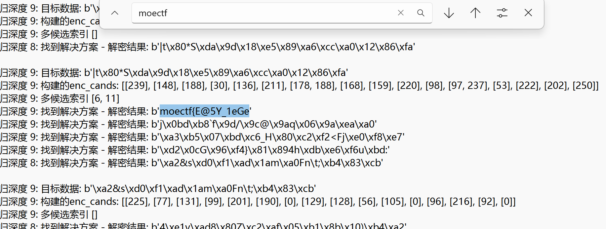
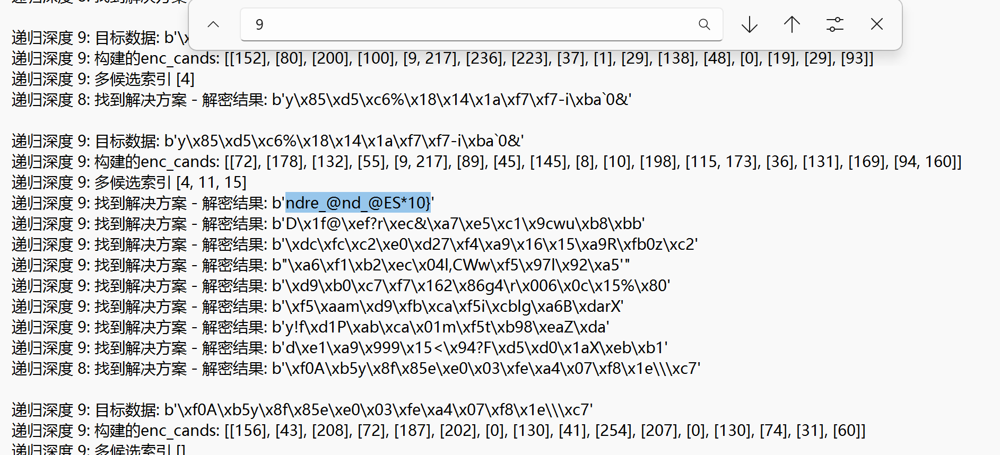

前言:这次比赛Crypto方向的题目数量较去年增加了点，覆盖的知识点比较全面，难度梯度设置合理，感觉比去年简单，非常适合新生作为进阶练习，个人认为这是一次很有价值的比赛(๑´ڡ`๑)

# Crypto入门指北

```python
#!/usr/bin/env python3
from Crypto.PublicKey import ElGamal
from Crypto.Random import get_random_bytes, random
from Crypto.Util.number import *
from random import *
from secret import flag

def generate_elgamal_keypair(bits=512):
    p = getPrime(bits)
    
    for _ in range(1000):
        g = getRandomRange(2, 5)
        if pow(g, (p - 1) // 2, p) != 1:
            break
            
    x = randrange(2, p - 1)
    y = pow(g, x, p)
    return p, g, y, x

key=generate_elgamal_keypair(bits=512)
p, g, y ,x= key

print("=== 公钥 (p, g, y) ===")
print("p =", p)
print("g =", g)
print("y =", y)
print()

k = randrange(1, p - 2)
m = bytes_to_long(flag)
c1 = pow(g, k, p)
c2 = (m * pow(y, k, p)) % p

print("=== 密文 (c1, c2) ===")
print("c1 =", c1)
print("c2 =", c2)
#不小心把x输出了()
print("x =", x)

"""
=== 公钥 (p, g, y) ===
p=11540963715962144951763578255357417528966715904849014985547597657698304891044841099894993117258279094910424033273299863589407477091830213468539451196239863
g=2
y=8313424783366011287014623582773521595333285291380540689467073212212931648415580065207081449784135835711205324186662482526357834042013400765421925274271853
=== 密文 (c1, c2) ===
c1=6652053553055645358275362259554856525976931841318251152940464543175108560132949610916012490837970851191204144757409335011811874896056430105292534244732863
c2=2314913568081526428247981719100952331444938852399031826635475971947484663418362533363591441216570597417789120470703548843342170567039399830377459228297983
x=8010957078086554284020959664124784479610913596560035011951143269559761229114027738791440961864150225798049120582540951874956255115884539333966429021004214
"""
```

## 思路

- ElGamal加密中,密文 $(c_1​,c_2​)$ 与明文 $m$ 的关系为 $c_1​ = g^k \bmod p$ , $c_2​=m⋅y^k \bmod p$
- 其中公钥 $y=g^x \bmod p$ ,因此 $y^k=(g^x)^k=(g^k)^x=c_1^x​ \bmod p$
- 联立可得明文计算公式 $m=c_2​⋅(c_1^x​)^{−1} \bmod p$
- 求 $c_1^x​$ 的模逆是根据费马小定理 $a^{p−1} \equiv 1 \pmod p$ 对等式两边同时除以 $a$ 得 $a^{p−2} \equiv a^{-1} \pmod p$

## 解答

```python
from Crypto.Util.number import *

p=
g=
y=
c1=
c2=
x=
a = pow(c1, x, p)
inv_c1 = pow(a, p-2, p)
m = (c2 * inv_c1) % p
flag = long_to_bytes(m)
print(flag)
#moectf{th1s_1s_y0ur_f1rst_ElG@m@l}
```

---

# ez_DES

```python
from Crypto.Cipher import DES
import secrets
import string

flag = 'moectf{???}'
characters = string.ascii_letters + string.digits + string.punctuation
key = 'ezdes'+''.join(secrets.choice(characters) for _ in range(3))
assert key[:5] == 'ezdes'
key = key.encode('utf-8')
l = 8

def encrypt(text, key):
    cipher = DES.new(key, DES.MODE_ECB)
    padded_text = text + (l - len(text) % l) * chr(len(text))
    data = cipher.encrypt(padded_text.encode('utf-8'))
    return data

c = encrypt(flag, key)
print('c =', c)

# c = b'\xe6\x8b0\xc8m\t?\x1d\xf6\x99sA>\xce \rN\x83z\xa0\xdc{\xbc\xb8X\xb2\xe2q\xa4"\xfc\x07'
```

## 思路

- $\text{key}$ 格式固定`ezdesXXX`,最后 $3$ 位是任意字符,长度固定为 $8$ 字节
- 枚举筛选

## 解答

```python
from Crypto.Cipher import DES
import string
import itertools

c = b'\xe6\x8b0\xc8m\t?\x1d\xf6\x99sA>\xce \rN\x83z\xa0\xdc{\xbc\xb8X\xb2\xe2q\xa4"\xfc\x07'
charset = string.ascii_letters + string.digits + string.punctuation

for k3 in itertools.product(charset, repeat=3):
    key = ("ezdes" + "".join(k3)).encode()
    cipher = DES.new(key, DES.MODE_ECB)
    pt = cipher.decrypt(c)
    if pt.startswith(b"moectf{"):
        print("Key:", key.decode())
        print("Plaintext:", pt)
        break
# Key: ezdes8br
# Plaintext: moectf{_Ju5t envmEra+e.!}
```

---

# baby_next

```python
from Crypto.Util.number import *
from gmpy2 import next_prime
from functools import reduce
from secret import flag

assert len(flag) == 38
assert flag[:7] == b'moectf{'
assert flag[-1:] == b'}'

def main():
    p = getPrime(512)
    q = int(reduce(lambda res, _: next_prime(res), range(114514), p))

    n = p * q
    e = 65537

    m = bytes_to_long(flag)

    c = pow(m, e, n)

    print(f'{n = }')
    print(f'{c = }')

if __name__ == '__main__':
    main()

"""
n = 96742777571959902478849172116992100058097986518388851527052638944778038830381328778848540098201307724752598903628039482354215330671373992156290837979842156381411957754907190292238010742130674404082688791216045656050228686469536688900043735264177699512562466087275808541376525564145453954694429605944189276397
c = 17445962474813629559693587749061112782648120738023354591681532173123918523200368390246892643206880043853188835375836941118739796280111891950421612990713883817902247767311707918305107969264361136058458670735307702064189010952773013588328843994478490621886896074511809007736368751211179727573924125553940385967
"""
```

## 思路

- $q$ 为 $p$ 的下 $114514$ 个素数
- $p$ 和 $q$ 非常接近,费马定理分解 $n$

## 解答

```python
from Crypto.Util.number import *
from gmpy2 import *

def fermat_attack(n):
    a = isqrt(n)
    b2 = a*a - n
    b = isqrt(n)
    count = 0
    while b*b != b2:
        a = a + 1
        b2 = a*a - n
        b = isqrt(b2)
        count += 1
    p = a+b
    q = a-b
    assert n == p * q
    return p, q

n = 
c = 
e = 65537

p, q = fermat_attack(n)
phi = (p-1)*(q-1)
d = invert(e, phi)
m = pow(c, d, n)
print(long_to_bytes(m))
#moectf{vv0W_p_m1nu5_q_i5_r34l1y_sm4lI}
```

---

# ez_square

```python
from Crypto.Util.number import *
from secret import flag

assert len(flag) == 35
assert flag[:7] == b'moectf{'
assert flag[-1:] == b'}'

def main():
    p = getPrime(512)
    q = getPrime(512)

    n = p * q
    e = 65537

    m = bytes_to_long(flag)

    c = pow(m, e, n)
    hint = pow(p + q, 2, n)

    print(f'{n = }')
    print(f'{c = }')
    print(f'{hint = }')

if __name__ == '__main__':
    main()

"""
n = 83917281059209836833837824007690691544699901753577294450739161840987816051781770716778159151802639720854808886223999296102766845876403271538287419091422744267873129896312388567406645946985868002735024896571899580581985438021613509956651683237014111116217116870686535030557076307205101926450610365611263289149
c = 69694813399964784535448926320621517155870332267827466101049186858004350675634768405333171732816667487889978017750378262941788713673371418944090831542155613846263236805141090585331932145339718055875857157018510852176248031272419248573911998354239587587157830782446559008393076144761176799690034691298870022190
hint = 5491796378615699391870545352353909903258578093592392113819670099563278086635523482350754035015775218028095468852040957207028066409846581454987397954900268152836625448524886929236711403732984563866312512753483333102094024510204387673875968726154625598491190530093961973354413317757182213887911644502704780304
"""
```

## 思路

- 这个 $hint$ 是 $(p+q)^2 \bmod n$ 的值,那么 $hint-n$ 就是 $(p^2+q^2) \bmod n$ ,但因为其对 $n$ 取余了,所以 $hint$ 可能比 $n$ 小
- 那我们尝试 $x \cdot n + hint$ 再开平方得到 $p+q$ ,最后 $hint-4 \cdot n$ 开方得到 $p-q$ 即可求解

## 解答

```python
from gmpy2 import *
from Crypto.Util.number import *

n = 
c = 
hint = 
e = 65537

for x in range(10000):
    ss = x*n + hint #(p+q)^2
    s = gmpy2.isqrt(ss) #p+q
    if s * s != ss:
        continue
    D = s * s - 4 * n #(p-q)^2
    if D < 0:
        continue
    sqrt_D = gmpy2.isqrt(D) #p-q
    p = (s + sqrt_D) // 2
    q = (s - sqrt_D) // 2
    assert p * q == n
    #print(f"x = {x}") #4
    phi = (p - 1) * (q - 1)
    d = inverse(e, phi)
    m = pow(c, d, n)
    flag = long_to_bytes(m)
    print(flag)
    break
#moectf{Ma7hm4t1c5_is_@_k1nd_0f_a2t}
```

---

# ezBSGS

西小电注意到，第一周的题目中出现了若干神秘数字，并且他还发现这些神秘数字与神秘Flag有关，具体地，$x$ 是能够满足神秘式子 $13^x=114514 \bmod 100000000000099$ 的最小整数，flag内容即为 $x$ ，你能帮助西小电求出正确的Flag吗？
_“好奇怪的标题啊，BSGS是什么？北上广深吗？”_

## 思路

- **离散对数**
- 形如 $y \equiv g^x \bmod p$ 的式子,其中 $x$ 满足 $0<e<(p-1)$ ,此时我们称 $x$ 是 $y$ 以 $g$ 作为基底模 $p$ 的离散对数,而DLP问题就是求这个指数(离散对数) $x$ 的问题

## 解答

```python
def babystep_giantstep(g, y, p):
    m = int((p-1)**0.5 + 0.5)
    # Baby step
    table = {}
    gr = 1  # g^r
    for r in range(m):
        table[gr] = r
        gr = (gr * g) % p
    # Giant step
    gm = pow(g, -m, p)  # gm = g^{-m}
    ygqm = y            # ygqm = y * g^{-qm}
    for q in range(m):
        if ygqm in table: # 当右边和左边相等时
            return q * m + table[ygqm]
        ygqm = (ygqm * gm) % p
    return None

g = 13
y = 114514
p = 100000000000099
x = babystep_giantstep(g, y, p)
print(x)
print(pow(g, x, p) == y)
#18272162371285
#moectf{18272162371285}
```

---

# ezAES

```python
from secret import flag

rc = [0x12, 0x23, 0x34, 0x45, 0x56, 0x67, 0x78, 0x89, 0x9a, 0xab, 0xbc, 0xcd, 0xde, 0xef,0xf1]

s_box = [
    [0x63, 0x7c, 0x77, 0x7b, 0xf2, 0x6b, 0x6f, 0xc5, 0x30, 0x01, 0x67, 0x2b, 0xfe, 0xd7, 0xab, 0x76],
    [0xca, 0x82, 0xc9, 0x7d, 0xfa, 0x59, 0x47, 0xf0, 0xad, 0xd4, 0xa2, 0xaf, 0x9c, 0xa4, 0x72, 0xc0],
    [0xb7, 0xfd, 0x93, 0x26, 0x36, 0x3f, 0xf7, 0xcc, 0x34, 0xa5, 0xe5, 0xf1, 0x71, 0xd8, 0x31, 0x15],
    [0x04, 0xc7, 0x23, 0xc3, 0x18, 0x96, 0x05, 0x9a, 0x07, 0x12, 0x80, 0xe2, 0xeb, 0x27, 0xb2, 0x75],
    [0x09, 0x83, 0x2c, 0x1a, 0x1b, 0x6e, 0x5a, 0xa0, 0x52, 0x3b, 0xd6, 0xb3, 0x29, 0xe3, 0x2f, 0x84],
    [0x53, 0xd1, 0x00, 0xed, 0x20, 0xfc, 0xb1, 0x5b, 0x6a, 0xcb, 0xbe, 0x39, 0x4a, 0x4c, 0x58, 0xcf],
    [0xd0, 0xef, 0xaa, 0xfb, 0x43, 0x4d, 0x33, 0x85, 0x45, 0xf9, 0x02, 0x7f, 0x50, 0x3c, 0x9f, 0xa8],
    [0x51, 0xa3, 0x40, 0x8f, 0x92, 0x9d, 0x38, 0xf5, 0xbc, 0xb6, 0xda, 0x21, 0x10, 0xff, 0xf3, 0xd2],
    [0xcd, 0x0c, 0x13, 0xec, 0x5f, 0x97, 0x44, 0x17, 0xc4, 0xa7, 0x7e, 0x3d, 0x64, 0x5d, 0x19, 0x73],
    [0x60, 0x81, 0x4f, 0xdc, 0x22, 0x2a, 0x90, 0x88, 0x46, 0xee, 0xb8, 0x14, 0xde, 0x5e, 0x0b, 0xdb],
    [0xe0, 0x32, 0x3a, 0x0a, 0x49, 0x06, 0x24, 0x5c, 0xc2, 0xd3, 0xac, 0x62, 0x91, 0x95, 0xe4, 0x79],
    [0xe7, 0xc8, 0x37, 0x6d, 0x8d, 0xd5, 0x4e, 0xa9, 0x6c, 0x56, 0xf4, 0xea, 0x65, 0x7a, 0xae, 0x08],
    [0xba, 0x78, 0x25, 0x2e, 0x1c, 0xa6, 0xb4, 0xc6, 0xe8, 0xdd, 0x74, 0x1f, 0x4b, 0xbd, 0x8b, 0x8a],
    [0x70, 0x3e, 0xb5, 0x66, 0x48, 0x03, 0xf6, 0x0e, 0x61, 0x35, 0x57, 0xb9, 0x86, 0xc1, 0x1d, 0x9e],
    [0xe1, 0xf8, 0x98, 0x11, 0x69, 0xd9, 0x8e, 0x94, 0x9b, 0x1e, 0x87, 0xe9, 0xce, 0x55, 0x28, 0xdf],
    [0x8c, 0xa1, 0x89, 0x0d, 0xbf, 0xe6, 0x42, 0x68, 0x41, 0x99, 0x2d, 0x0f, 0xb0, 0x54, 0xbb, 0x16]
]

s_box_inv = [
    [0x52, 0x09, 0x6a, 0xd5, 0x30, 0x36, 0xa5, 0x38, 0xbf, 0x40, 0xa3, 0x9e, 0x81, 0xf3, 0xd7, 0xfb],
    [0x7c, 0xe3, 0x39, 0x82, 0x9b, 0x2f, 0xff, 0x87, 0x34, 0x8e, 0x43, 0x44, 0xc4, 0xde, 0xe9, 0xcb],
    [0x54, 0x7b, 0x94, 0x32, 0xa6, 0xc2, 0x23, 0x3d, 0xee, 0x4c, 0x95, 0x0b, 0x42, 0xfa, 0xc3, 0x4e],
    [0x08, 0x2e, 0xa1, 0x66, 0x28, 0xd9, 0x24, 0xb2, 0x76, 0x5b, 0xa2, 0x49, 0x6d, 0x8b, 0xd1, 0x25],
    [0x72, 0xf8, 0xf6, 0x64, 0x86, 0x68, 0x98, 0x16, 0xd4, 0xa4, 0x5c, 0xcc, 0x5d, 0x65, 0xb6, 0x92],
    [0x6c, 0x70, 0x48, 0x50, 0xfd, 0xed, 0xb9, 0xda, 0x5e, 0x15, 0x46, 0x57, 0xa7, 0x8d, 0x9d, 0x84],
    [0x90, 0xd8, 0xab, 0x00, 0x8c, 0xbc, 0xd3, 0x0a, 0xf7, 0xe4, 0x58, 0x05, 0xb8, 0xb3, 0x45, 0x06],
    [0xd0, 0x2c, 0x1e, 0x8f, 0xca, 0x3f, 0x0f, 0x02, 0xc1, 0xaf, 0xbd, 0x03, 0x01, 0x13, 0x8a, 0x6b],
    [0x3a, 0x91, 0x11, 0x41, 0x4f, 0x67, 0xdc, 0xea, 0x97, 0xf2, 0xcf, 0xce, 0xf0, 0xb4, 0xe6, 0x73],
    [0x96, 0xac, 0x74, 0x22, 0xe7, 0xad, 0x35, 0x85, 0xe2, 0xf9, 0x37, 0xe8, 0x1c, 0x75, 0xdf, 0x6e],
    [0x47, 0xf1, 0x1a, 0x71, 0x1d, 0x29, 0xc5, 0x89, 0x6f, 0xb7, 0x62, 0x0e, 0xaa, 0x18, 0xbe, 0x1b],
    [0xfc, 0x56, 0x3e, 0x4b, 0xc6, 0xd2, 0x79, 0x20, 0x9a, 0xdb, 0xc0, 0xfe, 0x78, 0xcd, 0x5a, 0xf4],
    [0x1f, 0xdd, 0xa8, 0x33, 0x88, 0x07, 0xc7, 0x31, 0xb1, 0x12, 0x10, 0x59, 0x27, 0x80, 0xec, 0x5f],
    [0x60, 0x51, 0x7f, 0xa9, 0x19, 0xb5, 0x4a, 0x0d, 0x2d, 0xe5, 0x7a, 0x9f, 0x93, 0xc9, 0x9c, 0xef],
    [0xa0, 0xe0, 0x3b, 0x4d, 0xae, 0x2a, 0xf5, 0xb0, 0xc8, 0xeb, 0xbb, 0x3c, 0x83, 0x53, 0x99, 0x61],
    [0x17, 0x2b, 0x04, 0x7e, 0xba, 0x77, 0xd6, 0x26, 0xe1, 0x69, 0x14, 0x63, 0x55, 0x21, 0x0c, 0x7d]
]

def sub_bytes(grid):
    for i, v in enumerate(grid):
        grid[i] = s_box[v >> 4][v & 0xf]

def shift_rows(grid):
    for i in range(4):
        grid[i::4] = grid[i::4][i:] + grid[i::4][:i]
        grid =grid[0::4]+grid[1::4]+grid[2::4]+grid[3::4]

def mix_columns(grid):
    def mul_by_2(n):
        s = (n << 1) & 0xff
        if n & 128:
            s ^= 0x1b
        return s

    def mul_by_3(n):
        return n ^ mul_by_2(n)

    def mix_column(c):
        return [
            mul_by_2(c[0]) ^ mul_by_3(c[1]) ^ c[2] ^ c[3],  # [2 3 1 1]
            c[0] ^ mul_by_2(c[1]) ^ mul_by_3(c[2]) ^ c[3],  # [1 2 3 1]
            c[0] ^ c[1] ^ mul_by_2(c[2]) ^ mul_by_3(c[3]),  # [1 1 2 3]
            mul_by_3(c[0]) ^ c[1] ^ c[2] ^ mul_by_2(c[3]),  # [3 1 1 2]
        ]

    for i in range(0, 16, 4):
        grid[i:i + 4] = mix_column(grid[i:i + 4])

def key_expansion(grid):
    for i in range(10 * 4):
        r = grid[-4:]
        if i % 4 == 0:  # 对上一轮最后4字节自循环、S-box置换、轮常数异或，从而计算出当前新一轮最前4字节
            for j, v in enumerate(r[1:] + r[:1]):
                r[j] = s_box[v >> 4][v & 0xf] ^ (rc[i // 4] if j == 0 else 0)

        for j in range(4):
            grid.append(grid[-16] ^ r[j])
    return grid

def add_round_key(grid, round_key):
    for i in range(16):
        grid[i] ^= round_key[i]

def encrypt(b, expanded_key):
    # First round
    add_round_key(b, expanded_key)

    for i in range(1, 10):
        sub_bytes(b)
        shift_rows(b)
        mix_columns(b)
        add_round_key(b, expanded_key[i * 16:])

    # Final round
    sub_bytes(b)
    shift_rows(b)
    add_round_key(b, expanded_key[-16:])
    return b

def aes(key, msg):
    expanded = key_expansion(bytearray(key))

    # Pad the message to a multiple of 16 bytes
    b = bytearray(msg + b'\x00' * (16 - len(msg) % 16))
    # Encrypt the message
    for i in range(0, len(b), 16):
        b[i:i + 16] = encrypt(b[i:i + 16], expanded)
    return bytes(b)

if __name__ == '__main__':
    key = b'Slightly different from the AES.'
    enc = aes(key, flag)

    print('Encrypted:', enc)
    #Encrypted: b'%\x98\x10\x8b\x93O\xc7\xf02F\xae\xedA\x96\x1b\xf9\x9d\x96\xcb\x8bT\r\xd31P\xe6\x1a\xa1j\x0c\xe6\xc8'
```

## 思路

### 代码分析

- 这段自定义加密代码实现了类似**AES加密**的效果
- 加密密钥为 $32$ 字节字符串`Slightly different from the AES.`
- 通过`key_expansion`生成轮密钥,共生成 $11$ 轮密钥
- 明文被转换为字节序列后,用`\x00`填充至  字节的整数倍(通过`bytearray`)
- 明文被分成 $16$ 字节的块,每块独立加密;单块加密流程为<font color="#d99694">初始轮 → 9轮中间轮 → 1轮最后轮</font>
---
- **初始一轮:** 仅<font color="#d99694">add_round_key</font>
    - 功能: 将明文块与第 $1$ 轮密钥(扩展后的前 $16$ 字节)进行异或操作
---
- **中间九轮:** $4$ 步操作循环(每轮执行<font color="#d99694">sub_bytes → shift_rows → mix_columns → add_round_key</font>)
    - `sub_bytes`用 $\text{s\_box}$ 替换块中每个字节实现非线性变换
    - `shift_rows`每次移位后强制将矩阵转为行主序存储(先存第一行,再第二行...),导致后续`mix_columns`实际操作的是行(用固定系数矩阵混合行内字节),而非标准AES的列
    - `add_round_key`用当前轮的密钥(扩展后的第 $i*16$ 至 $(i+1)*16$ 字节)与块中每个字节异或
---
- **最后一轮:** 执行<font color="#d99694">sub_bytes → shift_rows → add_round_key</font>

### 逆向求解

- AES是对称加密,解密逻辑就是把加密过程反过来
- 需要注意的是`mix_columns`实现的矩阵混淆在解密时是通过它的逆矩阵实现

```python
import galois
import numpy as np

GF = galois.GF(2**8, repr="poly")
A = GF([[2, 3, 1, 1],
        [1, 2, 3, 1],
        [1, 1, 2, 3],
        [3, 1, 1, 2]])
B = np.linalg.inv(A)
print(B.view(np.ndarray).astype(int))
'''
[[14 11 13  9]
 [ 9 14 11 13]
 [13  9 14 11]
 [11 13  9 14]]
'''
```

## 解答

```python
rc = []
s_box = []
s_box_inv = []

def add_round_key(grid, round_key):
    for i in range(16):
        grid[i] ^= round_key[i]

def mul_by_2(n):
    s = (n << 1) & 0xff
    if n & 128:
        s ^= 0x1b
    return s

def mul_by_9(n):
    return mul_by_2(mul_by_2(mul_by_2(n))) ^ n

def mul_by_11(n):
    return mul_by_2(mul_by_2(mul_by_2(n)) ^ n) ^ n

def mul_by_13(n):
    return mul_by_2(mul_by_2(mul_by_2(n) ^ n)) ^ n

def mul_by_14(n):
    return mul_by_2(mul_by_2(mul_by_2(n) ^ n) ^ n)

def inv_mix_columns(grid):
    def mix_column(c):
        return [
            mul_by_14(c[0]) ^ mul_by_11(c[1]) ^ mul_by_13(c[2]) ^ mul_by_9(c[3]),
            mul_by_9(c[0]) ^ mul_by_14(c[1]) ^ mul_by_11(c[2]) ^ mul_by_13(c[3]),
            mul_by_13(c[0]) ^ mul_by_9(c[1]) ^ mul_by_14(c[2]) ^ mul_by_11(c[3]),
            mul_by_11(c[0]) ^ mul_by_13(c[1]) ^ mul_by_9(c[2]) ^ mul_by_14(c[3]),
        ]
    for i in range(0, 16, 4):
        grid[i:i+4] = mix_column(grid[i:i+4])

def key_expansion(grid):
    for i in range(10 * 4):
        r = grid[-4:]
        if i % 4 == 0:
            for j, v in enumerate(r[1:] + r[:1]):
                r[j] = s_box[v >> 4][v & 0xf] ^ (rc[i // 4] if j == 0 else 0)
        for j in range(4):
            grid.append(grid[-16] ^ r[j])
    return grid

def inv_sub_bytes(grid):
    for i, v in enumerate(grid):
        grid[i] = s_box_inv[v >> 4][v & 0xf]

def decrypt_block_buggyAES(b, expanded_key):
    add_round_key(b, expanded_key[-16:])
    inv_sub_bytes(b)

    for i in range(9, 0, -1):
        add_round_key(b, expanded_key[i*16:(i+1)*16])
        inv_mix_columns(b)
        inv_sub_bytes(b)

    add_round_key(b, expanded_key[0:16])
    return b

def decrypt_buggyAES(key, ct):
    expanded = key_expansion(bytearray(key))
    b = bytearray(ct)
    for i in range(0, len(b), 16):
        b[i:i+16] = decrypt_block_buggyAES(b[i:i+16], expanded)
    return bytes(b).rstrip(b"\x00")

enc = b'%\x98\x10\x8b\x93O\xc7\xf02F\xae\xedA\x96\x1b\xf9\x9d\x96\xcb\x8bT\r\xd31P\xe6\x1a\xa1j\x0c\xe6\xc8'
key = b'Slightly different from the AES.'

pt = decrypt_buggyAES(key, enc)
print(pt)
#moectf{Th1s_1s_4n_E4ZY_AE5_!@#}
```

---

# ez_det

```python
from random import randrange
from Crypto.Util.number import *
from sage.all import *
from secret import flag

m_blocks = [bytes_to_long(flag), 0, 0, 0, 0]
p = getPrime(128)

def make_mask(n, p):
    upper = identity_matrix(n)
    low   = identity_matrix(n)
    for i in range(n-1):
        for j in range(i+1, n):
            upper[i, j] = randrange(1, p)
            low[j, i]   = randrange(1, p)
    result = upper * low
    assert det(result) == 1
    return result

def matrix_to_list(mat):
    return [list(row) for row in mat]

Noise = [[randrange(1, p) for _ in range(5)] for _ in range(4)]
Noise.append(m_blocks)

M = matrix(Noise)
A = make_mask(5, p)
C = A * M

print(f"Noise1={Noise[:4]}")
print(f"C={matrix_to_list(C)}")
'''  
Noise1=[[188812369255757304700348466434858375423, 76227193101418053889793512137074274620, 182929943832562556837712357618449460966, 64089028822730485232228634757000880362, 105507998932915134646335608660824492778], [4164794451584365777414445214789654548, 218757364601017507642266976969178375594, 80900478205358595781985716970856912691, 8764894144288116721496194715688099729, 79843254020740598090548214477874901303], [117987853743114490372656147763454194438, 50462363711517823694719231238846607862, 223281008935308694936858040719274425965, 195686161149314741102381604090940280685, 255190262449767615741787613735615935193], [307996560867129103907440061301439467482, 244201634915439060595306901855401348278, 274311101173570181270086450310341285623, 107302772162122998219258251480409135045, 315856112749570024634898328181978603678]]
C=[[7549095046255750332237801728336040859334772097519102730041282718732588591286097116869332416391022019738347242276278766698156906555705385851, 32678071039005558259592443246596641034769961322822499350366597948506472312915956551829187426906905768184753514179380, 31986323782328762703818368292112429682487091705728337251517881966706448578725743041694735758215711997792479769768416, 14436850250809986882782230577460631764129797817847230901081280722327130562429243257968190463942277773451746453462582, 31121292454052422843719847188102625117398366197500933959853889186763173066605507892602645982827425901283104778292221], [7706938594218644198645262655888361646573462940640081908275744852516151826239618763929906370800935778758096453251327285086629846779468981315, 26330878424043569869214392883993117044708778826827450051713283720472446757085846592062228494046203274166331743213602, 24857177273083291760656086063531873337958479151212324100479828413230261594714770234719748627881602969003382340380303, 10701204334950696222836110814413459387113860196518011873575984392967690319665313155329101129794370494393952679549077, 24572394800395786579595451015986631185722061305759568372474188631404251754512686224709746129129276120602728383257777], [11413455295705082653945547551313333546335036834235413197142176083174466031786153627000022789417263202077931290945822526991594782041300524125, 25471180545905160889030953371219380924922739584058682948172053287466750144384688090173028639859506036824244304812158, 23570951485381148259743320056649061955890256395181599806489281180362961403987830105788981766739476950908584368018627, 8841273587596585448471713556252655344096448791123375053031642275508541897721478004315380581332333817343578483340851, 23502822195946748272231324934092148411160563639610181086553014413960808728166902969170101670012466997233946213819590], [7421950296415236255036285581661337216129672288628712160389173037334393744768886600555189991422762979394744362636715364094486754236805831283, 16457769281700732267826820071355765748300396519230181861693252076848397846956971602019313162032913030284068627192114, 15232356277146271770603816377269797778450646710986085702474591663364338830922301462505542520099289082804882409151229, 5693502364474910323896757819607564638117454538178679511671477570223524538553118891790661947619622326354006014535725, 15181756068875350357539670338144919822125852732174677771977932249778796486753690167705637589507167437374977859311864], [59840522766444025407946425909283435223280191210362668490197896687634499232220940811715879746607366608, 132693089828716473864848325625146553043330396013143903078592425572668035653388, 122813024364958858827663640077111626536436424651790581462109994081368873477982, 45904667136712185617747319952029678281659955585596441487265034839694031397236, 122405053037464876158961757478015519072596230291468407215303518565294845901638]]
'''
```

## 思路

- 构造矩阵 $M$ ,其中前四行为随机噪声,第五行包含flag
- 生成行列式为 $1$ 的掩码矩阵 $A$ ,加密矩阵 $C = A·M$ ,其中 $A$ 是单位上三角矩阵和单位下三角矩阵的乘积(最后一行最后一列元素为 $1$)
- 根据矩阵计算公式 $C_{4,0} = \sum_{j=0}^{4} A_{4,j} M_{j,0} = \left( \sum_{j=0}^{3} A_{4,j} M_{j,0} \right) + A_{4,4} M_{4,0}$
- 其中 $A_{4,4}=1$ , $M_{4,0}=m$
- 所以 $m = C_{4,0} - \sum_{j=0}^{3} A_{4,j} M_{j,0}$

## 解答

```python
from Crypto.Util.number import *
from sage.all import *

N0 = [188812369255757304700348466434858375423, 76227193101418053889793512137074274620, 182929943832562556837712357618449460966, 64089028822730485232228634757000880362, 105507998932915134646335608660824492778]
N1 = [4164794451584365777414445214789654548, 218757364601017507642266976969178375594, 80900478205358595781985716970856912691, 8764894144288116721496194715688099729, 79843254020740598090548214477874901303]
N2 = [117987853743114490372656147763454194438, 50462363711517823694719231238846607862, 223281008935308694936858040719274425965, 195686161149314741102381604090940280685, 255190262449767615741787613735615935193]
N3 = [307996560867129103907440061301439467482, 244201634915439060595306901855401348278, 274311101173570181270086450310341285623, 107302772162122998219258251480409135045, 315856112749570024634898328181978603678]
C4 = [59840522766444025407946425909283435223280191210362668490197896687634499232220940811715879746607366608, 132693089828716473864848325625146553043330396013143903078592425572668035653388, 122813024364958858827663640077111626536436424651790581462109994081368873477982, 45904667136712185617747319952029678281659955585596441487265034839694031397236, 122405053037464876158961757478015519072596230291468407215303518565294845901638]

A_coeff = Matrix([
    [N0[1], N1[1], N2[1], N3[1]],
    [N0[2], N1[2], N2[2], N3[2]],
    [N0[3], N1[3], N2[3], N3[3]],
    [N0[4], N1[4], N2[4], N3[4]]
])
bd = vector([C4[1], C4[2], C4[3], C4[4]])
x = A_coeff.solve_right(bd)

a = int(x[0])
b = int(x[1])
c = int(x[2])
d = int(x[3])
term = a * N0[0] + b * N1[0] + c * N2[0] + d * N3[0]
m = C4[0] - term
print(long_to_bytes(m))
#moectf{D0_Y0u_kn0w_wh@7_4_de7erm1n@n7_1s!}
```

---

# ezlegendre

```python
from Crypto.Util.number import getPrime, bytes_to_long
from secret import flag

p = 258669765135238783146000574794031096183
a = 144901483389896508632771215712413815934

def encrypt_flag(flag):
    ciphertext = []
    plaintext = ''.join([bin(i)[2:].zfill(8) for i in flag])
    for b in plaintext:
        e = getPrime(16)
        d = randint(1,10)
        n = pow(a+int(b)*d, e, p)
        ciphertext.append(n)
    return ciphertext

print(encrypt_flag(flag))
#
```
[下载附件 ezlegeendre.txt](/assets/md/ezlegeendre.txt)

## 思路

**加密**
- 把 $flag$ 转成二进制串(每字节补到 $8$ 位)
- 对每一位 $b$
    - 生成 $16$ 位质数 $e$
    - 随机 $d$ 在 $1$ 到 $10$
    - 计算
        $n = (a + b \cdot d)^e \bmod p$
- $b$ 只有两种可能: $0$ 或 $1$
- 如果 $b = 0$ :
    $n \equiv a^e \pmod{p}$
- 如果 $b = 1$ :
    $n \equiv (a + d)^e \pmod{p}$
    且 $d \in [1, 10]$
---
**解密**
- 我们已知 $p$ 和 $a$ ,以及输出的每个 $n$
- $e$ 是一个 $16$ 位质数
- 可以枚举所有可能的 $e$ 和 $d$ ,验证
    - 如果某个 $e$ 满足 $a^e \equiv n \pmod p$ ,那该位是 $0$
    - 如果某个 $e,d$ 满足 $(a+d)^e \equiv n \pmod p$ ,那该位是 $1$

## 解答

```python
from Crypto.Util.number import *
from sympy import primerange

p = 
a = 
cipher = 

primes_16 = list(primerange(2**15, 2**16))
bits = ""
for n in cipher:
    found = False
    for e in primes_16:
        if pow(a, e, p) == n:
            bits += "0"
            found = True
            break
    if found:
        continue
    for e in primes_16:
        for d in range(1, 11):
            if pow(a + d, e, p) == n:
                bits += "1"
                found = True
                break
        if found:
            break

flag_bytes = int(bits, 2).to_bytes(len(bits)//8, 'big')
print(flag_bytes)
#moectf{Y0u_h@v3_ju5t_s01v3d_7h1s_pr0b13m!}
```

---

# happyRSA

```python
from Crypto.Util.number import getPrime, bytes_to_long
from random import randint
from sympy import totient
from secret import flag

def power_tower_mod(a, k, m):  # a↑↑k mod m
    if k == 1:
        return a % m
    exp = power_tower_mod(a, k - 1, totient(m))
    return pow(a, int(exp), int(m))

p = getPrime(512)
q = getPrime(512)
r = 123456
n = p * q
e = 65537
n_phi= p+q-1
x=power_tower_mod(n_phi + 1, r, pow(n_phi, 3))
m = bytes_to_long(flag)
c = pow(m, e, n)

print(f"n = {n}")
print(f"e = {e}")
print(f"c = {c}")
print(f"x = {x}")

'''
n = 128523866891628647198256249821889078729612915602126813095353326058434117743331117354307769466834709121615383318360553158180793808091715290853250784591576293353438657705902690576369228616974691526529115840225288717188674903706286837772359866451871219784305209267680502055721789166823585304852101129034033822731
e = 65537
c = 125986017030189249606833383146319528808010980928552142070952791820726011301355101112751401734059277025967527782109331573869703458333443026446504541008332002497683482554529670817491746530944661661838872530737844860894779846008432862757182462997411607513582892540745324152395112372620247143278397038318619295886
x = 522964948416919148730075013940176144502085141572251634384238148239059418865743755566045480035498265634350869368780682933647857349700575757065055513839460630399915983325017019073643523849095374946914449481491243177810902947558024707988938268598599450358141276922628627391081922608389234345668009502520912713141
'''
```

## 思路

- $\text{power\_tower\_mod(a, k, m)}$ 表示计算 $a$ 的 $k$ 次幂塔模 $m$
- 即 $a↑↑k \bmod m = a^{a^{a^{...^a}}} \bmod m$ (共 $k$ 层指数)
- 对于 $x$ ,令 $t = \text{n\_phi}$ ,则 $a = t + 1$ ,目标为计算 $a↑↑r \bmod {t^3}$
---
- 我们假设 $r=2$ ,则 $(t+1)^{(t+1)} \bmod t^3$
- 由**二项式定理**展开得
$$(t + 1)^{t+1} = \sum_{k=0}^{t+1} \dbinom{t + 1}{k} t^k$$
- 模 $t^3$ 时, $k \ge 3$ 的项都是 $t^3$ 的倍数要舍去
$$(t + 1)^{t+1} \equiv \dbinom{t + 1}{0} t^0 + \dbinom{t + 1}{1} t^1 + \dbinom{t + 1}{2} t^2 \pmod{t^3}$$
- 代入组合数公式 $\dbinom{n}{k} = \frac{n!}{k!(n - k)!}$ 得
$$\dbinom{t + 1}{0} = 1, \quad \dbinom{t + 1}{1} = t + 1, \quad \dbinom{t + 1}{2} = \frac{(t + 1)t}{2}$$
- 于是
$$(t + 1)^{t+1} \equiv 1 + (t + 1)t + \frac{(t + 1)t}{2} t^2 \pmod{t^3}$$
- 最后一项包含 $t^3$ 要舍去
- 所以最终得到
$$(t + 1)^{t + 1} \equiv 1 + t + t^2 \pmod{t^3}$$
- 通过**数学归纳法**可证当 $r \ge 2$ 时,无论 $t$ 为何值,幂塔模 $t^3$ 的结果恒为上述等式
---
- 最后我们通过 $x$ 推出 $\text{n\_phi}$
- 由 $x = t^2 + t + 1$ 得二次方程 $t^2 + t + (1 - x) = 0$
- 计算判别式 $D=b^2-4ac=1 - 4(1 - x) = 4x - 3$
- 最后根据求根公式 $x = \frac{-b \pm \sqrt{b^2 - 4ac}}{2a}$ 求出 $\text{n\_phi}$
- :spoiler[多么美妙的数学推理σ ﾟ∀ ﾟ) ﾟ∀ﾟ)σ]

## 解答

```python
from math import isqrt
from Crypto.Util.number import *

n = 
e = 
c = 
x = 

D = 4*x - 3
s = isqrt(D)
if s * s != D:
    raise None

n_phi = (s - 1) // 2
phi = n - n_phi
d = inverse(e, phi)
m = pow(c, d, n)
flag = long_to_bytes(m)

print(flag.decode())
#moectf{rsa_and_s7h_e1se}
```

---

# 杂交随机数

```python
from Crypto.Util.number import bytes_to_long

def lfsr(data, mask):
    mask = mask.zfill(len(data))
    res_int = int(data, base=2)^int(mask, base=2)
    bit = 0
    while res_int > 0:
        bit ^= res_int % 2
        res_int >>= 1

    res = data[1:]+str(bit)
    return res

def lcg(x, a, b, m):
    return (a*x+b)%m

flag = b'moectf{???}'

x = bin(bytes_to_long(flag))[2:].zfill(len(flag)*8)
l = len(x)//2
L, R = x[:l], x[l:]
b = -233
m = 1<<l

for _ in range(2025):
    mask = R
    seed = int(L, base=2)
    L = lfsr(L, mask)
    R = bin(lcg(int(R, base=2), b, seed, m))[2:].zfill(l)
    L, R = R, L

en_flag = L+R
print(int(en_flag, base=2))
# en_flag = 4567941593066862873653209393990031966807270114415459425382356207107640
```

## 思路

**加密**
- $flag$ 被均分为二进制串 $\text{L}$ 和 $\text{R}$
- 加密过程进行 $2025$ 轮迭代,每轮通过`LFSR`处理 $\text{L}$ ,通过`LCG`处理 $\text{R}$ ,最后交换 $\text{L}$ 和 $\text{R}$
---
- **`LFSR`函数**
    - 计算 $\text{data(L)}$ 与 $\text{mask(R)}$ 的按位异或值 $\text{res\_int}$
    - 计算 $\text{res\_int}$ 的奇偶校验位(即所有比特异或的结果 $\text{bit}$）
    - 将 $\text{data}$ 的第一个比特移除,尾部拼接 $\text{bit}$ ,得到新的 $\text{L}$
---
- **`LCG`函数**
    - $x$ 是当前 $\text{R}$ 的整数形式, $a = -233$ , $b$ 是当前 $L$ 的整数形式, $m = 1<<l$
    - 最后结果转为二进制给 $\text{R}$
---
**解密**
- 我们可以针对 $flag$ 的长度得出 $l$ 的值
- $\text{en\_flag\_int.bit\_length()}$ 计算得 $232$ ,除以 $8$ 正好是 $29$
- 逆向时,先交换 $\text{L}$ 和 $\text{R}$ ,再逆向`LCG`,最后逆向`LFSR`,重复 $2025$ 次
- `LCG`线性可逆公式`R_prev = ( (R_new - seed) * a_inv ) % m`
- `LFSR`通过已知 $\text{L\_new}$ ,提取 $u = \text{L\_new}[:l-1]$ (前 $l-1$ 位)和 $b = \text{L\_new}[-1]$ (最后 $1$ 位); $\text{L\_prev}$ 的形式为 $b + u$ ($b$ 只能是 $0$ 或 $1$),最后通过`parity(L_prev ^ R_prev) == bit`验证(剪枝回溯法)

## 解答

```python
from Crypto.Util.number import *
from collections import deque

en_flag_int = 4567941593066862873653209393990031966807270114415459425382356207107640

def parity(x: int) -> int:
    p = 0
    while x:
        p ^= x & 1
        x >>= 1
    return p

def invert_all_with_backtracking(en_flag_int: int, total_bits: int, rounds: int = 2025, target_prefix: bytes = b"moectf{") -> bytes:
    l = total_bits // 2
    mod = 1 << l
    a = (-233) % mod
    a_inv = pow(a, -1, mod)

    bstr = bin(en_flag_int)[2:].zfill(total_bits)[-total_bits:]
    L = int(bstr[:l], 2)
    R = int(bstr[l:], 2)

    stack = [(rounds, L, R, [])]
    visited = 0

    while stack:
        depth, Ln, Rn, path = stack.pop()
        if depth == 0:
            x_bits = bin(Ln)[2:].zfill(l)[-l:] + bin(Rn)[2:].zfill(l)[-l:]
            n = int(x_bits, 2)
            data = n.to_bytes(len(x_bits) // 8, 'big')

            if data.startswith(target_prefix) and data.endswith(b'}'):
                print(f"找到有效flag! 路径访问数: {visited}")
                # 666457
                return data
            continue

        L1 = Rn
        R1 = Ln
        u = L1 >> 1
        last_bit = L1 & 1
        candidates = []

        # 尝试b=0和b=1两种可能
        for b in (0, 1):
            L0 = (b << (l - 1)) | u
            R0 = (a_inv * ((R1 - L0) % mod)) % mod

            # 检查奇偶校验条件
            if parity(L0 ^ R0) == last_bit:
                candidates.append((L0, R0, b))

        for L0, R0, b in candidates:
            stack.append((depth - 1, L0, R0, path + [b]))
        visited += 1

flag_bytes = invert_all_with_backtracking(en_flag_int, total_bits=232, rounds=2025)
flag = flag_bytes
print(f"flag: {flag}")
#moectf{I5_1t_Stream0rBlock.?}
```

---

# 沙茶姐姐的Fufu

## 题目描述

众所周知，沙茶姐姐很喜欢 Fufu，于是她趁着暑假准备大量购入 Fufu，现在有 $N(1 \leq N \leq 10^3)$ 只 Fufu 在沙茶姐姐的购物清单上，每只 Fufu 能且仅能购买**一次**，其中第 $i$ 只 Fufu 的可爱程度为 $w_i(1 \leq w_i \leq 10^9)$，每只 Fufu 还有一个“保养难度” $c_i(1 \leq c_i \leq 10^4)$，沙茶姐姐的精力 $M(1 \leq M \leq 10^4)$ 有限，也就是沙茶姐姐持有的所有 Fufu 的保养难度的总和不能大于 $M$，但她又想买入**总可爱度**尽可能多的 Fufu。现在，她把这个问题交给了你，请你帮她算算总可爱度最多可以是多少。

形式化地，你需要求出给定的 $N$ 只 Fufu 的一个子集 $S$ 在满足 $\sum_{i \in S} c_i \leq M$ 的前提下，$\sum_{i \in S} w_i$ 的最大值

由于沙茶姐姐是一种多维生物，所以你需要为所有 $T$ 个平行宇宙中的沙茶姐姐解决问题，在解决所有沙茶姐姐的问题后，所有问题答案的**异或和**就是沙茶姐姐给你的报酬——本题 Flag 的内容
## 输入格式

第一行一个整数 $T$

接下来 $T$ 组数据表示每一个子问题，每组数据第一行两个整数 $N$ 和 $M$，接下来 $N$ 行每行两个整数 $c_i$ 和 $w_i$ 描述一个 Fufu

[下载附件 in.txt](/assets/md/in.txt)

### 思路

- 非常经典的**0-1背包问题**:有 $n$ 个物品,每个物品有重量 $c_i$ 和价值 $w_i$ ,背包容量为 $M$ ,每个物品只能选或不选($0$ 或 $1$),求在不超过容量的情况下总价值最大
- 对于本题来说 Fufu 的保养难度 $c_i$ 是重量,可爱度 $w_i$ 是价值,精力 $M$ 是背包容量
- 文件首行数字为 $1145$ 表示后续需处理 $1145$ 个平行宇宙的背包问题,第一组的 $599$ $2631$ ,表示该组有 $599$ 个 Fufu 沙茶姐姐的精力上限为 $2631$ ,其后参数对应保养难度 $c_i$ 和可爱度 $w_i$
- 使用**0-1背包的动态规划算法**寻找最优解

### 解答

```python
def main():
    with open('D:\\in.txt', 'r') as f:
        data = f.read().strip().split()

    ptr = 0
    T = int(data[ptr])
    ptr += 1
    xor_sum = 0

    for _ in range(T):
        N, M = int(data[ptr]), int(data[ptr + 1])
        ptr += 2
        dp = [0] * (M + 1)

        for __ in range(N):
            c, w = int(data[ptr]), int(data[ptr + 1])
            ptr += 2
            if c > M:
                continue
            for cap in range(M, c - 1, -1):
                dp[cap] = max(dp[cap], dp[cap - c] + w)

        res = dp[M]
        print(res)
        xor_sum ^= res

    print(f"moectf{{{xor_sum}}}")

if __name__ == "__main__":
    main()
#moectf{34765768752}
```

---

# (半^3)部电台

```python
from random import choice
from Crypto.Util.number import bytes_to_long, long_to_bytes

with open('flag.txt', 'r') as file:
    flag = file.read()

class MACHINE:
    def __init__(self):
        self.alphabet = 'abcdefghijklmnopqrstuvwxyzABCDEFGHIJKLMNOPQRSTUVWXYZ ,.!?()\n'

        self.IP = [58, 50, 42, 34, 26, 18, 10, 2,
              60, 52, 44, 36, 28, 20, 12, 4,
              62, 54, 46, 38, 30, 22, 14, 6,
              64, 56, 48, 40, 32, 24, 16, 8,
              57, 49, 41, 33, 25, 17, 9, 1,
              59, 51, 43, 35, 27, 19, 11, 3,
              61, 53, 45, 37, 29, 21, 13, 5,
              63, 55, 47, 39, 31, 23, 15, 7
              ]

        self.IP_inv = [self.IP.index(i) + 1 for i in range(1, 65)]

        self.S1 = [14, 4, 13, 1, 2, 15, 11, 8, 3, 10, 6, 12, 5, 9, 0, 7,
              0, 15, 7, 4, 14, 2, 13, 1, 10, 6, 12, 11, 9, 5, 3, 8,
              4, 1, 14, 8, 13, 6, 2, 11, 15, 12, 9, 7, 3, 10, 5, 0,
              15, 12, 8, 2, 4, 9, 1, 7, 5, 11, 3, 14, 10, 0, 6, 13
              ]
        self.S2 = [15, 1, 8, 14, 6, 11, 3, 4, 9, 7, 2, 13, 12, 0, 5, 10,
              3, 13, 4, 7, 15, 2, 8, 14, 12, 0, 1, 10, 6, 9, 11, 5,
              0, 14, 7, 11, 10, 4, 13, 1, 5, 8, 12, 6, 9, 3, 2, 15,
              13, 8, 10, 1, 3, 15, 4, 2, 11, 6, 7, 12, 0, 5, 14, 9
              ]
        self.S3 = [10, 0, 9, 14, 6, 3, 15, 5, 1, 13, 12, 7, 11, 4, 2, 8,
              13, 7, 0, 9, 3, 4, 6, 10, 2, 8, 5, 14, 12, 11, 15, 1,
              13, 6, 4, 9, 8, 15, 3, 0, 11, 1, 2, 12, 5, 10, 14, 7,
              1, 10, 13, 0, 6, 9, 8, 7, 4, 15, 14, 3, 11, 5, 2, 12
              ]
        self.S4 = [7, 13, 14, 3, 0, 6, 9, 10, 1, 2, 8, 5, 11, 12, 4, 15,
              13, 8, 11, 5, 6, 15, 0, 3, 4, 7, 2, 12, 1, 10, 14, 9,
              10, 6, 9, 0, 12, 11, 7, 13, 15, 1, 3, 14, 5, 2, 8, 4,
              3, 15, 0, 6, 10, 1, 13, 8, 9, 4, 5, 11, 12, 7, 2, 14
              ]
        self.S5 = [2, 12, 4, 1, 7, 10, 11, 6, 8, 5, 3, 15, 13, 0, 14, 9,
              14, 11, 2, 12, 4, 7, 13, 1, 5, 0, 15, 10, 3, 9, 8, 6,
              4, 2, 1, 11, 10, 13, 7, 8, 15, 9, 12, 5, 6, 3, 0, 14,
              11, 8, 12, 7, 1, 14, 2, 13, 6, 15, 0, 9, 10, 4, 5, 3
              ]
        self.S6 = [12, 1, 10, 15, 9, 2, 6, 8, 0, 13, 3, 4, 14, 7, 5, 11,
              10, 15, 4, 2, 7, 12, 9, 5, 6, 1, 13, 14, 0, 11, 3, 8,
              9, 14, 15, 5, 2, 8, 12, 3, 7, 0, 4, 10, 1, 13, 11, 6,
              4, 3, 2, 12, 9, 5, 15, 10, 11, 14, 1, 7, 6, 0, 8, 13
              ]
        self.S7 = [4, 11, 2, 14, 15, 0, 8, 13, 3, 12, 9, 7, 5, 10, 6, 1,
              13, 0, 11, 7, 4, 9, 1, 10, 14, 3, 5, 12, 2, 15, 8, 6,
              1, 4, 11, 13, 12, 3, 7, 14, 10, 15, 6, 8, 0, 5, 9, 2,
              6, 11, 13, 8, 1, 4, 10, 7, 9, 5, 0, 15, 14, 2, 3, 12
              ]
        self.S8 = [13, 2, 8, 4, 6, 15, 11, 1, 10, 9, 3, 14, 5, 0, 12, 7,
              1, 15, 13, 8, 10, 3, 7, 4, 12, 5, 6, 11, 0, 14, 9, 2,
              7, 11, 4, 1, 9, 12, 14, 2, 0, 6, 10, 13, 15, 3, 5, 8,
              2, 1, 14, 7, 4, 10, 8, 13, 15, 12, 9, 0, 3, 5, 6, 11
              ]
        self.S = [self.S1, self.S2, self.S3, self.S4, self.S5, self.S6, self.S7, self.S8]

        self.E = [32, 1, 2, 3, 4, 5, 4, 5,
             6, 7, 8, 9, 8, 9, 10, 11,
             12, 13, 12, 13, 14, 15, 16, 17,
             16, 17, 18, 19, 20, 21, 20, 21,
             22, 23, 24, 25, 24, 25, 26, 27,
             28, 29, 28, 29, 30, 31, 32, 1
             ]

        self.P = [16, 7, 20, 21, 29, 12, 28, 17,
             1, 15, 23, 26, 5, 18, 31, 10,
             2, 8, 24, 14, 32, 27, 3, 9,
             19, 13, 30, 6, 22, 11, 4, 25
             ]

        self.PC_1 = [57, 49, 41, 33, 25, 17, 9,
                1, 58, 50, 42, 34, 26, 18,
                10, 2, 59, 51, 43, 35, 27,
                19, 11, 3, 60, 52, 44, 36,
                63, 55, 47, 39, 31, 23, 15,
                7, 62, 54, 46, 38, 30, 22,
                14, 6, 61, 53, 45, 37, 29,
                21, 13, 5, 28, 20, 12, 4
                ]

        self.PC_2 = [14, 17, 11, 24, 1, 5, 3, 28,
                15, 6, 21, 10, 23, 19, 12, 4,
                26, 8, 16, 7, 27, 20, 13, 2,
                41, 52, 31, 37, 47, 55, 30, 40,
                51, 45, 33, 48, 44, 49, 39, 56,
                34, 53, 46, 42, 50, 36, 29, 32
                ]

        self.shift_num = [1, 1, 2, 2, 2, 2, 2, 2, 1, 2, 2, 2, 2, 2, 2, 1]

        self.key = ''.join(choice(self.alphabet) for _ in range(8))
        self.subkey = self.generate_key(self.key.encode())

    def generate_key(self, ori_key):
        key = bin(bytes_to_long(ori_key))[2:].zfill(64)
        subkeys = []
        temp = [key[i - 1] for i in self.PC_1]
        for i in self.shift_num:
            temp[:28] = temp[:28][i:] + temp[:28][:i]
            temp[28:] = temp[28:][i:] + temp[28:][:i]
            subkeys.append(''.join(temp[j - 1] for j in self.PC_2))
        return subkeys

    def encrypt(self, text):
        if isinstance(text, str):
            text = text.encode()
        bin_flag = ''.join([bin(byte)[2:].zfill(8) for byte in text])

        padded_len = (64 - (len(bin_flag) % 64)) % 64
        padded_flag = bin_flag + '0' * padded_len

        cate_text = [padded_flag[i * 64:(i + 1) * 64] for i in range(0, len(padded_flag) // 64)]

        encrypted_text = ''
        for text in cate_text:
            t = ''.join(text[i - 1] for i in self.IP)
            L, R = t[:32], t[32:]

            for cnt in range(2):
                R_temp = R
                k = self.subkey[cnt]
                R_expanded = ''.join(R[i - 1] for i in self.E)
                R_xor = [str(int(R_expanded[i]) ^ int(k[i])) for i in range(48)]
                R_groups = [R_xor[i:i + 6] for i in range(0, 48, 6)]
                res = ''
                for i in range(8):
                    row = int(R_groups[i][0] + R_groups[i][5], base=2)
                    col = int(''.join(R_groups[i][1:5]), base=2)
                    int_res = self.S[i][16 * row + col]
                    res += bin(int_res)[2:].zfill(4)

                res_p = ''.join(res[i - 1] for i in self.P)
                new_R = ''.join(str(int(res_p[i]) ^ int(L[i])) for i in range(32))
                R = new_R
                L = R_temp

            t = R + L
            t = ''.join(t[i - 1] for i in self.IP_inv)
            encrypted_text += t

        encrypted_bytes = b''
        for i in range(0, len(encrypted_text), 8):
            byte = int(encrypted_text[i:i + 8], 2)
            encrypted_bytes += bytes([byte])
        encrypted_text = encrypted_bytes
        return encrypted_text

machine = MACHINE()
text = ''.join(choice('abcdefghijklmnopqrstuvwxyzABCDEFGHIJKLMNOPQRSTUVWXYZ ,.!?()\n') for _ in range(80))
en_text = machine.encrypt(text)
en_flag = machine.encrypt(flag)

print("Encrypted flag:", bytes_to_long(en_flag))
print("Random text:", bytes_to_long(text.encode()))
print("Encrypted random text:", bytes_to_long(en_text))

# Encrypted flag: 506458269098939826960971423610159136667886219051299643760622998596767357811997224332195890562843437011687824235676185462701582614135275684558477272328581409202703237130229375790318202710895885697268066327403764770557219642796927080801770072809660671215794532079293982876789586816417872789394061654671064587289672842870470270263803610858964126470687109397612924771773368030389822482579193175368744807532764068876984777992565191135509732996440133637337739308429437648772904056221340900615557140722627309791236325461505539143761250262449212320199217957346613159646881766652018910376043556506728534637512497529871205177226888376779575995678994124523634456278240026035685787724801719921394926315324721842774822763304040242039901686165445312288960938083727724427282454268138341815663186487943039256878793824131999528993409771273083277538355077982940639325446402563358384971623255583621215590993547247773483828036471240390651251311603602962042798060921477800053712662295571966977837160442666760033014203198244932802682699088080790851663047362777614731261352616794945673617004648146106516797335911165149257904402826009836732112298917249147926104524776395303660429966130698037938894975021885967395697431253610698602076440450592500564498172888375449749670059892585548351123522434952397491036654705684333338035409208788699528069418467055483591253045448302978838490881915252279979290069161535504364458858454172046068204170648349734183027883709695166466549840389188133377114676469290213833994137760515490155069215738448611683950533174245987121895474089569236767402124066400114638044680312869009657611109626334890673372779644834915029266582153453168163341566068906086344058667436217227401561787329636982609075660474992908136479048049064094566056256382819193875062239780566073940848908552258584473850692546497406638508747223212012779286421164769804461216877302482367614126872117469368985403127287632396779325698931856563992756547942141331567250238529782118607764126058226192091242239899569191428557887782526666133286076671676296900510788664984235576810300581041205840964852795347907565684891087967572099102599978668275832792915910166267534059969069598845676348657569285190021094845882014570388111356438633949805332854965979916851621596346893530398380271332253874495988349996715379563807868013438229758430845586556802746956959137377272780701011527227204586703760758729750879747313127634
# Random text: 1733571697283962509488226713108269753699322498714010326656310076489877844089729148788129403124099930593602491145395337324365415309638864335256126266980930992016878248102013062728229825856295255
# Encrypted random text: 3578059052586522474100389050030320588160089073371878413925896715373042626307922378489203525965322427489129100605094275877241918595390796602423805072859665451626477779012814084741966341775758398
```

## 思路

- 这段自定义加密代码实现了类似**DES加密**的效果
### 代码分析

**密钥生成:**
<font color="#d99694">8 字节密钥 → 64 位二进制 → PC-1(56 位)→ 循环移位 + PC-2(48 位子密钥 ×16)</font>

- $8$ 字节密钥: 从指定字符集随机生成 $8$ 字节密钥`self.key`
- $64$ 位二进制转换: 通过`bytes_to_long`转长整数,再用`bin`转二进制字符串,补零至 $64$ 位
- $\text{PC -1}$ 置换: 从 $64$ 位中选 $56$ 位(去 $8$ 位奇偶校验)
- 循环移位: 前 $28$ 位和后 $28$ 位按`shift_num`表左移
- $\text{PC -2}$ 置换: 每次移位后从 $56$ 位中选 $48$ 位,生成 $16$ 轮子密钥`subkey`

**数据加密:**
<font color="#d99694">明文分块 → IP 置换 → 两轮 Feistel (扩展 + 异或 + S 盒 + P 置换 + 左右交换)→ IP 逆置换 → 密文</font>

- 预处理:
    - 明文转二进制,补零至 $64$ 位倍数,分割为 $64$ 位块
- $\text{IP}$ 置换: $64$ 位块按 $\text{IP}$ 表重排,分为左右 $32$ 位 $\text{L0}$ 、$\text{R0}$
- 两轮 $\text{Feistel}$ 迭代:
    - 扩展置换: 右半部分 $\text{R}$ 按 $\text{E}$ 表扩展为 $48$ 位
    - 异或子密钥: $48$ 位扩展值与当前子密钥异或
    - $\text{S}$ 盒替换: $48$ 位分 $8$ 组,每组 $6$ 位经 $\text{S}$ 盒转 $4$ 位(首位 + 末位定行,中间 $4$ 位定列)
    - $\text{P}$ 置换: $32$ 位 $\text{S}$ 盒输出按 $\text{P}$ 表重排
    - 左右更新: 新右半部分 = 左半部分 $\oplus \text{ P }$置换结果 , 左半部分 = 原右半部分
- $\text{IP}$ 逆置换: 两轮后合并左右部分,按 $\text{IP\_inv}$ 表还原,转字节串输出

### 逆向求解

<font color="#d99694">利用 80 字节明文-密文对,通过 Feistel 结构特性和 S 盒约束逆推子密钥</font>

- 利用 $10$ 组 $8$ 字节明文-密文对,经 $\text{IP}$ 置换后拆解为 $\text{L0}$ 、$\text{R0}$ (明文)和 $\text{R2}$ 、$\text{L2}$(密文)
- 推导两轮加密中间值 $\text{f1\_out} = \text{L0} \oplus \text{L2}$ (第一轮 $f$ 函数输出)、$\text{f2\_out} = \text{R0} \oplus \text{R2}$ (第二轮 $f$ 函数输出)
- 对每个 $\text{S}$ 盒枚举 $6$ 位子密钥候选,通过「扩展置换 + 异或子密钥 + $\text{S}$ 盒映射」匹配中间值,利用多块交集筛选出唯一的 $48$ 位密钥 $\text{k1}$ (第一轮)和 $\text{k2}$ (第二轮)
- 将密文按 $8$ 字节分块,每组经 $\text{IP}$ 置换得 $\text{R2}||\text{L2}$
- 第二轮解密: 用 $\text{k2}$ 计算 $f(\text{L2}, \text{k2})$ ,得 $\text{R0} = \text{R2} \oplus f(\text{L2}, \text{k2})$ (其中 $\text{R1} = \text{L2}$ 为第一轮加密的右半部分）
- 第一轮解密: 用 $\text{k1}$ 计算 $f(\text{R0}, \text{k1})$ ,得 $\text{L0} = \text{L2} \oplus f(\text{R0}, \text{k1})$
- $\text{IP}$ 逆置换: 合并 $\text{L0}||\text{R0}$ 后经 $\text{IP}$ 逆置换,还原为明文块并拼接

**最后解出的明文是一封信,末尾有提示让我们把每个句号前一个字符连起来**

## 解答

```python
from typing import List

# ------------------------- Tables (copied from the challenge) -------------------------
IP = []

IP_inv = [IP.index(i) + 1 for i in range(1, 65)]

S1 = []
S2 = []
S3 = []
S4 = []
S5 = []
S6 = []
S7 = []
S8 = []
S = [S1, S2, S3, S4, S5, S6, S7, S8]

E = []

P = []

# ------------------------- Helpers -------------------------

def long_to_bytes(i: int) -> bytes:
    if i == 0:
        return b"\x00"
    length = (i.bit_length() + 7) // 8
    return i.to_bytes(length, byteorder='big')


def bytes_to_long(b: bytes) -> int:
    return int.from_bytes(b, byteorder='big')


def bits_from_bytes(b: bytes) -> str:
    return ''.join(f'{byte:08b}' for byte in b)


def bytes_from_bits(bitstr: str) -> bytes:
    assert len(bitstr) % 8 == 0
    return bytes(int(bitstr[i:i+8], 2) for i in range(0, len(bitstr), 8))


def permute(bitstr: str, table: List[int]) -> str:
    return ''.join(bitstr[i-1] for i in table)


def xor_bits(a: str, b: str) -> str:
    return ''.join('1' if a[i] != b[i] else '0' for i in range(len(a)))


def sbox_apply(box: List[int], sixbits: str) -> str:
    row = int(sixbits[0] + sixbits[5], 2)
    col = int(sixbits[1:5], 2)
    val = box[16 * row + col]
    return f'{val:04b}'


def f_func(R32: str, k48: str) -> str:
    Rexp = permute(R32, E)            # 48 bits
    x = xor_bits(Rexp, k48)
    out = ''
    for i, box in enumerate(S):
        chunk = x[6*i:6*(i+1)]
        out += sbox_apply(box, chunk)
    return permute(out, P)

# ------------------------- Core attack routines -------------------------

def recover_round_key_chunks(blocks_P: List[bytes], blocks_C: List[bytes]):
    # candidates for each 6-bit chunk (8 chunks)
    candidates_k1 = [set(range(64)) for _ in range(8)]
    candidates_k2 = [set(range(64)) for _ in range(8)]

    # build inverse of P
    invP = [0] * 32
    for i, pos in enumerate(P):
        invP[pos - 1] = i + 1

    for pb, cb in zip(blocks_P, blocks_C):
        p_bits = bits_from_bytes(pb)
        p_ip = permute(p_bits, IP)
        L0, R0 = p_ip[:32], p_ip[32:]

        c_bits = bits_from_bytes(cb)
        t = permute(c_bits, IP)  # after IP: R2 || L2
        R2, L2 = t[:32], t[32:]

        # From the Feistel round equations (and knowing R1 == L2):
        # res_p (the P-permuted sbox outputs) = L0 xor R1 = L0 xor L2
        f1_out = xor_bits(L0, L2)
        f1_preP = permute(f1_out, invP)

        # For round 2: res_p2 = R0 xor R2
        f2_out = xor_bits(R0, R2)
        f2_preP = permute(f2_out, invP)

        ER0 = permute(R0, E)
        ER1 = permute(L2, E)  # since R1 == L2

        for i_box, box in enumerate(S):
            s1 = f1_preP[4*i_box:4*(i_box+1)]
            ER0_i = ER0[6*i_box:6*(i_box+1)]
            valid_k1 = set()
            for k in range(64):
                val = int(ER0_i, 2) ^ k
                if sbox_apply(box, f'{val:06b}') == s1:
                    valid_k1.add(k)
            candidates_k1[i_box] &= valid_k1

            s2 = f2_preP[4*i_box:4*(i_box+1)]
            ER1_i = ER1[6*i_box:6*(i_box+1)]
            valid_k2 = set()
            for k in range(64):
                val = int(ER1_i, 2) ^ k
                if sbox_apply(box, f'{val:06b}') == s2:
                    valid_k2.add(k)
            candidates_k2[i_box] &= valid_k2

    # finalize
    k1_chunks = []
    k2_chunks = []
    for i in range(8):
        if len(candidates_k1[i]) != 1 or len(candidates_k2[i]) != 1:
            raise RuntimeError(f"S-box {i} ambiguous: k1 {candidates_k1[i]}, k2 {candidates_k2[i]}")
        k1_chunks.append(next(iter(candidates_k1[i])))
        k2_chunks.append(next(iter(candidates_k2[i])))

    k1_bits = ''.join(f'{x:06b}' for x in k1_chunks)
    k2_bits = ''.join(f'{x:06b}' for x in k2_chunks)
    return k1_bits, k2_bits


def blocks_from_int(i: int, total_len_bytes: int = None) -> List[bytes]:
    b = long_to_bytes(i)
    if total_len_bytes is not None and len(b) < total_len_bytes:
        b = b"\x00" * (total_len_bytes - len(b)) + b
    if len(b) % 8 != 0:
        raise ValueError("Byte length must be multiple of 8")
    return [b[j:j+8] for j in range(0, len(b), 8)]


def decrypt_blocks(blocks: List[bytes], k1_bits: str, k2_bits: str) -> List[bytes]:
    out = []
    for cb in blocks:
        c_bits = bits_from_bytes(cb)
        t = permute(c_bits, IP)  # R2 || L2
        R2, L2 = t[:32], t[32:]
        R1 = L2
        f2 = f_func(R1, k2_bits)
        R0 = xor_bits(R2, f2)
        f1 = f_func(R0, k1_bits)
        L0 = xor_bits(R1, f1)
        preIP = L0 + R0
        p_bits = permute(preIP, IP_inv)
        out.append(bytes_from_bits(p_bits))
    return out

# ------------------------- Main -------------------------

def main():
    # Provided integers (from the prompt)
    # Random text
    P_rand_int = 
    # Encrypted random text
    C_rand_int = 
    # Encrypted flag
    C_flag_str = (
        ""
    )
    C_flag_int = int(C_flag_str)

    # Reconstruct 8-byte blocks for the known 80-byte random text
    pt_blocks = blocks_from_int(P_rand_int, total_len_bytes=80)
    ct_blocks = blocks_from_int(C_rand_int, total_len_bytes=80)

    print("[*] Recovering subkeys k1 and k2 using the 10 known blocks...")
    k1_bits, k2_bits = recover_round_key_chunks(pt_blocks, ct_blocks)

    print("[+] Recovered round subkeys (48-bit bits):")
    print("k1 bits:", k1_bits)
    print("k2 bits:", k2_bits)
    print("k1 hex:", hex(int(k1_bits, 2)))
    print("k2 hex:", hex(int(k2_bits, 2)))

    # Decrypt flag
    flag_cipher_bytes = long_to_bytes(C_flag_int)
    # left-pad to multiple of 8 bytes if needed
    if len(flag_cipher_bytes) % 8 != 0:
        flag_cipher_bytes = b"\x00" * (8 - (len(flag_cipher_bytes) % 8)) + flag_cipher_bytes

    flag_ct_blocks = [flag_cipher_bytes[i:i+8] for i in range(0, len(flag_cipher_bytes), 8)]
    flag_pt_blocks = decrypt_blocks(flag_ct_blocks, k1_bits, k2_bits)
    flag_plain = b''.join(flag_pt_blocks).rstrip(b'\x00')

    print('\n[+] Decrypted flag plaintext (bytes):')
    print(flag_plain)
    try:
        decoded = flag_plain.decode('utf-8')
        print('\n[+] Decrypted flag plaintext (utf-8):\n')
        print(decoded)
    except Exception:
        print('\n[!] Could not decode as UTF-8 cleanly; you can inspect bytes above.')

    # Puzzle-specific extraction: "connect all the characters that come before dots"
    try:
        s = decoded
        hidden = ''.join(s[i-1] for i, ch in enumerate(s) if ch == '.' and i > 0)
        print('\n[+] Hidden string (chars before each "."):', hidden)
        print("[!] Likely CTF flag: moectf{" + hidden + "}")
    except Exception:
        print('\n[!] Could not automatically extract the hidden string — inspect the plaintext.')


if __name__ == '__main__':
    main()
```

**输出结果:**

```plain
[*] Recovering subkeys k1 and k2 using the 10 known blocks...
[+] Recovered round subkeys (48-bit bits):
k1 bits: 111000001011111001000100111111010100111010100001
k2 bits: 101000000011010001110110001100111111101001100100
k1 hex: 0xe0be44fd4ea1
k2 hex: 0xa0347633fa64

[+] Decrypted flag plaintext (bytes):
b'Dear Alice,\n\nI hope this message finds you wel1. I\xe9\x88\xa5\xe6\xaa\x93 writing to tell you that I\xe9\x88\xa5\xe6\xaa\x9de been participating in Moectf recently ,\nit\xe9\x88\xa5\xe6\xaa\x9a a cybersecurity competition designed for students like you and me. The contest offers various tracks\nsuch as Web, Pwn, and morE.Based on my interest5, I chose the Crypto track.\nSince you\xe9\x88\xa5\xe6\xaa\x9de been my long-time partner in cryptology, I\xe9\x88\xa5\xe6\xaa\x93 sure you understand how much I wish our communication\ncould be free from the threats of cryptographic attackS. Every time we try to connect over the internet, it feels\nlike there\xe9\x88\xa5\xe6\xaa\x9a someone trying to steal our informatioN. How frustrating!\nThat\xe9\x88\xa5\xe6\xaa\x9a why I believe we should learn more about cryptography to better protect ourselves!. If you agree with my idea,\nplease include the flag hidden in this letter in your next replyy. If you\xe9\x88\xa5\xe6\xaa\x99e not sure what it is, try connecting all\nthe characters that come before dots in this letter into one lin3.\n\nLooking forward to hearing from you!\nYours,\nBob'

[+] Decrypted flag plaintext (utf-8):

Dear Alice,

I hope this message finds you wel1. I鈥檓 writing to tell you that I鈥檝e been participating in Moectf recently ,
it鈥檚 a cybersecurity competition designed for students like you and me. The contest offers various tracks
such as Web, Pwn, and morE.Based on my interest5, I chose the Crypto track.
Since you鈥檝e been my long-time partner in cryptology, I鈥檓 sure you understand how much I wish our communication
could be free from the threats of cryptographic attackS. Every time we try to connect over the internet, it feels
like there鈥檚 someone trying to steal our informatioN. How frustrating!
That鈥檚 why I believe we should learn more about cryptography to better protect ourselves!. If you agree with my idea,
please include the flag hidden in this letter in your next replyy. If you鈥檙e not sure what it is, try connecting all
the characters that come before dots in this letter into one lin3.

Looking forward to hearing from you!
Yours,
Bob

[+] Hidden string (chars before each "."): 1eEkSN!y3
[!] Likely CTF flag: moectf{1eEkSN!y3}
```

---

# Ez_wiener

```python
from Crypto.Util.number import*
from secret import flag

p=getPrime(512)
q=getPrime(512)
m=bytes_to_long(flag)
n=p*q
phi_n=(p-1)*(q-1)
while True:
    nbits=1024
    d = getPrime(nbits // 5)
    if (GCD(d, phi_n) == 1 and 30 * pow(d, 4) < n):
        break
e = pow(d,-1,phi_n)
c=pow(m,e,n)
print ("n=",n)
print ("e=",e)
print ("c=",c)
'''
n= 84605285758757851828457377667762294175752561129610097048351349279840138483398457225774806927631502994733733589395840262513798535197234231207789297886471069978772805190331670685610247724499942260404337703802384815835647029115023558590369107257177909006753910122009460031921101203824769814404613875312981158627
e= 36007582633238869298665544067678113422327323938964762672901735035127703586926259430077542134592019226503943946361640448762427529212920888008258014995041748515569059310310043800176826513779147205500576568904875173836996771537397098255940072198687847850344965265595497240636679977485413228850326441605991445193
c= 25377227886381037011295005467170637635721288768510629994676412581338590878502600384742518383737721726526909112479581593062708169548345605933735206312240456062728769148181062074615706885490647135341795076119102022317083118693295846052739605264954692456155919893515748429944928104584602929468479102980568366803
'''
```

## 思路

- **Wiener攻击-连分数**套路题
- 当RSA中私钥指数满足 $d < \dfrac{1}{3}n^{\frac{1}{4}}$ 且素因子满足 $q < p < 2q$ 时,Wiener攻击可通过连分数展开高效破解利用 $ed \equiv 1 \mod \varphi(n)$ 推导出 $\dfrac{e}{n} \approx \dfrac{k}{d}$ ,对 $\dfrac{e}{n}$ 作连分数展开,其渐近分数可精确逼近 $\dfrac{k}{d}$ ,进而反推 $d$ ,该攻击基于 $\varphi(n) \approx n$ 的近似性,在多项式时间内完成密钥破解

## 解答

```python
from Crypto.Util.number import *
from gmpy2 import *

n = 
e = 
c = 

# 定义了一个名为 ContinuedFraction 的类，用于生成连分数和它的近似分数
class ContinuedFraction():
    def __init__(self, numerator, denumerator):
        self.numberlist = []  # number in continued fraction
        self.fractionlist = []  # the near fraction list
        self.GenerateNumberList(numerator, denumerator)
        self.GenerateFractionList()

    # GenerateNumberList 方法用于生成连分数的分子列表
    def GenerateNumberList(self, numerator, denumerator):
        while numerator != 1:
            quotient = numerator // denumerator
            remainder = numerator % denumerator
            self.numberlist.append(quotient)
            numerator = denumerator
            denumerator = remainder

    # GenerateFractionList 方法用于生成连分数的近似分数列表
    def GenerateFractionList(self):
        self.fractionlist.append([self.numberlist[0], 1])
        for i in range(1, len(self.numberlist)):
            numerator = self.numberlist[i]
            denumerator = 1
            for j in range(i):
                temp = numerator
                numerator = denumerator + numerator * self.numberlist[i - j - 1]
                denumerator = temp
            self.fractionlist.append([numerator, denumerator])

# 使用ContinuedFraction类的实例a来生成e和n的连分数近似分数
a = ContinuedFraction(e, n)
for k, d in a.fractionlist:
    m = powmod(c, d, n)
    flag = long_to_bytes(m)

    if b'moectf{' in flag:
        print(flag)
#moectf{Ez_W1NNer_@AtT@CK!||}
```

---

# Prime_in_prime

```python
from Crypto.Util.number import long_to_bytes, bytes_to_long, getPrime
import random, gmpy2
from secret import flag

class RSAEncryptor:
    def __init__(self):
        self.g = self.a = self.b = 0
        self.e = 65537
        self.factorGen()
        self.product()

    def factorGen(self):
        while True:
            self.g = getPrime(256)
            while not gmpy2.is_prime(2*self.g*self.a+1):
                self.a = random.randint(2**255, 2**256)
            while not gmpy2.is_prime(2*self.g*self.b+1):
                self.b = random.randint(2**255, 2**256)
            self.h = 2*self.g*self.a*self.b+self.a+self.b
            if gmpy2.is_prime(self.h):
                self.N = 2*self.h*self.g+1
                print(len(bin(self.N)))
                return

    def encrypt(self, msg):
        return pow(msg, self.e, self.N)

    def product(self):
        self.flag =bytes_to_long(flag)
        self.enc = self.encrypt(self.flag)
        self.show()
        print(f'enc={self.enc}')

    def show(self):
        print(f"N={self.N}")
        print(f"e={self.e}")
        print(f"g={self.g}")
RSAEncryptor()
'''
N=214573917396475151591439896765340649356903366282510444643717995836268241944086135730442283063193255393603869402234028852312016590097601494284791676448001267763372323062884418596889759120350628812186406667350758599829877640794231128163608814018423074272718202058782335546144064988748275832931793658220184699303
e=65537
g=73484977888603783021476338660533250408703389103657907428651575929878729152777
enc=49286646888982964532457878423948757700937118706141638346625071009061730002909495567061807689872070340382970279453224387751923897721080202354534089230325929411325064104922189262557791044445049532087245955298868504045172441275341650423890273895540164235535897925083392664030102071783198499588031261031158836202
'''
```

## 思路

- 将上述算法生成的素数看作RSA中的 $p$ , $q$ ,其满足 $g=gcd(p−1,q−1)$ 是一个大素数因子,故称 $p$ , $q$ 为<font color="#d99694">共素数</font>(common primes),其中 $g$ 为这两个素数的<font color="#d99694">共因子</font>(common factor)
- [共素数RSA(Common_Prime-RSA)-已知g](https://sevensnight.github.io/posts/common-prime-rsa/#已知g)

## 解答

```python
from sage.groups.generic import bsgs
from Crypto.Util.number import *

N=
e=
g=
enc=

nbits = int(N).bit_length()
#print(len(bin(g)[2:]))
gamma = 256/nbits   #这边的256对应g的比特位数
cbits = ceil(nbits * (0.5 - 2 * gamma))

M = (N - 1) // (2 * g)
u = M // (2 * g)
v = M - 2 * g * u
GF = Zmod(N)
x = GF.random_element()
y = x ^ (2 * g)
# c的范围大概与N^(0.5-2*gamma)很接近
c = bsgs(y, y ^ u, (2**(cbits-1), 2**(cbits+1)), operation='*')
#(a, b, bounds, operation='*', identity=None, inverse=None, op=None)
ab = u - c
apb = v + 2 * g * c
P.<x> = ZZ[]
f = x ^ 2 - apb * x + ab
a = f.roots()
if a:
    a, b = a[0][0], a[1][0]
    p = 2 * g * a + 1
    q = 2 * g * b + 1
    assert p * q == N
print(p)
print(q)

phi = (p-1)*(q-1)
d = inverse(e, phi)
m = pow(enc, d, N)
print(long_to_bytes(m))
#moectf{Ju57_@_5YmP1e_C0mm0n_Pr1me#!}
```

---

# ez_lattice

```python
from random import randrange
from Crypto.Util.number import getPrime, bytes_to_long
from secret import flag
assert len(flag) % 5 == 0

block_size = len(flag) // 5
m_blocks = [bytes_to_long(flag[i*block_size:(i+1)*block_size])for i in range(5)]
p = getPrime(128)

def make_mask(n, p):
    from sage.all import identity_matrix, det
    upper = identity_matrix(n)
    low   = identity_matrix(n)
    for i in range(n-1):
        for j in range(i+1, n):
            upper[i, j] = randrange(1, p)
            low[j, i]   = randrange(1, p)
    result = upper * low
    assert det(result) == 1
    return result

def matrix_to_list(mat):
    return [list(row) for row in mat]

Noise = [[randrange(1, p) for _ in range(5)] for _ in range(4)]
Noise.append(m_blocks)

M = matrix(Noise)
A = make_mask(5, p)
C = A * M

print(f"p={p}")
print(f"C={matrix_to_list(C)}")
'''
p=202895599069795265300217445440887330777
C=[[5844964918905682736874002656822493633721014644198794438856307233274089159054271956509307935078407187685625823672214, 1135355253717010417350195229267160362825070493329509495646600221505075422646138405982280939161352788789393941674599, 4766958082110011091467111947260800788076522203034710708553465153699312156202348643127724087051290384217421843918356, 5136176149417308431331884755922175384667644522674316122790963148786190458383423381464644973871369708368358367351665, 2758221047695076594641885796062154727162927378625168462941131496257388168694296996544388712692535802159238978070942], [8142722027883223438871384152623052125523422645015862353475302544813257775775297834762437231454273731047928317212751, 2102386162882298834851733571268343316610266818702798944622012172920039241153247360551413231366974661274357631084556, 5686087028204205396197380336139671368831104376141420055500078625191090997193502833955344828590875947929331579769901, 7206367455126419320638353903371691665224110961295969024393724044457630448430575447157505211492798972525751704390546, 4420017245462841069535989454015246975175298616740927823204887634009029408630589573162423351348742841756458174170754], [8909105793299735404873208368369170510078019649401140676222171808623852259333153113495952506205720577072177674244162, 2143269963643655097169368959515232985312568877602572349851150253780897383454755938458259720328678357597055263808118, 6646844209593560705831188068062367510025973607222949834055995549767557199351543349038321150307134982830116080598653, 7859897220058551740085689620638136780117649577941681139151696788495616799616470589832275778389442382632425711023710, 4901136494910018401352497302344557801338671400474145229856060239082111284588915449091879357146059688372126453387896], [4561442428174641117266630043136867822557233769207089985004496514132034193704269987678304073037358904869898234388961, 930025556058528960428410536600171336272884979299307992417460883629550615478076128200020725863875012739730450235313, 3833639721069060311796600965947270553375657606880898216588759803544762170277006614271101333428816617169907309399265, 3999463967008836383955155828371784687843514906451542733879257869892186989205205139319354405375086830946026612695963, 2538583555698839226594422914665498018526964732573652699008111652147518726871881180289850412555120611895780699987863], [32900558121774236422587406670918164622087729011476679901148471880611154091796, 6708044734455549062270088852632185267182293732478929978186867102089467695125, 27651096872760085638143519159270328235531352854418201803726181670063035562555, 28847146220624859062466822361427589930122450674432214448392678509420006537362, 18310176470795140094049031724315523460954206960087902168285695441662935827960]]
'''
```

## 思路

- flag被分成五个等长块,转换为长整数列表`m_blocks`,再生成四行随机噪声与`m_blocks`组成 $5×5$ 矩阵 $M$
- 生成行列式为 $1$ 的掩码矩阵 $A$ ,加密矩阵 $C = A·M$ ,其中 $A$ 是单位上三角矩阵和单位下三角矩阵的乘积,其逆矩阵 $A^{-1}$ 也是整数矩阵
- 由于`m_blocks`对应的向量长度远小于噪声向量,可通过<font color="#d99694">LLL算法</font>在格中找到该短向量(SVP问题)

## 解答

```python
from Crypto.Util.number import *

p = 
C = Matrix()

short_vec = min(C.LLL(), key=lambda v: v.norm())
flag = b''.join(long_to_bytes(abs(x)) for x in short_vec).decode()
print(flag)
#moectf{h0w_P0werfu1_7he_latt1ce_1s}
```

---

# 神秘数字太多了

这又是一道关于神秘数字的题目，但和上次略有不同......
求最小的正整数 $N$，使得 $11⋯1$ ($N$ 个 $1$) $\equiv 114514 \bmod 10000000000099$

## 思路

- 依照题目要求 $R_N \equiv 114514 \pmod M$ ,其中 $M=10000000000099$
- 令 $R_N = \underbrace{111\ldots1}_{N} = \frac{10^N - 1}{9}$ ,等价于存在整数 $k$ 使得 $10^N-1=9 \cdot 114514+9kM$
- 即 $10^N \equiv 9 \cdot 114514 + 1 = 1030627 \pmod{9M}$
- 注意到 $9M=9\cdot10000000000099=3^2\cdot p$ 且 $p=10000000000099$ 是素数,模 $9$ 上有 $10 \equiv 1 \pmod 9$ ,而 $1030627 \equiv 1 \pmod 9$ ,对模 $9$ 没有额外约束,因此问题归结为在素数模 $p$ 下求离散对数 $10^N \equiv 1030627 \pmod p$

## 解答

```python
def babystep_giantstep(g, y, p):
    m = int((p-1)**0.5 + 0.5)
    # Baby step
    table = {}
    gr = 1  # g^r
    for r in range(m):
        table[gr] = r
        gr = (gr * g) % p
    # Giant step
    gm = pow(g, -m, p)  # gm = g^{-m}
    ygqm = y            # ygqm = y * g^{-qm}
    for q in range(m):
        if ygqm in table: # 当右边和左边相等时
            return q * m + table[ygqm]
        ygqm = (ygqm * gm) % p
    return None

g = 10
# y = 114514 * 9 + 1
y = 1030627
p = 10000000000099
x = babystep_giantstep(g, y, p)
print(x)
print(pow(g, x, p) == y)
#7718260004383
#moectf{7718260004383}
```

---

# ezHalfGCD

```python
from Crypto.Util.number import bytes_to_long, getStrongPrime
from secret import flag

e = 11
p = getStrongPrime(1024)
q = getStrongPrime(1024)
n = p * q
phi = (p - 1) * (q - 1)
d = pow(e, -1, phi)
enc_d = pow(d, e, n)
enc_phi = pow(phi, e, n)
enc_flag = pow(bytes_to_long(flag), e, n)
print(f"{e=}")
print(f"{n = }")
print(f"{enc_d = }")
print(f"{enc_phi = }")
print(f"{enc_flag = }")
'''
e=11
n = 31166099657280475125475535365831782783093875463247358362475188588947278779261659087382153841735341294644470135658242563894811427195085499234687959821014213884097144683916979145688501653937652132196507641706592058541461494851978378234097501450088696202067780458185699118745693112795064523774316076900622924515043087514299819363383005261432426124907190050031873969718731577577610423430342011833399812571330259167141343053584093492407110726050289284883569075898031613703838488237576756303655189545592872431914967027530453720947545137077577544615857606624432667091058064432254815560483584621525418467954592836937243988243
enc_d = 13808910452602719582082356538103809869422886228259509560372242093772427733416618401205696740074353028623820317050192627491660359558892392153999532272857339481298482802886251848703046960504786528793589170539584003383632027476914361574273144291330585735179166690513545471901763697269194228467287645573188775899890375853801796593582850975578804671547453457528686518397397234277841944184055117669277697362945463508844599947716337314398521363079749738943908860398843430518505690528296941997988869732759053587554475692300841912141199296010163641185664377742397777941968394746150611710777000625916609542525700860321528867212
enc_phi = 7712799451523923934297438340493818709638100911475880659269081521797448094000671886662453371669377561442768781648787281763679814952312810588749220640616349121013802986627369725105748412428708271146640375251603852154891826036699121824706508396445679193881511426962350499448921650925902083009038656420224517990418144263810608916613943703387804258988710100695100014625921151006914635066745373266932452264209581055597451243351753611834270245107587926127995770837997657200564139159783438755362906511732933456755615781562673235575025697927723044975521898510169824612319133648292886516647301360818651593931313229819219102145
enc_flag = 894510730103475572849584456948777906177928458037601077973815297094718207962800841050676989919558783959100151883021776468599378605624814726543232609670826195546342526501910728018180564277901156145145431115589678554941920392777979439329210254339330200637295639957614541733453280727879958971862238162005775966684182859139832583501267115086918765938983728386252082360729694525611252282765144977858082339098241367689924035089953114271269967974794791094625994785638389602317004891381734713155429498571328372671258967340771255624802290579938944569672935599910907961053536945947262426210286500553262856689698523083914877686
'''
```

## 思路

- 已知参数 $e=11$ ,模数 $n$ ,加密的私钥 $\text{enc\_d}=d^e \bmod n$ ,加密的欧拉函数 $\text{enc\_phi}= \phi^e \bmod n$ 以及加密的明文 $\text{enc\_flag}$ ,其中 $d$ 满足 $e \cdot d \equiv 1 \bmod \phi$
- 由 $e \cdot d \equiv 1 \bmod \phi$ ,存在整数 $k$ 使得 $e \cdot d = 1 + k \cdot \phi$ 其中 $k$ 的取值范围为 $1 \leq k \leq 10$ 因为 $e = 11$ ,且 $d \approx \phi / e$ ,故 $k$ 取值较小
- 根据 $e \cdot d \equiv 1 + k \cdot \phi \bmod n$ 两边同时取 $e$ 次方得 $(e \cdot d)^e \equiv (1 + k \cdot \phi)^e \bmod n$
- 将 $\text{enc\_d}$ 带入上式得 $\text{enc\_d} \cdot e^e \equiv (1 + k \cdot \phi)^e \bmod n$ ;同时根据 $\text{enc\_phi}$ 有 $\phi^e \equiv \text{enc\_phi} \bmod n$
- 由此定义两个多项式
    - $f(x) = (1 + k \cdot x)^e - \text{enc\_d} \cdot e^e \bmod n$
    - $g(x)= x^e - \text{enc\_phi} \bmod n$
- $\phi$ 是公共根,即 $f(\phi) \equiv 0 \pmod n$ 和 $g(\phi) \equiv 0 \pmod n$ ,因此 $\phi$ 是 $f(x)$ 和 $g(x)$ 的**最大公因式**的根
- 多项式的GCD计算类似整数的**欧几里得算法**,通过反复带余除法降低多项式次数,最终得到次数最高的公因式
- 当 $k$ 是正确的倍数时, $phi$ 是 $f(x)$ 和 $g(x)$ 的公共根,因此两多项式的GCD模 $n$ 可能是
    - 一次多项式(如 $x - a$),其根 $a$ 即为 $phi$ (验证 $a^e \equiv \text{enc\_phi} \bmod n$ 即可确认)
    - $n$ 的因子,此时可分解 $n$ ,再计算 $phi$

## 解答

```python
from sympy import symbols, Poly, invert, sqrt
from sympy.polys.polytools import gcd as polygcd
from Crypto.Util.number import *

e = 
n = 
enc_d = 
enc_phi = 
enc_flag = 

x = symbols('x')

phi = None
good_k = None

for k in range(1, 11):
    # f(x) = (1 + kx)^e - enc_d * e^e
    # g(x) = x^e - enc_phi
    f = Poly((1 + k*x)**e - enc_d * (e**e), x).set_modulus(n)
    g = Poly(x**e - enc_phi, x).set_modulus(n)

    G = polygcd(f, g)
    if G.degree() == 1 and G.all_coeffs()[0] % n == 1:
        a = int(G.all_coeffs()[1]) % n
        phi_candidate = (-a) % n
        if pow(phi_candidate, e, n) == enc_phi:
            phi = phi_candidate
            good_k = k
            break

if phi is None:
    raise SystemExit("[-] Failed to find phi.")

print(f"[+] Found k = {good_k}") # k = 10
#print(f"[+] phi = {phi}")
d = int(invert(e, phi))
m = pow(enc_flag, d, n)
pt = long_to_bytes(m)
print(f"[+] flag = {pt}")
#moectf{N0w_y0u_kn0w_h0w_t0_g3t_th1s_fl@G__!!!!!!!!!!}
```

或用如下脚本实现**多项式的GCD**

```python
from math import gcd
from Crypto.Util.number import *

e = 
n = 
enc_d = 
enc_phi = 
enc_flag = 

# 二项式系数 C(e, i)
def binom(e, i):
    if i < 0 or i > e:
        return 0
    res = 1
    for j in range(1, i + 1):
        res = res * (e - j + 1) // j
    return res

# 多项式带余除法
def poly_divmod(a, b, n):
    if not b or all(coef == 0 for coef in b):
        return True, a, None
    a = a[:]
    deg_b = len(b) - 1
    while len(a) >= len(b) and a[0] != 0:
        deg_a = len(a) - 1
        if deg_a < deg_b:
            break
        try:
            inv_b0 = pow(b[0], -1, n)
        except:
            d = gcd(b[0], n)
            if 1 < d < n:
                return False, None, d
            return False, None, 1
        t = (a[0] * inv_b0) % n
        shift = deg_a - deg_b
        b_shifted = b + [0] * shift
        term = [(t * coef) % n for coef in b_shifted]
        a_new = []
        min_len = min(len(a), len(term))
        for i in range(min_len):
            a_new.append((a[i] - term[i]) % n)
        if len(a) > min_len:
            a_new.extend(a[min_len:])
        elif len(term) > min_len:
            a_new.extend(term[min_len:])
        while a_new and a_new[0] == 0:
            a_new.pop(0)
        a = a_new
    return True, a, None

# 多项式 GCD
def poly_gcd(a, b, n):
    r0, r1 = a, b
    while r1:
        if len(r0) < len(r1):
            r0, r1 = r1, r0
        success, r2, factor = poly_divmod(r0, r1, n)
        if not success:
            return factor
        r0, r1 = r1, r2
    if not r0:
        return [0]
    try:
        inv0 = pow(r0[0], -1, n)
    except:
        d = gcd(r0[0], n)
        if 1 < d < n:
            return d
        return r0
    return [(coef * inv0) % n for coef in r0]

# 计算 C = enc_d * (e^e) mod n
C = (enc_d * pow(e, e, n)) % n

phi = None
p = None
q = None
for k in range(1, 11):
    # 构造 f(x) = (1 + k*x)^e - C
    f_coeffs = [0] * (e + 1)
    for i in range(e + 1):
        coef = binom(e, i) * pow(k, i, n) % n
        pos = i
        f_coeffs[e - i] = coef
    f_coeffs[e] = (f_coeffs[e] - C) % n

    # 构造 g(x) = x^e - enc_phi
    g_coeffs = [0] * (e + 1)
    g_coeffs[0] = 1
    g_coeffs[e] = (-enc_phi) % n

    # 计算 GCD
    gcd_poly = poly_gcd(f_coeffs, g_coeffs, n)
    if isinstance(gcd_poly, list):
        if len(gcd_poly) == 2:
            a, b = gcd_poly[0], gcd_poly[1]
            if a == 0:
                continue
            try:
                inv_a = pow(a, -1, n)
            except:
                d_factor = gcd(a, n)
                if 1 < d_factor < n:
                    p = d_factor
                    q = n // d_factor
                    break
                continue
            phi_candidate = (-b * inv_a) % n
            if pow(phi_candidate, e, n) == enc_phi:
                phi = phi_candidate
                break
    elif isinstance(gcd_poly, int) and 1 < gcd_poly < n:
        p = gcd_poly
        q = n // p
        break

if phi is None and p is not None:
    phi = (p - 1) * (q - 1)

if phi is None:
    print("Failed to find phi or factor n")
    exit()

d = inverse(e, phi)
flag = pow(enc_flag, d, n)
flag_bytes = long_to_bytes(flag)
print("Flag:", flag_bytes.decode())
#moectf{N0w_y0u_kn0w_h0w_t0_g3t_th1s_fl@G__!!!!!!!!!!}
```

---

# wiener++

```python
from Crypto.Util.number import *
from secret import flag

m = bytes_to_long(flag)
p = getPrime(1024)
q = getPrime(1024)
phi = (p-1)*(q-1)
E = []
for i in range(3):
    E.append(pow(getPrime(600),-1,phi))
n = p*q
e = 65537
c = pow(m,e,n)
print(f'E = {E}')
print(f'c = {c}')
print(f'n = {n}')
"""
E = [6535354858431850852882901159552069642652745264375395319401872291559383432177438285988364127472613549365509820935925577361414464075764640533208334665987592109205997966463551882468734344050074283602043327838642976610275755119106168019918564063715435876334390534614689273949767994713168344350212980200133843053996291542940897549076525747071976992346914997811867133598974772513201381446388313238061416275364774924879724623269275665955247476790410755454726735472729022234802527690839198476806961518389403284927512824802658120648166827671254702373707128253843009043343574820976133354679456691450195111421331838281980791169, 521740717797571328928542404746379489096681606296105709448001512801594188896794342910355692394114530313434027423805653128165121456821386005483234429465641848647231537545838107252519841836568394320914726188097536963645943740347602217310772591525035163575052097127250480550907254287152638159351757425050079034153320658804563142684053234861691610577439191450390837819069924806441572660111002277302472455857154076563710145258049404077025429614021344906361972885981934904848504701502497235325466136083457136074450313163397641812912247912853463291040073062853345391031149063654983069868879608400357250959694496146579685451, 8911805261833830474004605259907370605807913822533492645509364142094890565950914302571054903181099150347283987131973548407729373207539140949793938540351210310484507151010644704903841608034912618537032004944897772587351902872171465767156632786417718010302417945824640353543336103022123477513493841427508247924758472122357830026975916981381121237555468719061263601411254700854117936657411984123602591805427708008566595616753092377705022452331809886048933193760019801687147365544765265412906882965454515613718524542064373022515540363942939377959932432943637382868458666514763671495031622571616696370398455908620153043919]
c = 6753155979488207369146877527563962489798459549318070923366033245920698810626960872130015507640079255967883699975637707573487421437682484657575346378258338966332206545439810503073328798748741132167015894650686768925239854863550203205724604895839456517875108542083858900948587934359333734716352762480295451652976617660823153097682212487885039311354081578869472189112818410420202093044127626917233949906728334691001613133349724175401388010902496533739535048147542837664443019380587362527652958368440203848684943761090115145949772541171220588682127280853035360547963393464562446348630721098472522627580664983812781660775
n = 13574881868338582214480395446670580940012507548374450902518317364375475722668157493607158810724244896266071642370444779252115446641944766507717015889181393406304349721002246334571932443491014007813032684284177348256442664560920714698180362225066349458599934259487635040453190554685942293568882945035152595000888123888791436446731739856349561654337315238581318196198972142582551083105737178416447194992839881126339173823749783111704949164881364240077721677409809320748025824802169248149833407214474947847788378002642917634973813614056523994315689432930551129372591378019659084153696307545609036884627279543075621209259
"""
```

## 思路

- **扩展维纳攻击**
- 参考[扩展维纳攻击 - CTF Wiki](https://ctf-wiki.org/crypto/asymmetric/rsa/d_attacks/rsa_extending_wiener/#_3)中两个和三个小解密指数的情况

|    $n$     |  1   |  2   |  3  |   4   |   5   |
| :--------: | :--: | :--: | :-: | :---: | :---: |
| $\alpha_n$ | 0.25 | 5/14 | 0.4 | 15/34 | 29/62 |

## 解答

:::tip
法1:当做两个小解密指数
:::

```python
from Crypto.Util.number import *
from gmpy2 import invert

c = 
N = 
e = 65537
#从E中3选2
e1 = 
e2 = 
#5/14=0.356
a = 0.27 # ?
M1 = N**0.5
M2 = N **(a+1)
D = diagonal_matrix(ZZ,[N,M1,M2,1])
#D = diagonal_matrix(ZZ, [N, int(N^(1/2)), int(N^(1+a)), 1])
M = matrix(ZZ,[[1,-N,0,N**2],[0,e1,-e1,-e1*N],[0,0,e2,-e2*N],[0,0,0,e1*e2]])*D
L = M.LLL()
t = vector(ZZ,L[0])
x = t*M**(-1)
phi = int(x[1]/x[0]*e1)
d = invert(e,phi)
m = pow(c,d,N)
print(long_to_bytes(m))
#moectf{W1N4er_A@tT@CkRR-R@4ENggeEE|!}
```
:::tip
法2:三个小解密指数
:::

```python
from Crypto.Util.number import *

e1 = 
e2 = 
e3 = 
c = 
n = 
e = 65537
L = matrix(ZZ, [
    [1, -n, 0, n**2, 0, 0, 0, -n**3],
    [0, e1, -e1, -n * e1, -e1, 0, n * e1, n**2 * e1],
    [0, 0, e2, -n * e2, 0, n * e2, 0, n**2 * e2],
    [0, 0, 0, e1 * e2, 0, -e1 * e2, -e1 * e2, -n * e1 * e2],
    [0, 0, 0, 0, e3, -n * e3, -n * e3, n**2 * e3],
    [0, 0, 0, 0, 0, e1 * e3, 0, -n * e1 * e3],
    [0, 0, 0, 0, 0, 0, e2 * e3, -n * e2 * e3],
    [0, 0, 0, 0, 0, 0, 0, e1 * e2 * e3]
])
alpha = 2/5
D = diagonal_matrix(ZZ, [floor(pow(n, 3/2)), n, floor(pow(n, alpha + 3/2)), floor(pow(n, 1/2)), floor(pow(n, alpha + 3/2)), floor(pow(n, alpha + 1)), floor(pow(n, alpha + 1)), 1])
M = L * D
B = M.LLL()
b = vector(ZZ, B[0])
A = b * M^(-1)
phi = floor(A[1] / A[0] * e1)

d = inverse_mod(e, phi)
m = pow(c, d, n)
flag = long_to_bytes(int(m))
print(flag)
#moectf{W1N4er_A@tT@CkRR-R@4ENggeEE|!}
```

---

# Ledengre_revenge

```python
from Crypto.Util.number import *
from Crypto.Cipher import AES
import gmpy2
import random
from secrets import flag

p=251
e=65537

def function(x,p):
    y=0
    if x>=p:
        y=x
    elif pow(x,(p-1)//2,p)==1:
        y=pow(x,2,p)
    else:
        y=pow(x,3,p)
    return y

def matrix_to_str(matrix):
    b = bytes(sum([[matrix[row][col] for col in range(4)] for row in range(4)], []))
    return b.rstrip(b'\0')

def str_to_matrix(s):
    matrix = [[function(s[row + 4*col],p) for row in range(4)] for col in range(4)]
    return matrix

a=[[random.choice([227,233,239,251]) for row in range(4)] for col in range(4)]
p_=getPrime(256)

text_=[[pow(bytes_to_long(flag[(row+col*4)*2:(row+col*4)*2+2]),-2,p_)+1 for row in range(4)] for col in range(4)]
key = 0
for row in range(4):
    for col in range(4):
        key*=2
        key+=(pow(text_[row][col],(p_-1)//2,p_)+1)%p_//2

assert len(flag)==32
assert p_ == 71583805456773770888820224577418671344500223401233301642692926000191389937709
assert pow(key,2*e,p_) == 1679283667939124174051653611794421444808492935736643969239278575726980681302

text_=[flag[:16],flag[16:]]
cipher = AES.new(long_to_bytes(key<<107), AES.MODE_ECB)
for t in range(2):
    lis=[[0 for row in range(4)] for col in range(4)]
    for i in range(10):
        enc = cipher.encrypt(text_[t])
        matrix = str_to_matrix(enc)
        for row in range(4):
            for col in range(4):
                lis[row][col]=lis[row][col] << 1
                if matrix[row][col]>a[row][col]//2:
                    lis[row][col]+=1
        matrix = [[function(matrix[col][row],a[col][row]) for row in range(4)] for col in range(4)]
        text_[t] = matrix_to_str(matrix)
    print(f"lis{t}={lis}")

text=pow(bytes_to_long(text_[0]+text_[1]),2,p_)
print(f"text={text}")
print(f"a={a}")

'''
lis0=[[341, 710, 523, 1016], [636, 366, 441, 790], [637, 347, 728, 426], [150, 184, 421, 733]]
lis1=[[133, 301, 251, 543], [444, 996, 507, 1005], [18, 902, 379, 878], [235, 448, 836, 263]]
text=26588763961966808496088145486940545448967891102453278501457496293530671899568
a=[[239, 239, 251, 239], [233, 227, 233, 251], [251, 239, 251, 233], [233, 227, 251, 233]]
'''
```

## 思路

### 代码分析

- 首先定义了一些基础组件
    - `function(x,p)`是核心转换函数,根据 $x$ 是否为模 $p$ 的二次剩余,分别进行平方或立方运算
    - `matrix_to_str()`和`str_to_matrix()`用于矩阵和字节串之间的相互转换
---
- 其次有一个密钥生成逻辑
    - 生成 $256$ 位质数 $\text{p\_}$
    - 将 $32$ 字节的 $flag$ 按 $2$ 字节分组,每组转换为整数
    - 对每个整数计算模 $\text{p\_}$ 下的 $-2$ 次方再加 $1$ ,形成 $4×4$ 矩阵 $\text{text\_}$
    - 基于 $\text{text\_}$ 矩阵元素是否为模 $p\_$ 的二次剩余,构建二进制密钥 $\text{key}$
    - 验证 $\text{pow(key, 2e, p\_)}$ 是否等于指定值
---
- 最后是主要的加密逻辑(加密过程分为两部分均分处理 $flag$)
    - 使用`AES-ECB`模式,密钥由 $\text{key}$ 左移 $107$ 位转换而来
    - 对每部分进行 $10$ 轮迭代处理
        - 用`AES`加密当前文本
        - 将加密结果转换为 $4×4$ 矩阵(使用`str_to_matrix()`)
        - 根据矩阵元素与随机生成的 $a$ 矩阵元素的比较更新 $\text{lis}$ 矩阵
        - 对矩阵进行转置并应用`function`函数变换
        - 将矩阵转回字符串作为下一轮输入
    - 输出两个 $\text{lis}$ 矩阵
    - 最后将两部分处理后的文本拼接,转换为整数并计算其平方模 $\text{p\_}$ ,输出为 $\text{text}$

### 逆向求解

- 首先我们求解 $\text{key}$ ,因其是整个加密的核心, $\text{p\_}$ 是质数,根据**费马小定理**可轻松求解指数 $\text{key}=60679$ ,随后可还原`AES`的密钥
- 加密对两部分 $flag$ 各进行了 $10$ 轮迭代,每轮流程为 $\text{text\_[t]} → \text{AES加密} → \text{str\_to\_matrix} → \text{更新lis} → 矩阵变换 → \text{matrix\_to\_str} → \text{new\_text\_[t]}$
- 如是我说求解 $\text{text\_}$ 即可得到最后一轮加密后的 $\text{text\_[t]}$
- 同理根据**费马小定理**求解指数 $\text{text\_}$ ,得到的结果为 $\text{bytes\_to\_long(text\_[0]+text\_[1])}$ ,再转字节均分为两部分
- 目标是对这两部分逆向回去,理论上这种加密是对称的
- $\text{lis}$ 矩阵是加密过程中生成的中间结果,其作用是记录每轮迭代中矩阵元素与 $a$ 矩阵元素的大小关系
- 那么如何从 $\text{lis}$ 反推每轮矩阵元素的约束再逆向上述三函数转换逻辑最后逆向矩阵变换即为解密核心

:::note[解法1]
预期解
:::

- 先把 $\text{key}$ 和 $\text{bytes\_to\_long(text\_[0]+text\_[1])}$ 求出来

```python
from sympy.ntheory.residue_ntheory import nthroot_mod

p_ = 71583805456773770888820224577418671344500223401233301642692926000191389937709
C  = 1679283667939124174051653611794421444808492935736643969239278575726980681302
e  = 65537
key = nthroot_mod(C, 2*e, p_)
print(f"key = {key}")
#key = 60679
text = 26588763961966808496088145486940545448967891102453278501457496293530671899568
text_val = nthroot_mod(text, 2, p_)
print(f"text_val = {text_val}")
#text_val = 30565192635368786249732024567787542864212990230048954769681860484383995323228
```

- 每个 $\text{lis[row][col]}$ 就是一个整数,存 $10$ 个比特
- $\text{lis}$ 的第 $r$ 位记录了第 $r$ 轮时,这个字节经过`function(p)`后的值,是否大于 $\text{a[row][col]}$ 的一半
- 我们手里有的是下一轮的 $\text{text}$ ,想要求上一步的 $\text{enc}$ ,需要先解`function`的输出 $\text{text[row][col] = function(m, a[row][col])}$ ,求 $m$ ,然后还要解 $\text{m = function(enc\_byte, p)}$
- 当我们逆推时先得到可能的若干个 $\text{m\_candidates}$ ,它们都满足 $\text{function(e, p) = m\_candidates[i]}$
- 然后用 $\text{lis}$ 的这一位,丢掉不符合大小关系的那些,这样就相比于下面的解法更快

:::note[解法2]
非预期-如下思路没用上 $\text{lis}$ 矩阵
:::

- 把 $\text{text\_[t]}$ 看作 $16$ 字节矩阵 $\text{Mout[row][col]}$
- 对于每个`AES`输出字节  $\text{enc[i] (i=0..15)}$ 逐个枚举 $b \in [0..255]$
    - 把 $\text{enc}$ 设置为只有 $\text{enc[i]}=b$ ,其余为 $0$ 的向量,运行如下的**正向映射**,得到该 $b$ 对应的完整 $\text{text\_out\_b}$
    - 观察 $\text{text\_out\_b}$ 哪一位随 $\text{enc[i]}$ 变化(通过`forward_variant_full`得到);记录该受影响的位置 $\text{pos}$ ,再挑出那些 $b$ 使得`text_out_b[pos] == target_text_out[pos]` — 这些就是 $\text{enc[i]}$ 的候选字节

```python
M[col][row] = function(enc[row + 4*col], p)
M2[col][row] = function(M[col][row], a[col][row])
text_out = flatten_by_row(M2)
```

- 对 $16$ 个字节分别得到候选集
- 对于存在多候选的字节枚举它们的组合,把组合拼成完整 $\text{enc}$ ,检验`forward(enc) == text_out`以确保组合正确,然后对合格的 $\text{enc}$ 做`AES.decrypt(enc)`得到可能的 $\text{prev}$
- 前一轮的加密结果就藏在这个 $\text{prev}$ ,但是我们不知道哪个是对的;因为数据量不大,所以这里直接递归穷举
- 此中道理既明,答案自现

## 解答

:::tip[解法1]
预期解
:::

```python
from Crypto.Cipher import AES
from Crypto.Util.number import *
import itertools

p = 251
a=[[239, 239, 251, 239], [233, 227, 233, 251], [251, 239, 251, 233], [233, 227, 251, 233]]
lis0=[[341, 710, 523, 1016], [636, 366, 441, 790], [637, 347, 728, 426], [150, 184, 421, 733]]
lis1=[[133, 301, 251, 543], [444, 996, 507, 1005], [18, 902, 379, 878], [235, 448, 836, 263]]

text_val = 30565192635368786249732024567787542864212990230048954769681860484383995323228
key = 60679
key_bytes = long_to_bytes(key << 107)

def function(x, mod):
    if x >= mod:
        return x
    elif pow(x, (mod-1)//2, mod) == 1:
        return pow(x, 2, mod)
    else:
        return pow(x, 3, mod)

mods = set([p] + sum(a, []))
cache = {}
for m in mods:
    mp = {}
    for x in range(256):
        out = function(x, m)
        mp.setdefault(out, []).append(x)
    cache[m] = mp

def reverse_round(curr_text, lis_matrix, round_i, aes_cipher):
    candidates = [None]*16
    for k in range(16):
        row, col = k//4, k%4
        a_val = a[row][col]
        tbyte = curr_text[k]

        m_candidates = cache[a_val].get(tbyte, [])
        bit_index = 9 - round_i
        bit = (lis_matrix[row][col] >> bit_index) & 1
        m_candidates = [m for m in m_candidates if (m > a_val//2) == (bit==1)]

        enc_candidates = []
        for m in m_candidates:
            enc_candidates.extend(cache[p].get(m, []))
        enc_candidates = sorted(set(enc_candidates))
        if not enc_candidates:
            return []
        candidates[k] = enc_candidates

    all_prev = []
    for prod in itertools.product(*candidates):
        enc_bytes = bytes(prod)
        prev_text = aes_cipher.decrypt(enc_bytes)
        all_prev.append(prev_text)
    return all_prev

def reverse_block(final_block, lis_matrix):
    aes = AES.new(key_bytes, AES.MODE_ECB)
    curr_set = {final_block}
    for r in reversed(range(10)):
        next_set = set()
        for txt in curr_set:
            for prev in reverse_round(txt, lis_matrix, r, aes):
                next_set.add(prev)
        curr_set = next_set
    return list(curr_set)

text_bytes = long_to_bytes(text_val).rjust(32, b'\x00')
block0, block1 = text_bytes[:16], text_bytes[16:]

prev0 = reverse_block(block0, lis0)[0]
prev1 = reverse_block(block1, lis1)[0]
flag = prev0 + prev1

print(flag.decode())
#moectf{E@5Y_1eGendre_@nd_@ES*10}
```

:::tip[解法2]
非预期解
:::

```python
import re
from Crypto.Cipher import AES
from Crypto.Util.number import long_to_bytes
from itertools import product
import copy

def parse_candidates(output_text):
    """从输出文本中解析候选值"""
    candidates = [[] for _ in range(16)]
    lines = output_text.split('\n')
    for line in lines:
        if "candidates for enc[" in line:
            match = re.search(r"enc\[(\d+)\] -> .*?candidates for enc\[\d+\] = \[([^\]]*)\]", line)
            if match:
                idx = int(match.group(1))
                vals = match.group(2).split(', ')
                if vals[0].strip():  # 避免空列表
                    candidates[idx] = [int(v) for v in vals]
                else:
                    candidates[idx] = [0]  # 空列表时设置默认值
    return candidates


def forward_variant_full(enc, a, p=251):
    """正向变换函数(基于matrix = [function(matrix[col][row],a[col][row])]推导)"""
    M = [[None] * 4 for _ in range(4)]
    for col in range(4):
        for row in range(4):
            idx = row + 4 * col
            b = enc[idx]
            M[col][row] = function(b, p) if b < p else b
    M2 = [[None] * 4 for _ in range(4)]
    for col in range(4):
        for row in range(4):
            x = M[col][row]
            mod = a[col][row]
            M2[col][row] = function(x, mod) if x < mod else x
    # text_out_b
    flat = bytes(sum([[M2[row][col] for col in range(4)] for row in range(4)], []))
    return flat


def function(x, m):
    """变换函数"""
    if x >= m:
        return x
    return pow(x, 2, m) if pow(x, (m - 1) // 2, m) == 1 else pow(x, 3, m)


def decrypt_and_forward(key, enc, a):
    """解密并执行正向变换"""
    cipher = AES.new(long_to_bytes(key << 107), AES.MODE_ECB)
    prev = cipher.decrypt(enc)
    out = forward_variant_full(prev, a)
    return prev, out


def build_enc_cands(prev, a, target):
    """根据当前解密结果构建enc_cands，确保没有空列表"""
    enc_candidates = [set() for _ in range(16)]
    target = target if target else b'\x00' * 16  # 防止target为None

    for i in range(16):
        outputs = []
        for b in range(256):
            enc = bytearray(16)
            enc[i] = b
            for j in range(16):
                if j != i and j < len(prev):
                    enc[j] = prev[j]
            out = forward_variant_full(bytes(enc), a)
            outputs.append(out)
        varying_positions = []
        for j in range(16):
            col_vals = set(out[j] for out in outputs)
            if len(col_vals) > 1:
                varying_positions.append(j)
        # 确保每个候选列表至少有一个值
        if varying_positions:
            pos = varying_positions[0]
            found = False
            for b in range(256):
                if outputs[b][pos] == target[pos]:
                    enc_candidates[i].add(b)
                    found = True
            if not found:  # 如果没有找到匹配值，添加默认值
                enc_candidates[i].add(0)
        else:
            # 使用prev中的对应值或默认值
            enc_candidates[i].add(prev[i] if i < len(prev) else 0)
    return [sorted(cand) for cand in enc_candidates]


def recursive_decrypt(key, a, target, depth=0, max_depth=9, prev_enc_cands=None):
    """递归解密函数，修复空列表和None值问题"""
    if depth > max_depth:
        return []
    print(f"\n递归深度 {depth}: 目标数据: {target}")
    # 初始化enc_cands
    if prev_enc_cands is None:
        # 初始调用，使用解析得到的enc_cands
        # 初始调用代码
        """
from Crypto.Cipher import AES
from Crypto.Util.number import long_to_bytes
from itertools import product

def function(x, m):
    if x >= m:
        return x
    return pow(x, 2, m) if pow(x, (m - 1)//2, m) == 1 else pow(x, 3, m)

def forward_variant_full(enc, a, p=251):
    # variant that matched earlier but return full 16 bytes (no rstrip)
    M = [[None]*4 for _ in range(4)]
    for col in range(4):
        for row in range(4):
            idx = row + 4*col
            b = enc[idx]
            M[col][row] = function(b, p) if b < p else b
    M2 = [[None]*4 for _ in range(4)]
    for col in range(4):
        for row in range(4):
            x = M[col][row]
            mod = a[col][row]
            M2[col][row] = function(x, mod) if x < mod else x
    # text_out_b
    flat = bytes(sum([[M2[row][col] for col in range(4)] for row in range(4)], []))
    return flat  # full 16 bytes

# params
key = 60679
cipher = AES.new(long_to_bytes(key << 107), AES.MODE_ECB)
a = [[239, 239, 251, 239], [233, 227, 233, 251], [251, 239, 251, 233], [233, 227, 251, 233]]
text_out = b"两段加密文本"
target = text_out

enc_candidates = [set() for _ in range(16)]
for i in range(16):
    outputs = []
    for b in range(256):
        enc = bytearray(16)
        enc[i] = b
        out = forward_variant_full(bytes(enc), a, p=251)
        outputs.append(out)
    varying_positions = []
    for j in range(16):
        col_vals = set(out[j] for out in outputs)
        if len(col_vals) > 1:
            varying_positions.append(j)
    if len(varying_positions) != 1:
        print(f"enc index {i} varies at positions {varying_positions} (len {len(varying_positions)})")
    pos = varying_positions[0]
    for b in range(256):
        if outputs[b][pos] == target[pos]:
            enc_candidates[i].add(b)
    print(f"enc[{i}] -> affects out pos {pos}; candidates for enc[{i}] = {sorted(enc_candidates[i])}")
        """

        # 注意：这里的enc_cands是通过上述脚本事先求解的，这个属于text_[0]
        """
        enc[0] -> affects out pos 0; candidates for enc[0] = [100]
        enc[1] -> affects out pos 1; candidates for enc[1] = [5]
        enc[2] -> affects out pos 2; candidates for enc[2] = [22]
        enc[3] -> affects out pos 3; candidates for enc[3] = [125]
        enc[4] -> affects out pos 4; candidates for enc[4] = [117, 158]
        enc[5] -> affects out pos 5; candidates for enc[5] = [205]
        enc[6] -> affects out pos 6; candidates for enc[6] = [89]
        enc[7] -> affects out pos 7; candidates for enc[7] = [123]
        enc[8] -> affects out pos 8; candidates for enc[8] = [148]
        enc[9] -> affects out pos 9; candidates for enc[9] = [107]
        enc[10] -> affects out pos 10; candidates for enc[10] = [233]
        enc[11] -> affects out pos 11; candidates for enc[11] = [175]
        enc[12] -> affects out pos 12; candidates for enc[12] = [29]
        enc[13] -> affects out pos 13; candidates for enc[13] = [9]
        enc[14] -> affects out pos 14; candidates for enc[14] = [101]
        enc[15] -> affects out pos 15; candidates for enc[15] = [106]
        """

        # 注意：这里的enc_cands是通过上述脚本事先求解的，这个属于text_[1]
        output_text = """
        enc[0] -> affects out pos 0; candidates for enc[0] = [228]
        enc[1] -> affects out pos 1; candidates for enc[1] = [14]
        enc[2] -> affects out pos 2; candidates for enc[2] = [37]
        enc[3] -> affects out pos 3; candidates for enc[3] = [98]
        enc[4] -> affects out pos 4; candidates for enc[4] = [213]
        enc[5] -> affects out pos 5; candidates for enc[5] = [8]
        enc[6] -> affects out pos 6; candidates for enc[6] = [116, 132]
        enc[7] -> affects out pos 7; candidates for enc[7] = [199]
        enc[8] -> affects out pos 8; candidates for enc[8] = [93]
        enc[9] -> affects out pos 9; candidates for enc[9] = [45]
        enc[10] -> affects out pos 10; candidates for enc[10] = [184]
        enc[11] -> affects out pos 11; candidates for enc[11] = [178, 188]
        enc[12] -> affects out pos 12; candidates for enc[12] = [252]
        enc[13] -> affects out pos 13; candidates for enc[13] = [64]
        enc[14] -> affects out pos 14; candidates for enc[14] = [23]
        enc[15] -> affects out pos 15; candidates for enc[15] = [204, 231]
        """
        enc_cands = parse_candidates(output_text)
    else:
        # 递归调用，根据前一步的解密结果构建enc_cands
        enc_cands = build_enc_cands(prev_enc_cands, a, target)
    print(f"递归深度 {depth}: 构建的enc_cands: {[c for c in enc_cands]}")
    # 找出有多个候选值的索引，同时过滤掉空列表
    multi_indices = []
    for i, c in enumerate(enc_cands):
        # 确保候选列表有效
        if not c:
            enc_cands[i] = [0]  # 修复空列表
        if len(c) > 1:
            multi_indices.append(i)
    print(f"递归深度 {depth}: 多候选索引 {multi_indices}")
    solutions = []
    # 初始化enc_list，确保没有None值
    enc_list = [c[0] for c in enc_cands]  # 直接使用每个列表的第一个元素

    if multi_indices:
        # 穷举所有可能的候选组合
        for choices in product(*[enc_cands[i] for i in multi_indices]):
            # 复制基础列表并替换多候选位置的值
            current_enc = enc_list.copy()
            for idx, val in zip(multi_indices, choices):
                current_enc[idx] = val
            enc = bytes(current_enc)
            # 执行正向变换验证
            out = forward_variant_full(enc, a)
            if out == target:
                # 解密
                prev, _ = decrypt_and_forward(key, enc, a)
                print(f"递归深度 {depth}: 找到解决方案 - 解密结果: {prev}")
                # 递归处理下一层
                next_solutions = recursive_decrypt(
                    key, a, prev, depth + 1, max_depth, prev
                )
                solutions.append((prev, next_solutions))
    else:
        # 没有多候选值，直接使用当前enc_list
        enc = bytes(enc_list)
        # 执行正向变换验证
        out = forward_variant_full(enc, a)
        if out == target:
            # 解密
            prev, _ = decrypt_and_forward(key, enc, a)
            print(f"递归深度 {depth}: 找到解决方案 - 解密结果: {prev}")
            # 递归处理下一层
            next_solutions = recursive_decrypt(
                key, a, prev, depth + 1, max_depth, prev
            )
            solutions.append((prev, next_solutions))
    return solutions


from sympy.ntheory.residue_ntheory import nthroot_mod

p_ = 71583805456773770888820224577418671344500223401233301642692926000191389937709
C  = 1679283667939124174051653611794421444808492935736643969239278575726980681302
e  = 65537
key = nthroot_mod(C, 2*e, p_)
print(f"key = {key}")
#key = 60679
a=[[239, 239, 251, 239], [233, 227, 233, 251], [251, 239, 251, 233], [233, 227, 251, 233]]
text = 26588763961966808496088145486940545448967891102453278501457496293530671899568
text_01 = nthroot_mod(text, 2, p_)
print(f"text_01 = {text_01}")
#text_01 = 30565192635368786249732024567787542864212990230048954769681860484383995323228
bytes_str = long_to_bytes(text_01)
print(f"字节串表示: {bytes_str}")
text_0 = bytes_str[:16]
text_1 = bytes_str[16:]
print(f"text_[0]: {text_0}")
# C\x93I53W\xc0\xf3\xdf(:\x1b\xe3\xcdD/
print(f"text_[1]: {text_1}")
# \xd8rF\xcc\x0cd\xe5c\xad2\xdc\x9d\xfcs\xe3\\

#text_out = b"C\x93I53W\xc0\xf3\xdf(:\x1b\xe3\xcdD/"
text_out = b"\xd8rF\xcc\x0cd\xe5c\xad2\xdc\x9d\xfcs\xe3\\"

# 开始递归解密
print("开始递归解密...")
solutions = recursive_decrypt(key, a, text_out, max_depth=9)
print(f"\n总共找到 {len(solutions)} 个顶级解决方案")

#moectf{E@5Y_1eGendre_@nd_@ES*10}
```

:::important[搜索结果]
如下即最终的搜索结果
:::



