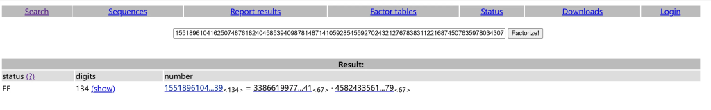

# 题目-1

:::CAUTION[题目来源]
HGAME2025-week1-suprimeRSA
:::
```python
from Crypto.Util.number import *
import random
from sympy import prime

FLAG=b'hgame{xxxxxxxxxxxxxxxxxx}'
e=0x10001

def primorial(num):
    result = 1
    for i in range(1, num + 1):
        result *= prime(i)
    return result
M=primorial(random.choice([39,71,126]))

def gen_key():
    while True:
        k = getPrime(random.randint(20,40))
        a = getPrime(random.randint(20,60))
        p = k * M + pow(e, a, M)
        if isPrime(p):
            return p

p,q=gen_key(),gen_key()
n=p*q
m=bytes_to_long(FLAG)
enc=pow(m,e,n)

print(f'{n=}')
print(f'{enc=}')

"""
n=787190064146025392337631797277972559696758830083248285626115725258876808514690830730702705056550628756290183000265129340257928314614351263713241
enc=365164788284364079752299551355267634718233656769290285760796137651769990253028664857272749598268110892426683253579840758552222893644373690398408
"""
```
---
## 解题思路

### ROCA攻击是针对什么样的RSA?

**ROCA漏洞**是一个加密漏洞,它允许从具有漏洞的设备生成的密钥中的公钥中恢复密钥对的私钥;"ROCA"是"Return of Coppersmith`s attack"的缩写`

:::note[[ROCA攻击-WiKi](https://en.wikipedia.org/wiki/ROCA_vulnerability)]
:::

就是形如`p = k ∗ M + (65537 ** a (mod M))`来生成素数的RSA系统都存在`ROCA`漏洞,其中`M`是是前`n`个连续素数`(2,3,5,7,11,13,…)`的乘积,`n`是仅取决于所需密钥大小的常数

### 攻击脚本

+ sage_functions.py
```python
from sage.all_cmdline import *

def coppersmith_howgrave_univariate(pol, modulus, beta, mm, tt, XX):
    """
    Taken from https://github.com/mimoo/RSA-and-LLL-attacks/blob/master/coppersmith.sage
    Coppersmith revisited by Howgrave-Graham

    finds a solution if:
    * b|modulus, b >= modulus^beta , 0 < beta <= 1
    * |x| < XX
    More tunable than sage's builtin coppersmith method, pol.small_roots()
    """
    #
    # init
    #
    dd = pol.degree()
    nn = dd * mm + tt

    #
    # checks
    #
    if not 0 < beta <= 1:
        raise ValueError("beta should belongs in [0, 1]")

    if not pol.is_monic():
        raise ArithmeticError("Polynomial must be monic.")

    #
    # calculate bounds and display them
    #
    """
    * we want to find g(x) such that ||g(xX)|| <= b^m / sqrt(n)

    * we know LLL will give us a short vector v such that:
    ||v|| <= 2^((n - 1)/4) * det(L)^(1/n)

    * we will use that vector as a coefficient vector for our g(x)

    * so we want to satisfy:
    2^((n - 1)/4) * det(L)^(1/n) < N^(beta*m) / sqrt(n)

    so we can obtain ||v|| < N^(beta*m) / sqrt(n) <= b^m / sqrt(n)
    (it's important to use N because we might not know b)
    """
    #
    # Coppersmith revisited algo for univariate
    #

    # change ring of pol and x
    polZ = pol.change_ring(ZZ)
    x = polZ.parent().gen()

    # compute polynomials
    gg = []
    for ii in range(mm):
        for jj in range(dd):
            gg.append((x * XX) ** jj * modulus ** (mm - ii) * polZ(x * XX) ** ii)
    for ii in range(tt):
        gg.append((x * XX) ** ii * polZ(x * XX) ** mm)

    # construct lattice B
    BB = Matrix(ZZ, nn)

    for ii in range(nn):
        for jj in range(ii + 1):
            BB[ii, jj] = gg[ii][jj]

    BB = BB.LLL()

    # transform shortest vector in polynomial
    new_pol = 0
    for ii in range(nn):
        new_pol += x ** ii * BB[0, ii] / XX ** ii

    # factor polynomial
    potential_roots = new_pol.roots()

    # test roots
    roots = []
    for root in potential_roots:
        if root[0].is_integer():
            result = polZ(ZZ(root[0]))
            if gcd(modulus, result) >= modulus ** beta:
                roots.append(ZZ(root[0]))
    return roots
```
+ roca_attack.py
```python
from sage.all import *
from tqdm import tqdm

def solve(M, n, a, m):
    # I need to import it in the function otherwise multiprocessing doesn't find it in its context
    from sage_functions import coppersmith_howgrave_univariate

    base = int(65537)
    # the known part of p: 65537^a * M^-1 (mod N)
    known = int(pow(base, a, M) * inverse_mod(M, n))
    # Create the polynom f(x)
    F = PolynomialRing(Zmod(n), implementation='NTL', names=('x',))
    (x,) = F._first_ngens(1)
    pol = x + known
    beta = 0.1
    t = m+1
    # Upper bound for the small root x0
    XX = floor(2 * n**0.5 / M)
    # Find a small root (x0 = k) using Coppersmith's algorithm
    roots = coppersmith_howgrave_univariate(pol, n, beta, m, t, XX)
    # There will be no roots for an incorrect guess of a.
    for k in roots:
        # reconstruct p from the recovered k
        p = int(k*M + pow(base, a, M))
        if n%p == 0:
            return p, n//p

def roca(n):

    keySize = n.bit_length()

    if keySize <= 960:
        M_prime = 0x1b3e6c9433a7735fa5fc479ffe4027e13bea
        m = 5

    elif 992 <= keySize <= 1952:
        M_prime = 0x24683144f41188c2b1d6a217f81f12888e4e6513c43f3f60e72af8bd9728807483425d1e
        m = 4
        print("Have you several days/months to spend on this ?")

    elif 1984 <= keySize <= 3936:
        M_prime = 0x16928dc3e47b44daf289a60e80e1fc6bd7648d7ef60d1890f3e0a9455efe0abdb7a748131413cebd2e36a76a355c1b664be462e115ac330f9c13344f8f3d1034a02c23396e6
        m = 7
        print("You'll change computer before this scripts ends...")

    elif 3968 <= keySize <= 4096:
        print("Just no.")
        return None

    else:
        print("Invalid key size: {}".format(keySize))
        return None

    a3 = Zmod(M_prime)(n).log(65537)
    order = Zmod(M_prime)(65537).multiplicative_order()
    inf = a3 // 2
    sup = (a3 + order) // 2

    # Search 10 000 values at a time, using multiprocess
    # too big chunks is slower, too small chunks also
    chunk_size = 10000
    for inf_a in range(inf, sup, chunk_size):
        # create an array with the parameter for the solve function
        inputs = [((M_prime, n, a, m), {}) for a in range(inf_a, inf_a+chunk_size)]
        # the sage builtin multiprocessing stuff
        from sage.parallel.multiprocessing_sage import parallel_iter
        from multiprocessing import cpu_count

        for k, val in parallel_iter(cpu_count(), solve, inputs):
            if val:
                p = val[0]
                q = val[1]
                print("found factorization:\np={}\nq={}".format(p, q))
                return val

if __name__ == "__main__":
    # Normal values
    #p = 88311034938730298582578660387891056695070863074513276159180199367175300923113
    #q = 122706669547814628745942441166902931145718723658826773278715872626636030375109
    #a = 551658, interval = [475706, 1076306]
    # won't find if beta=0.5
    #p = 80688738291820833650844741016523373313635060001251156496219948915457811770063
    #q = 69288134094572876629045028069371975574660226148748274586674507084213286357069
    #a = 176170, interval = [171312, 771912]
    # 替换成要分解的n
    n = 787190064146025392337631797277972559696758830083248285626115725258876808514690830730702705056550628756290183000265129340257928314614351263713241
    # For the test values chosen, a is quite close to the minimal value so the search is not too long
    roca(n)
```

## 解答

+ sage roca_attack.py

```python
found factorization:
p=954455861490902893457047257515590051179337979243488068132318878264162627
q=824752716083066619280674937934149242011126804999047155998788143116757683
```

+ 

```python
from Crypto.Util.number import *

p = 954455861490902893457047257515590051179337979243488068132318878264162627
q = 824752716083066619280674937934149242011126804999047155998788143116757683
e = 65537
enc = 365164788284364079752299551355267634718233656769290285760796137651769990253028664857272749598268110892426683253579840758552222893644373690398408

n=p*q
phi = (p-1)*(q-1)
d = inverse(e, phi)
m = pow(enc, d, n)
print(long_to_bytes(m))
#hgame{ROCA_ROCK_and_ROll!}
```
---
# 题目-2

:::CAUTION[题目来源]
[GKCTF 2020] Backdoor
:::
```python
from Crypto.PublicKey import RSA
with open('./pub.pem' ,'r') as f:
    key = RSA.import_key(f.read())
    e = key.e
    n = key.n
    print('e = %d\nn = %d'%(e,n))
e = 65537
n = 15518961041625074876182404585394098781487141059285455927024321276783831122168745076359780343078011216480587575072479784829258678691739
#密文c
#02142af7ce70fe0ddae116bb7e96260274ee9252a8cb528e7fdd29809c2a6032727c05526133ae4610ed944572ff1abfcd0b17aa22ef44a2
```

## 解题思路

**法1:**

+ 因为题目给出提示:`p=k*M+(65537**a %M)`发现是一个cve漏洞复现
+ `a`和`k`理论上也不会太大,暴力碰撞一下,秒出`p`,`q`

**法2:**

+ `ROCA`攻击

+ 

**法3:**

+ `n`可以直接`factordb`分解

+ 

## 解答

```python
from Crypto.Util.number import *
from gmpy2 import *

vals=39
M=1
n = mpz(15518961041625074876182404585394098781487141059285455927024321276783831122168745076359780343078011216480587575072479784829258678691739)
primes = [2, 3, 5, 7, 11, 13, 17, 19, 23, 29, 31, 37, 41, 43, 47, 53, 59, 61, 67, 71, 73, 79, 83, 89, 97, 101, 103, 107, 109, 113, 127, 131, 137, 139, 149, 151, 157, 163, 167, 173, 179, 181, 191, 193, 197, 199, 211, 223, 227, 229, 233, 239, 241, 251, 257, 263, 269, 271, 277, 281, 283, 293, 307, 311, 313, 317, 331, 337, 347, 349, 353, 359, 367, 373, 379, 383, 389, 397, 401, 409, 419, 421, 431, 433, 439, 443, 449, 457, 461, 463, 467, 479, 487, 491, 499, 503, 509, 521, 523, 541, 547, 557, 563, 569, 571, 577, 587, 593, 599, 601, 607, 613, 617, 619, 631, 641, 643, 647, 653, 659, 661, 673, 677, 683, 691, 701, 709, 719, 727, 733, 739, 743, 751, 757, 761, 769, 773, 787, 797, 809, 811, 821, 823, 827, 829, 839, 853, 857, 859, 863, 877, 881, 883, 887, 907, 911, 919, 929, 937, 941, 947, 953, 967, 971, 977, 983, 991, 997, 1009, 1013, 1019, 1021, 1031, 1033, 1039, 1049, 1051, 1061, 1063, 1069, 1087, 1091, 1093, 1097, 1103, 1109, 1117, 1123, 1129, 1151, 1153, 1163, 1171, 1181, 1187, 1193, 1201, 1213, 1217, 1223, 1229, 1231, 1237, 1249, 1259, 1277, 1279, 1283, 1289, 1291, 1297, 1301, 1303, 1307, 1319, 1321, 1327, 1361, 1367, 1373, 1381, 1399, 1409, 1423, 1427, 1429, 1433, 1439, 1447, 1451, 1453, 1459, 1471, 1481, 1483, 1487, 1489, 1493, 1499, 1511, 1523, 1531, 1543, 1549, 1553, 1559, 1567, 1571, 1579, 1583, 1597, 1601, 1607, 1609, 1613, 1619, 1621, 1627, 1637, 1657, 1663, 1667, 1669, 1693, 1697, 1699, 1709, 1721, 1723, 1733, 1741, 1747, 1753, 1759, 1777, 1783, 1787, 1789, 1801, 1811, 1823, 1831, 1847, 1861, 1867, 1871, 1873, 1877, 1879, 1889, 1901, 1907, 1913, 1931, 1933, 1949, 1951, 1973, 1979, 1987, 1993, 1997, 1999, 2003, 2011, 2017, 2027, 2029, 2039, 2053, 2063, 2069, 2081, 2083, 2087, 2089, 2099, 2111, 2113, 2129, 2131, 2137, 2141, 2143, 2153, 2161, 2179, 2203, 2207, 2213, 2221, 2237, 2239, 2243, 2251, 2267, 2269, 2273, 2281, 2287, 2293, 2297, 2309, 2311, 2333, 2339, 2341, 2347, 2351, 2357, 2371, 2377, 2381, 2383, 2389, 2393, 2399, 2411, 2417, 2423, 2437, 2441, 2447, 2459, 2467, 2473, 2477, 2503, 2521, 2531, 2539, 2543, 2549, 2551, 2557, 2579, 2591, 2593, 2609, 2617, 2621, 2633, 2647, 2657, 2659, 2663, 2671, 2677, 2683, 2687, 2689, 2693, 2699, 2707, 2711, 2713, 2719, 2729, 2731, 2741, 2749, 2753, 2767, 2777, 2789, 2791, 2797, 2801, 2803, 2819, 2833, 2837, 2843, 2851, 2857, 2861, 2879, 2887, 2897, 2903, 2909, 2917, 2927, 2939, 2953, 2957, 2963, 2969, 2971, 2999]

for x in range(0, vals):
    M=M*primes[x]


for a in range(1,20):
    for k in range(50):
        p=mpz(k*M+(65537**a %M))
        if is_prime(p):
            q = mpz(n//p)
            if is_prime(q):
                print('p=%d\nq=%d'%(p,q))

'''
p = 4582433561127855310805294456657993281782662645116543024537051682479
q = 3386619977051114637303328519173627165817832179845212640767197001941
'''
c = 0x02142af7ce70fe0ddae116bb7e96260274ee9252a8cb528e7fdd29809c2a6032727c05526133ae4610ed944572ff1abfcd0b17aa22ef44a2
e = 65537
phi_n= (p - 1) * (q - 1)
d = invert(e, phi_n)
m = pow(c,d,n)
print(long_to_bytes(m))
#flag{760958c9-cca9-458b-9cbe-ea07aa1668e4}
```
